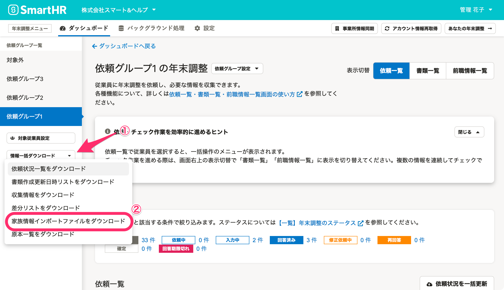

:::alert
当ページで案内しているSmartHRの年末調整機能の内容は、2021年（令和3年）版のものです。
2022年（令和4年）版の年末調整機能の公開時期は秋頃を予定しています。
なお、画面や文言、一部機能は変更になる可能性があります。
公開時期が決まり次第、[アップデート情報](https://smarthr.jp/update)でお知らせします。
:::

年末調整のアンケートで追加・変更された**税扶養の家族情報**をSmartHRに取り込むためのCSVファイルをダウンロードできます。

CSVファイルは依頼グループ単位でダウンロードできるほか、全依頼グループ分をまとめてダウンロードもできます。

:::tips
この機能では、**依頼が確定した従業員の税扶養の家族のみ**を出力します。
今年死亡した税扶養対象の家族は、年末調整上は税扶養の対象となりますが、ファイルには出力しません。
:::

# 特定の依頼グループの家族情報をダウンロードする

## 1\. 依頼一覧画面の［ダウンロード▼］>［家族情報インポートファイルをダウンロード］をクリック

依頼一覧画面の **［ダウンロード▼］>［家族情報インポートファイルをダウンロード］** をクリックすると、 **［家族情報インポートファイルのダウンロード］** 画面が表示されます。

## 2\. ［ダウンロード］をクリック

 **［家族情報インポートファイルのダウンロード］画面** の **［ダウンロード］** をクリックすると、バックグラウンド処理を開始します。

## 3\. CSVファイルをダウンロードする

年末調整メニューの **［バックグラウンド処理］** をクリックします。

ステータスが **［完了］** に変わったら、 **［{依頼グループ名}の家族情報一括更新用CSVダウンロード］** をクリックすると、処理結果画面に移動します。

 **［処理結果］** 内の **［ダウンロード］** をクリックして、CSVファイルをダウンロードします。

詳しくは、下記のヘルプページをご覧ください。

# すべての依頼グループの家族情報を一括でダウンロードする

## 1\. 依頼グループ一覧の下部にある［情報一括ダウンロード▼］>［家族情報インポートファイルをダウンロード］をクリック

依頼グループ一覧の下部にある **［情報一括ダウンロード▼］>［家族情報インポートファイルをダウンロード］** をクリックすると、 **［家族情報インポートファイルのダウンロード］** 画面が表示されます。

## 2\. ［ダウンロード］をクリック

 **［家族情報インポートファイルのダウンロード］** 画面の **［ダウンロード］** をクリックすると、バックグラウンド処理を開始します。

## 3\. CSVファイルをダウンロードする

年末調整メニューの **［バックグラウンド処理］** をクリックします。

 **ステータスが［完了］** に変わったら、 **［家族情報一括更新用CSVの一括ダウンロード］** をクリックすると、処理結果画面に移動します。

 **［処理結果］** 内の **［ダウンロード］** をクリックして、CSVファイルをダウンロードします。

# 家族情報をSmartHRに反映させる

家族情報をSmartHRに反映させる方法や、CSVファイルの項目一覧など、詳しくは下記のヘルプページをご覧ください。

:::related
[年末調整の結果を、家族情報一括更新用CSVでSmartHRにインポートする際の注意事項](https://knowledge.smarthr.jp/hc/ja/articles/360039794053)
[複数の従業員情報・家族情報を一括で更新する](https://knowledge.smarthr.jp/hc/ja/articles/360026265333)
[【一覧】年末調整の家族情報一括更新用CSV凡例](https://knowledge.smarthr.jp/hc/ja/articles/360056730693)
[年末調整の業務終了後に、SmartHRに従業員情報と家族情報を反映する方法と給与計算ソフトとの連携方法](https://knowledge.smarthr.jp/hc/ja/articles/4405495798937)
:::
