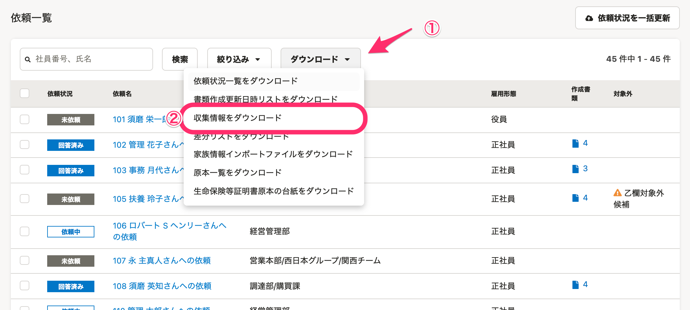
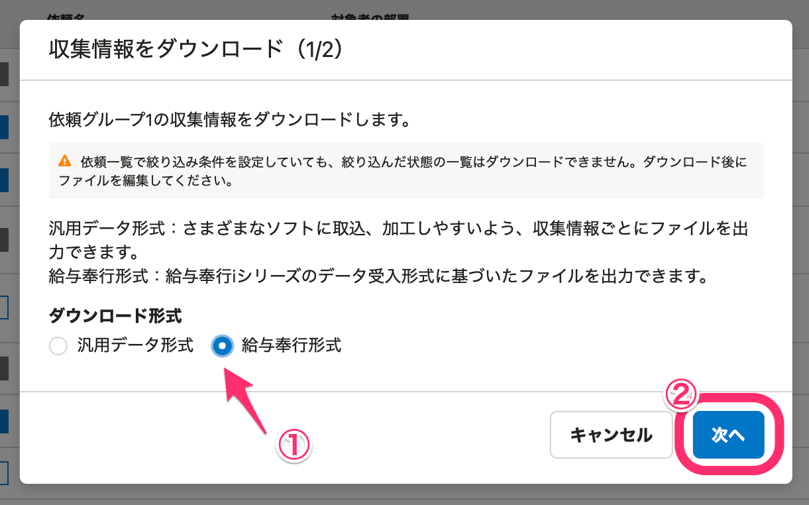
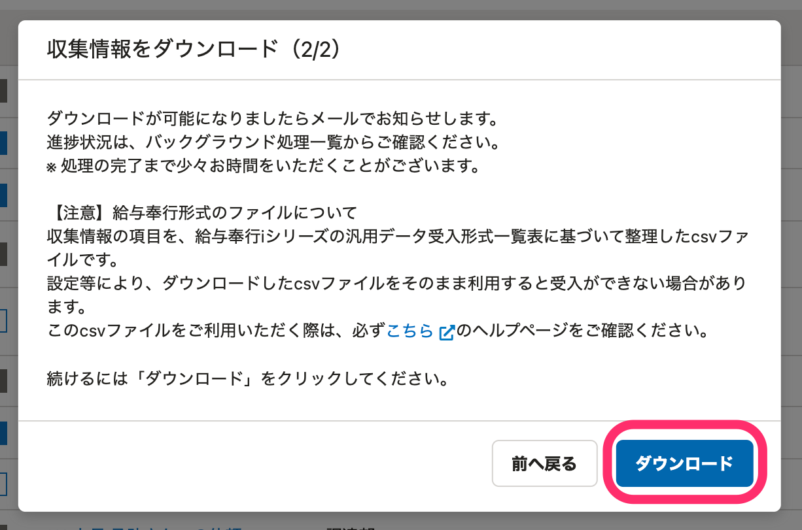
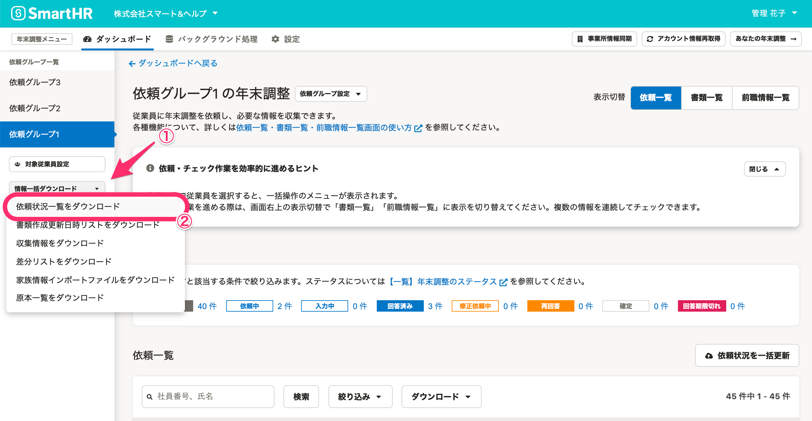
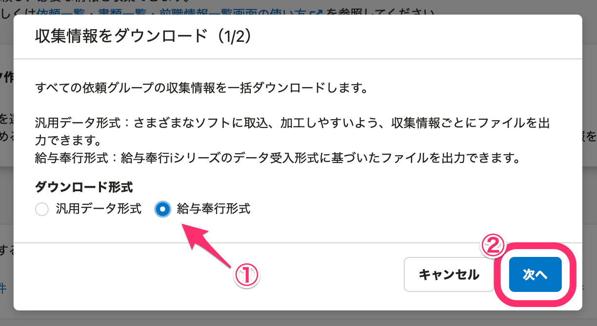
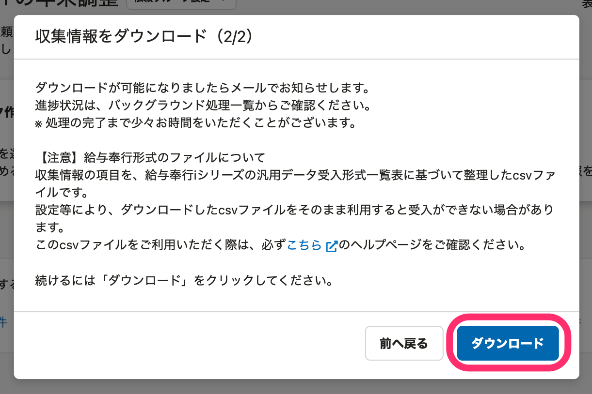

:::alert
当ページで案内しているSmartHRの年末調整機能の内容は、2021年（令和3年）版のものです。
2022年（令和4年）版の年末調整機能の公開時期は秋頃を予定しています。
なお、画面や文言、一部機能は変更になる可能性があります。
公開時期が決まり次第、[アップデート情報](https://smarthr.jp/update)でお知らせします。
:::

SmartHRの年末調整機能で収集した情報を、給与奉行iシリーズのデータ受入形式に対応した項目名（コード）で、依頼グループごともしくはすべての依頼グループ分を一括してダウンロードできます。

:::alert
**給与奉行形式のCSVファイルをご利用いただくにあたっては、必ず「免責事項」をお読みください。**
**CSVファイルのダウンロード後、受入をする際には、必ず「CSVファイル仕様」「データ受入（インポート）時の注意事項」をお読みください。**
:::

# 免責事項

- ダウンロード形式は、2021年3月1日時点で開示されている、「給与奉行iシリーズ 汎用データ受入形式一覧表」の定義を使用しています。
- 給与奉行iシリーズへのデータの受入（インポート）方法といったサポートは、弊社で承ることができません。給与奉行iシリーズのご利用方法は、OBCさまへお問い合わせをお願いします。
- SmartHRでは、年末調整機能にご入力いただいた内容をCSVファイルでダウンロードする機能のみ提供しています。お手数ですが、ご入力の誤りや不備はユーザーさまで検知いただくようお願いします。
- 参考情報として記載している「社員情報データ」「給料等調整データ」「年末調整データ」の受入条件設定は、弊社が認識している参考情報であり、公式情報ではありません。詳細はOBCさまへお問い合わせをお願いします。
- 給与計算結果に関するお問い合わせも、弊社では承ることができません。

# 特定の依頼グループの収集情報をダウンロードする

## 1\. 依頼一覧画面の［ダウンロード▼］>［収集情報をダウンロード］をクリック

依頼一覧画面の **［ダウンロード▼］メニュー**  にある **［収集情報をダウンロード］** をクリックすると、 **［収集情報をダウンロード（1/2）］** 画面が表示されます。

## 2.［給与奉行形式］を選択し、［次へ］をクリック

ダウンロード形式に **［給与奉行形式］** を選択して、 **［次へ］** をクリックします。

なお、「汎用データ形式」のダウンロード方法は下記のヘルプページをご覧ください。

[特定の依頼グループの収集情報をダウンロードする](https://knowledge.smarthr.jp/hc/ja/articles/360055844513)

## 3.［ダウンロード］をクリック

確認画面の **［ダウンロード］** をクリックすると、バックグラウンド処理が始まります。

進捗は年末調整メニューの **［バックグラウンド処理］** で確認してください。

ステータスが **［完了］** に変わったら、 **［処理名］** をクリックします。

バックグラウンド処理終了後、処理結果の画面から「OBC奉行インポート用データ.zip」というファイルをダウンロードできます。

ZIPファイルには、以下2つのCSVファイルが含まれています。内容を確認してください。

- 【OBC奉行インポート用】R03年末調整用.csv
- 【OBC奉行インポート用】R04年末調整用.csv

# すべての依頼グループの収集情報を一括でダウンロードする

## 1\. 依頼グループ一覧の下部にある［情報一括ダウンロード▼］>［収集情報をダウンロード］をクリック

依頼グループ一覧の下部にある **［情報一括ダウンロード▼］メニュー**  の **［収集情報をダウンロード］** をクリックすると、 **［収集情報をダウンロード（1/2）］** 画面が表示されます。

## 2.［給与奉行形式］を選択し、［次へ］をクリック

ダウンロード形式に **［給与奉行形式］** を選択して、 **［次へ］** をクリックします。

## 3.［ダウンロード］をクリック

確認画面の **［ダウンロード］** をクリックすると、バックグラウンド処理が始まります。

進捗は年末調整メニューの **［バックグラウンド処理］** で確認してください。

ステータスが **［完了］** に変わったら、 **［処理名］** をクリックします。

 **［処理結果］** 内の **［ダウンロード］** をクリックして、CSVファイルをダウンロードします。

詳しくは下記のヘルプページをご覧ください。

:::related
[情報一括ダウンロードの使い方](https://knowledge.smarthr.jp/hc/ja/articles/4405396080025)
:::

# CSVファイル仕様

## 前提

- 給与奉行iシリーズは、入力した内容によってさまざまな判定や計算を行ないます。例えば、扶養家族の人数、同居老親等（生年月日と続柄で判定）等の給与奉行側で自動判定するものに関しては、CSVファイルに出力していません。
- 配偶者以外の扶養家族について、控除対象外の家族はCSVファイルに出力していません。
- 「他の所得者が控除を受ける扶養親族」についても、CSVファイルには出力していません。当ページ「データ受入（インポート）時の注意事項」に記載のとおり対応をお願いします。

## 前職源泉徴収票

- 給与奉行iシリーズの仕様で出力しています。情報は1つしか入らないため、会社名、住所は退職日が直近のものを出力しています。
- 収入金額、社会保険料、所得税については、複数入力がある場合は、金額を合算しています。
- 前職の源泉徴収票が入手できない場合、SmartHRでは年末調整の対象外となるため、年調対象区分（ESAL004）は 「0」（対象外）と出力します。

## 家族情報の人数

- 給与奉行iシリーズでは、家族情報は10人までしか登録できません。
- SmartHRの年末調整機能から給与奉行形式でダウンロードしたファイルも、最大10人分の家族情報までしか含まれません。

## 扶養家族の続柄

- 続柄は、SmartHRとOBCさまとの続柄名の違いなどもあり、SmartHRで自動変換しています。
- SmartHRではフリーテキストで続柄を設定できる仕様のため、下記以外の続柄名を入力していた場合は、CSVファイルでは「空欄」としています。
- 管理者さまにてご確認のうえ、CSVファイルにご入力をお願いします。
- 給与奉行iシリーズでは、同居老親等は続柄が入力されていないと人数をカウントしない仕様となっていますのでご注意ください。

| **SmartHRに入力された続柄** | **CSVへの変換** |
| --- | --- |
| 下記以外の入力 | 空欄 |
| 続柄にかかわらず、扶養親族の入力時に、「子供である」にチェックが入っていた場合 | 01（子） |
| 父 実父 義父 | 02（父） |
| 母 実母 義母 | 03（母） |
| 妹 | 04（妹） |
| 弟 | 05（弟） |
| 祖父 | 06（祖父） |
| 祖母 | 07（祖母） |
| 姉 | 08（姉） |
| 兄 | 09（兄） |

## 年調対象区分（ESAL004）

年調対象区分は以下の通り定義しています。

| **SmartHRに入力された内容** | **CSVへの変換** |
| --- | --- |
|   ■依頼ステータスが以下の場合 未依頼、依頼中、入力中、修正依頼中、回答期限切れ  ■依頼ステータスによらず、対象外理由が以下の場合 対象外(乙欄)、対象外(退職)、対象外(給与支給なし)、対象外（源泉）、乙欄対象外候補、退職対象外候補、源泉対象外候補、対象外(収入)、収入対象外候補   | 0（年末調整が不要） |
| ■依頼ステータスが以下の場合 回答済み、再回答、確定 ※対象外理由が「紙による提出」のときは、依頼ステータスが条件を満たせば対象区分は「1」になります。 ※未依頼の依頼ステータスを確定にした場合、書類が存在していない状態でも対象区分は「1」になります。  | 1（年末調整が必要） |

## 課税区分（ESAL003）

課税区分は、以下の条件を番号順に確認して判定します。

1.  対象外理由が「乙欄対象外」の場合は「2」を出力します。
2.  対象外理由が「乙欄対象外候補」、または、それ以外の対象外・対象外候補の場合は「空欄」で出力します。
3.  1と2に該当せず、依頼ステータスが一度でも「回答済み」になったことがある場合は、現在の依頼ステータスが「修正依頼中」であっても「1」を出力します。
4.  いずれの条件も満たさない場合（依頼ステータスが「未依頼」「依頼中」「入力中」「回答期限切れ」の場合）は「空欄」で出力します。

## 配偶者の有無と扶養区分（EFMM020）

- 年末調整機能のアンケート画面で「配偶者がいる」と回答している場合、「配偶者の有無」（EFML001）には「1」と出力します。
- その際の「配偶者 - 扶養区分コード」（EFMM020）は、配偶者情報の登録はあるが控除の対象とならない内容で申告がされている場合は「0」と出力します。また、配偶者情報の登録がない（＝登録がないので対象にもならない）場合も、「配偶者 - 扶養区分コード」（EFMM020）は「0」で出力します。
- 「入力中」など回答が確定していないステータスで出力した場合、「配偶者 - 扶養区分コード」（EFMM020）は「空欄」となります。「空欄」のデータを取り込んでも、給与奉行iシリーズの登録データは上書きされません。

## 控除額適用区分コード（YITS007）

住宅借入金等特別控除申告書の控除区分に応じて、旧様式・新様式とも以下を出力します。

| **出力する値** | **説明** |
| --- | --- |
| 0 |   控除区分が以下いずれかに該当する場合に出力  - 「印字なし」の場合 - 「居住者用」（イ欄）の場合 - 「居住者用」（チ欄かつ、特定増改築等の費用の額※が空白または0）の場合  ※旧様式の場合は「ル欄」、新様式の場合は「ヌ欄」   |
| 1 | 控除区分が「居住者・特例用」の場合 |
| 2 |   控除区分が以下いずれかに該当する場合に出力  - 「居住者・特定増改築等住宅借入金等控除用」の場合 - 「居住者用」（チ欄かつ、特定増改築等の費用の額※が1以上）の場合  ※旧様式の場合は「ル欄」、新様式の場合は「ヌ欄」   |
| 3 |   控除区分が以下いずれかに該当する場合に出力  - 「居住者・長期優良住宅用」の場合 - 「居住者・認定住宅用」の場合   |
| 4 | 控除区分が「居住者・震災再取得等用」の場合 |

## 特定取得区分（YITS013）

- 特定取得区分コードがない場合は「0」と出力します。
- 特定取得の場合は「1」と出力します。
- 特別特定取得の場合は「2」と出力します。

# データ受入（インポート）時の注意事項

## 給与奉行形式のCSVファイルについて

- SmartHRの年末調整で更新・追加した項目を給与奉行iシリーズの汎用データ受入形式一覧表に基づいて整理し、1つのファイルで提供しています。
- 給与奉行iシリーズには、給与奉行形式のCSVファイルをそのまま受入（インポート）できません。給与奉行iシリーズのデータカテゴリごとにCSVファイルを分割し、受入をしてください。
- 2行目に日本語の項目名が入っています。こちらは、給与奉行iシリーズのデータ受入形式の項目名に対して内容が判別しやすいよう、SmartHRで入力したものです。
    - 受入の際は2行目を削除すると「未受」は発生しません。
    - 削除せずに受入をしても2行目は「未受」となり、情報は給与奉行iシリーズに受入されません。
- A列は年末調整の依頼グループ名、B列は年末調整一覧の依頼ステータス、C列は対象外理由を表示しています。
    - 依頼グループ名・依頼ステータス・対象外理由によって連携対象かどうかを判断のうえ、連携対象外の従業員データは行ごと削除してください。
    - 従業員データの削除後は、A列～C列をすべて削除し、受入してください。

## 給与奉行iシリーズでの受入条件設定について

SmartHRでは給与奉行iシリーズの「社員情報データ」「給料等調整データ」「年末調整データ」に該当するデータを抽出しています。

受入にあたっては、給与奉行iシリーズで「社員情報データ」「給料等調整データ」「年末調整データ」それぞれの受入条件設定が必要です。

受入条件設定時には「汎用データが空白の場合も登録済みのデータを更新する」を有効にし、空白で上書きする項目を選択してください。

有効にしなかった場合、税扶養から外れた家族のデータが残ってしまう等のケースが発生します。

本件については弊社が認識している参考情報です。

受入条件設定の詳細についてはOBCさまにお問い合わせください。

:::alert
### 給与奉行iシリーズを人事マスタとして利用している場合
給与奉行形式のCSVファイルの家族データは、税扶養対象外の場合には出力されません。
そのため、「汎用データが空白の場合も登録済みのデータを更新する」の設定にした場合、社保扶養のみの家族・扶養していない家族は削除されます。
上記の家族データを保持したい場合は、一度、CSV出力などで給与奉行iシリーズの家族情報を退避させ、SmartHRの年末調整データを受入後、必要な家族だけ再登録してください。
### 給与奉行iシリーズに住宅ローン控除の「取得対価の額」や「面積」「居住割合」などを登録する場合
給与奉行iシリーズではデータをインポートする際、「取得対価の額」「面積」「居住割合」をインポートするかどうかを選択できますが、SmartHRの年末調整機能からダウンロードできる給与奉行形式のCSVファイルはこの仕様には対応していません。
必要に応じて「住宅借入金控除CSV」のデータを別途給与奉行に連携してください。
:::

## 「他の所得者が控除を受ける扶養親族」の情報について

CSVファイルに「他の所得者が控除を受ける扶養親族」の情報は含まれていません。

下記ヘルプページ内【「他の所得者が控除を受ける扶養親族」の判別方法】に記載の手順で「他の所得者が控除を受ける扶養親族」がいる従業員を判別・抽出のうえ、個別に給与奉行iシリーズへ家族情報を登録するようお願いします。

登録の際は、扶養区分を「控除対象外」にしてください。

:::related
[SmartHRで作成した所得金額調整控除申告書の「他の所得者が控除を受ける扶養親族」について注意点と対処法](https://knowledge.smarthr.jp/hc/ja/articles/360055283073)
:::
