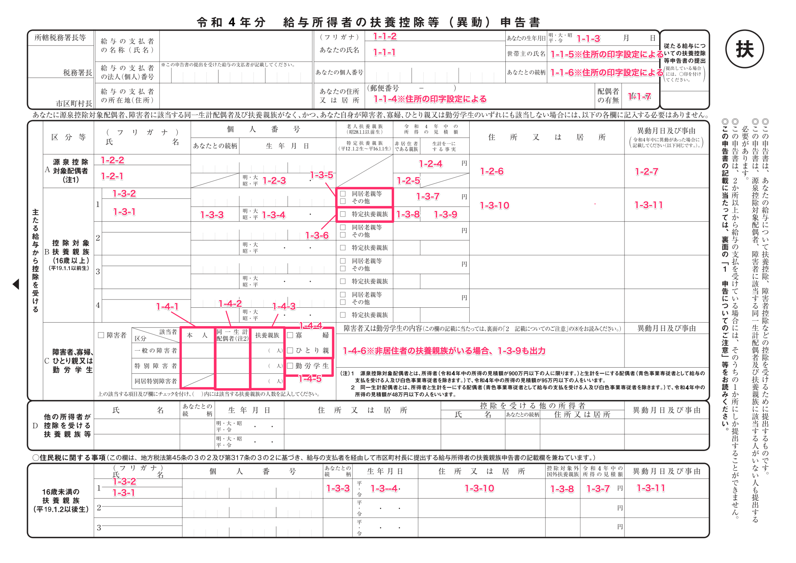
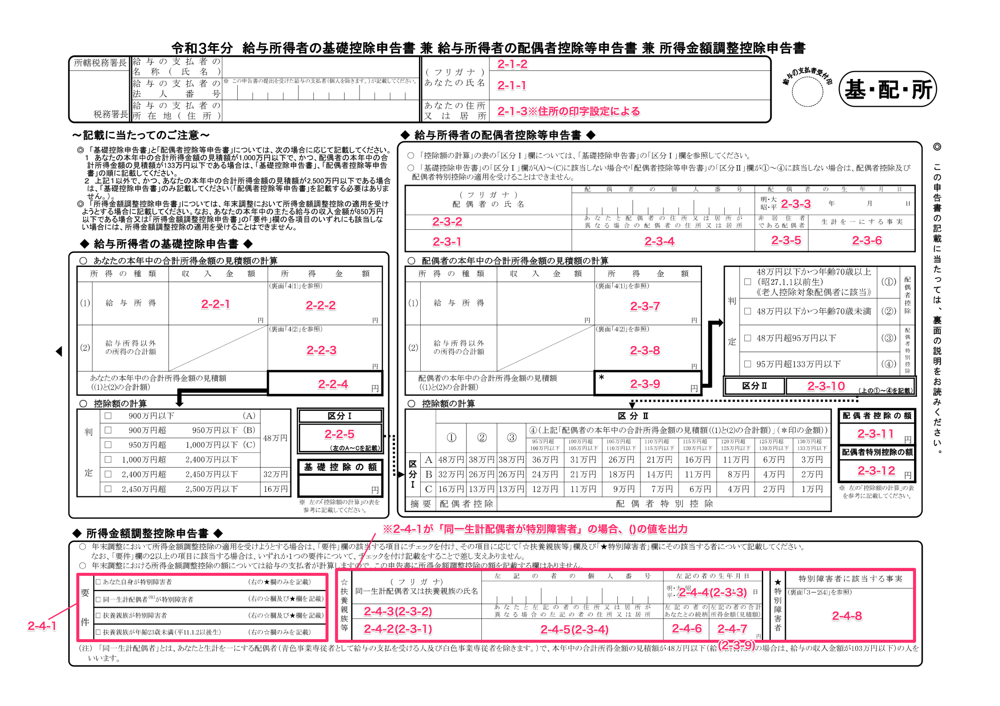
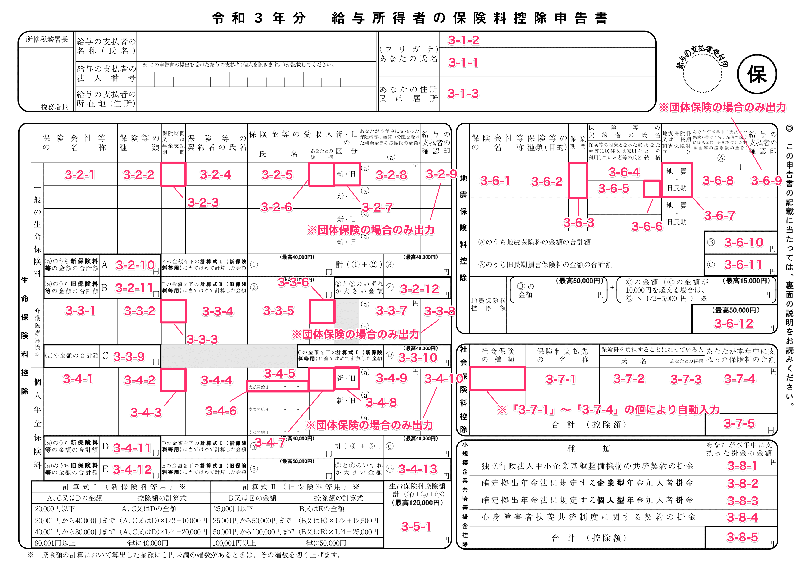
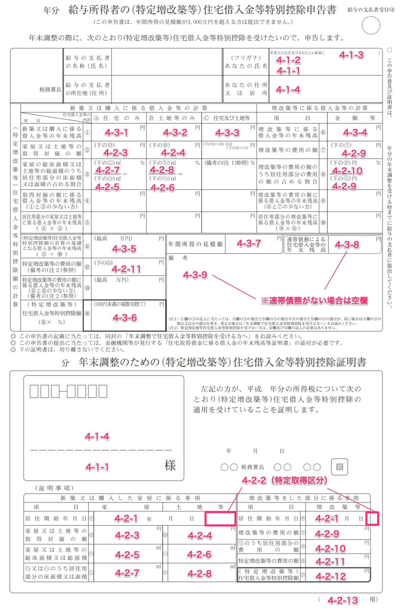
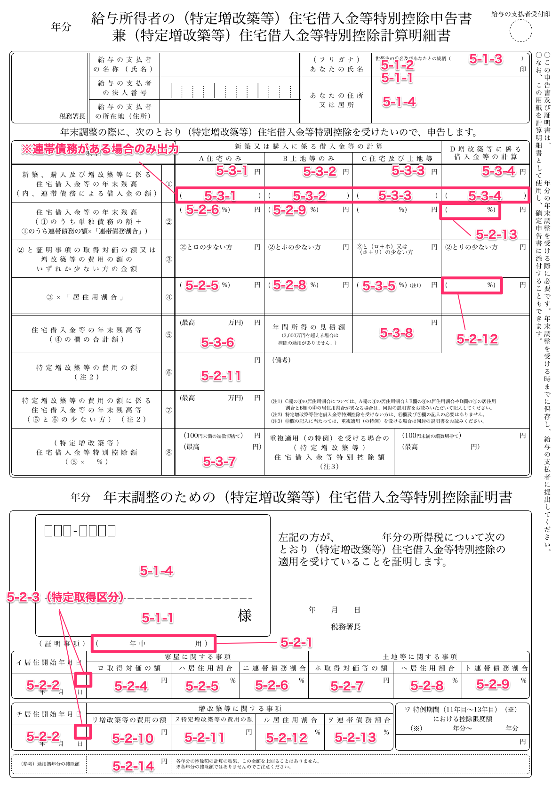

:::alert
当ページで案内しているSmartHRの年末調整機能の内容は、2021年（令和3年）版のものです。
2022年（令和4年）版の年末調整機能の公開時期は秋頃を予定しています。
なお、画面や文言、一部機能は変更になる可能性があります。
公開時期が決まり次第、[アップデート情報](https://smarthr.jp/update%E2%80%9D)でお知らせします。
:::

年末調整機能からダウンロードできるCSVファイルの各項目が、年末調整書類のどこに反映されるのか、記載位置の紐付きを説明します。

対照表のExcelファイルは以下URLからダウンロードしてください。

Excelファイルの使い方は、ファイル内 **［利用方法］** シートに記載の内容を参照してください。

[年末調整書類の対照表](./__________.xlsx)

書類画像は、クリックすると拡大できます。

# 給与所得者の扶養控除等（異動）申告書

表示規則は以下の通りです。

- 書類番号：1
    - 本人情報：1-1-n
    - 源泉控除対象配偶者情報：1-2-n
    - 控除対象扶養親族情報、16歳未満の扶養親族情報：1-3-n
    - 障害者、寡婦・ひとり親、勤労学生情報：1-4-n

# 給与所得者の基礎控除申告書 兼 配偶者控除等申告書 兼 所得金額調整控除申告書

表示規則は以下の通りです。

- 書類番号：2
    - 本人情報：2-1-n
    - 給与所得者の基礎控除申告書：2-2-n
    - 給与所得者の配偶者控除等申告書：2-3-n
    - 所得金額調整控除申告書：2-4-n

# 給与所得者の保険料控除等申告書

表示規則は以下の通りです。

- 書類番号：3
    - 本人情報：3-1-n
    - 生命保険料控除\_一般の生命保険料：3-2-n
    - 生命保険料控除\_介護医療保険料：3-3-n
    - 生命保険料控除\_個人年金保険料：3-4-n
    - 生命保険料控除\_控除額：3-5-n
    - 地震保険料控除：3-6-n
    - 社会保険料控除：3-7-n
    - 小規模企業共済等掛金控除：3-8-n

# 給与所得者の（特定増改築等）住宅借入金等特別控除申告書

:::tips
SmartHRの年末調整機能では、申告書の上半分に記載の書類名をもとに、それぞれの様式を「旧様式」「新様式」と区別して表記しています。
- 書類名が「給与所得者の（特定増改築等）住宅借入金等特別控除申告書」：旧様式
- 書類名が「給与所得者の（特定増改築等）住宅借入金等特別控除申告書 兼（特定増改築等）住宅借入金等特別控除計算明細書」：新様式※
※2020年から新たに採用された書類の様式を指し、SmartHRでは従来の様式と比較して「新様式」と表記しています。
:::

## 旧様式

表示規則は以下の通りです。

- 書類番号：4
    - 本人情報：4-1-n
    - 住宅借入金等特別控除証明書（書類下部）：4-2-n
    - 住宅借入金等特別控除申告書（書類上部）：4-3-n

## 新様式

表示規則は以下の通りです。

- 書類番号：5
    - 本人情報：5-1-n
    - 住宅借入金等特別控除証明書（書類下部）：5-2-n
    - 住宅借入金等特別控除申告書兼住宅借入金等特別控除計算明細書（書類上部）：5-3-n

