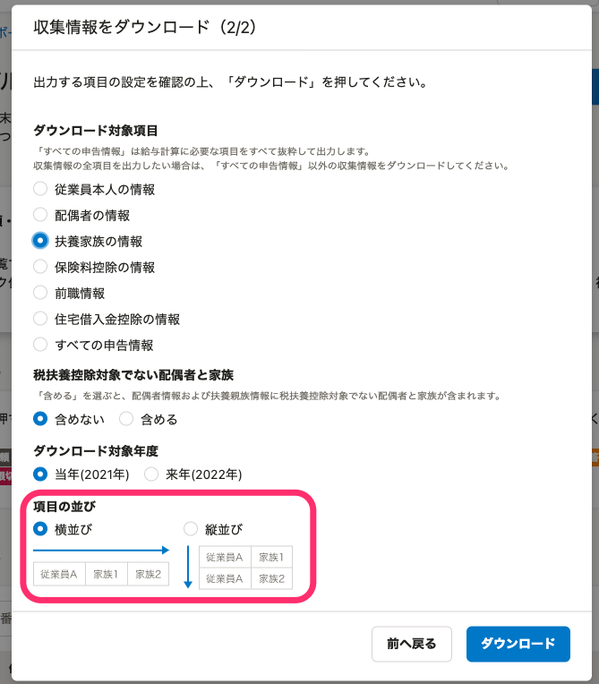

:::alert
当ページで案内しているSmartHRの年末調整機能の内容は、2021年（令和3年）版のものです。
2022年（令和4年）版の年末調整機能の公開時期は秋頃を予定しています。
なお、画面や文言、一部機能は変更になる可能性があります。
公開時期が決まり次第、[アップデート情報](https://smarthr.jp/update%E2%80%9D)でお知らせします。
:::

SmartHRの年末調整機能からダウンロードできる収集情報のうち、「扶養家族情報」のCSVファイルについて記載の項目名とその内容を説明します。

扶養家族情報のCSVファイルでは、年末調整のアンケートに入力された扶養家族にまつわる情報を一覧で確認できます。

「扶養家族情報CSV」は、特定の依頼グループ分をダウンロードする方法と、すべての依頼グループ分を一括してダウンロードする方法の2つがあります。

詳しくは以下のヘルプページをご覧ください。

[特定の依頼グループの収集情報をダウンロードする](https://knowledge.smarthr.jp/hc/ja/articles/360055844513)

[情報一括ダウンロードの使い方](https://knowledge.smarthr.jp/hc/ja/articles/4405396080025)

# CSVファイルの表示形式

扶養家族情報CSVファイルは、「横並び」「縦並び」のいずれかの表示形式を選択できます。

 **［収集情報をダウンロード］** の **［項目の並び］** から指定してください。

## 横並びを選択した場合

横並びを指定すると、1名の従業員にまつわる情報を1行で記載します。

| **氏名** | **社員番号** | **情報1** | **情報2** | **情報3** | **情報4** | **情報5** | **家族情報1** | **家族情報2** |
| --- | --- | --- | --- | --- | --- | --- | --- | --- |
| 須磨英一郎 | 100 | \~~~ | \~~~ | \~~~ | \~~~ | \~~~ | 須磨英子 | 須磨太郎 |

:::tips
横並びの場合、被扶養者の項目は従業員1名につき15個（被扶養者1〜15）表示します。
:::

## 縦並びを選択した場合

縦並びを指定すると、1名の従業員にまつわる情報を、家族情報として登録されている人数と同じ行数で記載します。

横並びでは項目名部分が「情報1」「情報2」と表記されていますが、縦並びでは数字は入らず、「情報」という項目名のみが表示されます。

例：従業員に扶養家族が3名いた場合、1従業員につき3行で情報を記載

| **氏名** | **社員番号** | **情報** | **情報** | **情報** | **情報** | **情報** |
| --- | --- | --- | --- | --- | --- | --- |
| 須磨英一郎 | 100 | \~~~ | \~~~ | \~~~ | \~~~ | \~~~ |
| 須磨英子 |   | \~~~ | \~~~ | \~~~ | \~~~ | \~~~ |
| 須磨太郎 |   | \~~~ | \~~~ | \~~~ | \~~~ | \~~~ |

# 当年（2021年）

| **項目名** | **説明** | **例** | **備考** |
| --- | --- | --- | --- |
| 依頼グループ | 依頼グループ名 | 依頼グループ1 |   |
| 依頼ステータス | 年末調整の依頼ステータスを表示 | 未依頼 | 依頼ステータス：未依頼、依頼中、入力中、回答済み、修正依頼中、再回答、確定、回答期限切れ |
| 対象外理由 | 年末調整の対象外/対象外候補と判定した理由を表示 | 源泉対象外候補 | 対象外/対象外候補理由：対象外(紙による提出)、対象外(乙欄)、対象外(退職)、対象外(給与支給なし)、対象外(源泉)、対象外(収入)、乙欄対象外候補、退職対象外候補、源泉対象外候補 |
| 社員番号 | 従業員の社員番号を表示 | 1 |   |
| 姓 | 従業員の姓 | 須磨 |   |
| 名 | 従業員の名 | 太郎 |   |
| 姓（ヨミガナ） | 従業員の姓ヨミガナ | スマ |   |
| 名（ヨミガナ） | 従業員の名ヨミガナ | タロウ |   |
| 生年月日 | 従業員の生年月日 | 1990/01/01 |   |
|   横並びの場合： 被扶養者1 マイナンバーの有無  縦並びの場合： 被扶養者 マイナンバーの有無   | 年末調整機能に被扶養者のマイナンバー情報があるかどうか | 有 |   横並びの場合、被扶養者の項目は従業員1名につき15個（被扶養者1〜15）表示します。※以下同じ  表示：有（被扶養者のマイナンバーを年末調整機能に同期している）、無（被扶養者のマイナンバーを年末調整機能に同期していない、もしくは同期しているがSmartHRに被扶養者のマイナンバーがない）   |
| 今年 扶養控除等申告書 | 今年の扶養控除等申告書が作られたかどうかを表示 | 1 | 表示：0（対象外）、1（対象） ※本人氏名、住所等情報のみの場合でも1を表示します。 |
| 配偶者控除等申告書 | 配偶者控除等申告書が作られたかどうかを表示 | 1 | 表示：0（対象外）、1（対象） |
| 所得金額調整控除申告書 | 所得金額調整控除申告書が作られたかどうかを表示 | 1 |
| 基礎控除等申告書 | 基礎控除等申告書が作られたかどうかを表示 | 1 |
| 被扶養者1 家族コード | 管理者が付与した家族を一意に指定するためのID | 1111111 |   |
| 被扶養者1 続柄 | 同左 | 長男 |   |
| 被扶養者1 性別 | 同左 | 男性 |   |
| 被扶養者1 姓 | 同左 | 須磨 |   |
| 被扶養者1 名 | 同左 | 三郎 |   |
| 被扶養者1 姓（ヨミガナ） | 同左 | スマ |   |
| 被扶養者1 名（ヨミガナ） | 同左 | サブロウ |   |
| 被扶養者1 生年月日 | 同左 | 2005/03/03 |   |
| 被扶養者1 今年 税法上の被扶養者 | 税法上の被扶養者であるかどうかを表示 | 1 | 表示：0（扶養対象としない場合）、1（税法上の扶養対象とする場合）、99（扶養状況が不明な場合） ※乙欄対象外で、来年の扶養控除等申告書のみが作られている場合でも、扶養家族登録時に「両年とも扶養する」もしくは「今年のみ扶養する」を選択した場合は、1が表示されます。 |
| 被扶養者1 今年 死亡 | 今年死亡した被扶養者である場合「1」を表示 | 1 | 表示：1（今年死亡） |
| 被扶養者1 税法上の被扶養者でなくなった日 | 今年死亡した被扶養者の、SmartHRに登録している税法上の被扶養者でなくなった日を表示 | 2020/06/30 |   |
| 被扶養者1 今年 同居・別居の別 | 同左 | 同居 | 表示：同居、別居、海外に居住 |
| 被扶養者1 今年 非居住者 | 非居住者かどうかを表示 | 0 | 表示：0（対象外）、1（対象） |
| 被扶養者1 今年 非居住者 親族関係書類の有無 | 親族関係書類が添付されているかどうかを表示 | 0 | 表示：0（無）、1（有） |
| 被扶養者1 今年 非居住者 送金関係書類の有無 | 送金関係書類が添付されているかどうかを表示 | 0 | 表示：0（無）、1（有） |
| 被扶養者1 今年 生計を一にする事実 | 送金額を表示 | 300000 |   |
| 被扶養者1 今年 住所（郵便番号） | 同左 | 143-0001 |   |
| 被扶養者1 今年 住所（都道府県） | 同左 | 東京都 |   |
| 被扶養者1 今年 住所（市区町村） | 同左 | 港区 | ※海外居住の場合はState and City。 |
| 被扶養者1 今年 住所（丁目・番地） | 同左 | 六本木 | ※海外居住の場合はAddress1。 |
| 被扶養者1 今年 住所（建物名・部屋番号） | 同左 | 六本木グランドタワー | ※海外居住の場合はAddress2。 |
| 被扶養者1 今年 住所（国コード） | 同左 | 81 |   |
| 被扶養者1 今年 障害者区分 | 同左 | 一般の障害者 | 表示：一般の障害者、特別障害者、同居特別障害者 |
| 被扶養者1 今年 障害の状態又は交付を受けている手帳などの種類 | 同左 | 身体障害者手帳3級 |   一般障害者を選択した場合：身体障害者手帳3級、身体障害者手帳4級、身体障害者手帳5級、身体障害者手帳6級、精神障害者保健福祉手帳2級、精神障害者保健福祉手帳3級、療育手帳B、その他 特別障害者を選択した場合：身体障害者手帳1級、身体障害者手帳2級、精神障害者保健福祉手帳1級、療育手帳A、その他   |
| 被扶養者1 今年 交付年月日 | 同左 | 2019/04/01 |   |
| 被扶養者1 今年 障害者手帳の画像添付の有無 | 障害者手帳の画像がアップされたかどうかについてのフラグ | 0 |   表示：0（無）、1（有） ※障害者手帳がない場合は空欄です。   |
| 被扶養者1 今年 税法上の年間所得見積額（単位: 円） | 同左 | 0 |   |
| 被扶養者1 今年 税法上の被扶養者になった日 | 同左 | 2020/04/01 |   |
| 被扶養者1 今年 税法上の被扶養者になった理由 | 同左 | 婚姻 |   |
| 被扶養者1 今年 老人扶養親族 | 老人扶養親族かどうかを表示 | 1 | 表示：0（対象外）、1（対象） |
| 被扶養者1 今年 特定扶養親族 | 特定扶養親族かどうかを表示 | 1 | 表示：0（対象外）、1（対象） |

# 来年（2022年）

| **項目名** | **説明** | **例** | **備考** |
| --- | --- | --- | --- |
| 依頼グループ | 依頼グループ名 | 依頼グループ1 |   |
| 依頼ステータス | 年末調整の依頼ステータスを表示 | 未依頼 |   依頼ステータス：未依頼、依頼中、入力中、回答済み、修正依頼中、再回答、確定、回答期限切れ   |
| 対象外理由 | 年末調整の対象外/対象外候補と判定した理由を表示 | 源泉対象外候補 | 対象外/対象外候補理由：対象外(紙による提出)、対象外(乙欄)、対象外(退職)、対象外(給与支給なし)、対象外(源泉)、対象外(収入)、乙欄対象外候補、退職対象外候補、源泉対象外候補 |
| 社員番号 | 従業員の社員番号を表示 | 1 |   |
| 姓 | 従業員の姓 | 須磨 |   |
| 名 | 従業員の名 | 太郎 |   |
| 姓（ヨミガナ） | 従業員の姓ヨミガナ | スマ |   |
| 名（ヨミガナ） | 従業員の名ヨミガナ | タロウ |   |
| 生年月日 | 従業員の生年月日 | 1990/01/01 |   |
|   横並びの場合： 被扶養者1 マイナンバーの有無  縦並びの場合： 被扶養者 マイナンバーの有無   | 年末調整機能に被扶養者のマイナンバー情報があるかどうか | 有 |   横並びの場合、被扶養者の項目は従業員1名につき15個（被扶養者1〜15）表示します。※以下同じ  表示：有（被扶養者のマイナンバーを年末調整機能に同期している）、無（被扶養者のマイナンバーを年末調整機能に同期していない、もしくは同期しているがSmartHRに被扶養者のマイナンバーがない）   |
| 来年 扶養控除等申告書 | 来年の扶養控除等申告書が作られたかどうかを表示 | 1 | 表示：0（対象外）、1（対象） ※本人氏名、住所等情報のみの場合でも1を表示します。  |
| 被扶養者1 家族コード | 管理者が付与した家族を一意に指定するためのID | 1111111 |   |
| 被扶養者1 続柄 | 同左 | 長男 |   |
| 被扶養者1 性別 | 同左 | 男性 |   |
| 被扶養者1 姓 | 同左 | 須磨 |   |
| 被扶養者1 名 | 同左 | 三郎 |   |
| 被扶養者1 姓（ヨミガナ） | 同左 | スマ |   |
| 被扶養者1 名（ヨミガナ） | 同左 | サブロウ |   |
| 被扶養者1 生年月日 | 同左 | 2005/03/03 |   |
| 被扶養者1 来年 税法上の被扶養者 | 税法上の被扶養者であるかどうかを表示 | 1 | 表示：0（扶養対象としない場合）、1（税法上の扶養対象とする場合）、99（扶養状況が不明な場合） |
| 被扶養者1 来年 同居・別居の別 | 同左 | 同居 | 表示：同居、別居、海外に居住 |
| 被扶養者1 来年 非居住者 | 非居住者かどうかを表示 | 0 | 表示：0（対象外）、1（対象） |
| 被扶養者1 来年 非居住者 親族関係書類の有無 | 親族関係書類が添付されているかどうかを表示 | 0 | 表示：0（無）、1（有） |
| 被扶養者1 来年 非居住者 送金関係書類の有無 | 送金関係書類が添付されているかどうかを表示 | 0 | 表示：0（無）、1（有） |
| 被扶養者1 来年 生計を一にする事実 | 送金額を表示 | 300000 |   |
| 被扶養者1 来年 住所（郵便番号） | 同左 | 143-0001 |   |
| 被扶養者1 来年 住所（都道府県） | 同左 | 東京都 |   |
| 被扶養者1 来年 住所（市区町村） | 同左 | 港区 | ※海外居住の場合はState and City。 |
| 被扶養者1 来年 住所（丁目・番地） | 同左 | 六本木 | ※海外居住の場合はAddress1。 |
| 被扶養者1 来年 住所（建物名・部屋番号） | 同左 | 六本木グランドタワー | ※海外居住の場合はAddress2。 |
| 被扶養者1 来年 住所（国コード） | 同左 | 81 |   |
| 被扶養者1 来年 障害者区分 | 同左 | 一般の障害者 | 表示：一般の障害者、特別障害者、同居特別障害者 |
| 被扶養者1 来年 障害の状態又は交付を受けている手帳などの種類 | 同左 | 身体障害者手帳3級 |   一般障害者を選択した場合：身体障害者手帳3級、身体障害者手帳4級、身体障害者手帳5級、身体障害者手帳6級、精神障害者保健福祉手帳2級、精神障害者保健福祉手帳3級、療育手帳B、その他 特別障害者を選択した場合：身体障害者手帳1級、身体障害者手帳2級、精神障害者保健福祉手帳1級、療育手帳A、その他   |
| 被扶養者1 来年 交付年月日 | 同左 | 2019/04/01 |   |
| 被扶養者1 来年 障害者手帳の画像添付の有無 | 障害者手帳の画像がアップされたかどうかについてのフラグ | 0 |   表示：0（無）、1（有） ※障害者手帳がない場合は空欄です。   |
| 被扶養者1 来年 税法上の年間所得見積額（単位: 円） | 同左 | 0 |   |
| 被扶養者1 来年 税法上の被扶養者になった日 | 同左 | 2020/04/01 |   |
| 被扶養者1 来年 税法上の被扶養者になった理由 | 同左 | 婚姻 |   |
| 被扶養者1 来年 老人扶養親族 | 老人扶養親族かどうかを表示 | 1 | 表示：0（対象外）、1（対象） |
| 被扶養者1 来年 特定扶養親族 | 特定扶養親族かどうかを表示 | 1 | 表示：0（対象外）、1（対象） |
