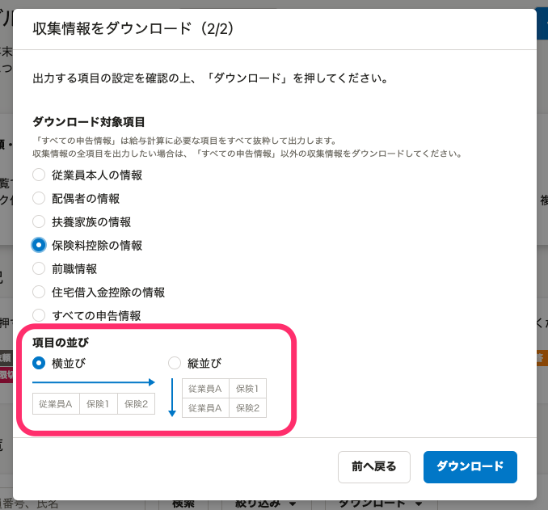

:::alert
当ページで案内しているSmartHRの年末調整機能の内容は、2021年（令和3年）版のものです。
2022年（令和4年）版の年末調整機能の公開時期は秋頃を予定しています。
なお、画面や文言、一部機能は変更になる可能性があります。
公開時期が決まり次第、[アップデート情報](https://smarthr.jp/update%E2%80%9D)でお知らせします。
:::

SmartHRの年末調整機能からダウンロードできる収集情報のうち、「保険料控除情報」のCSVファイルについて記載の項目名とその内容を説明します。

保険料控除情報のCSVファイルでは、年末調整のアンケートに入力された各種保険等、下記にまつわる情報を一覧で確認できます。

- 生命保険料（終身保険、入院保険、がん保険、所得補償保険、養老保険、学資保険など）
- 介護医療保険料
- 個人年金保険料
- 地震保険料
- 国民年金保険料（給与から控除されている厚生年金は該当しません）
- 国民健康保険料（給与から控除されている健康保険料は該当しません）
- 小規模企業共済掛金

:::tips
**CSVファイルのダウンロード方法**
「保険料控除情報CSV」は、特定の依頼グループ分をダウンロードする方法と、すべての依頼グループ分を一括してダウンロードする方法の2つがあります。
詳しくは以下のヘルプページをご覧ください。
[特定の依頼グループの収集情報をダウンロードする](https://knowledge.smarthr.jp/hc/ja/articles/360055844513)
[情報一括ダウンロードの使い方](https://knowledge.smarthr.jp/hc/ja/articles/4405396080025)
**CSVファイルの表示形式**
保険料控除情報のCSVファイルは、「横並び」「縦並び」のいずれかの表示形式を選択できます。［収集情報をダウンロード］の「項目の並び」から指定してください。

#### 「横並び」を選択した場合
- 保険情報が、保険契約ごとに横に出力されます。
- 列は、生命保険、介護保険、個人年金保険が20契約ずつ、地震保険、国民年金、国民健康保険が10契約ずつで固定されます。
#### 「縦並び」を選択した場合
- 保険情報が、保険契約ごとに縦に出力されます。
- 「縦並び」を選択した場合、下記2つのCSVファイルで構成されたZIPファイルをダウンロードします。ZIPファイルを展開して、内容を確認してください。
**年末調整\_保険料控除合計額.csv**
生保、地震、社会保険、小規模企業共済の各控除額の合計額を出力した給与計算用のファイル
**年末調整\_保険料控除内訳.csv**

契約ごとの内容を出力した確認用のファイル
:::

# 横並びの場合

| **項目名** | **説明** | **例** | **備考** |
| --- | --- | --- | --- |
| 依頼グループ | 依頼グループ名 | 依頼グループ1 |   |
| 依頼ステータス | 年末調整の依頼ステータスを表示 | 未依頼 | 依頼ステータス：未依頼、依頼中、入力中、回答済み、修正依頼中、再回答、確定、回答期限切れ |
| 対象外理由 | 年末調整の対象外/対象外候補と判定した理由を表示 | 源泉対象外候補 | 対象外/対象外候補理由：対象外(紙による提出)、対象外(乙欄)、対象外(退職)、対象外(給与支給なし)、対象外(源泉)、対象外(収入)、乙欄対象外候補、退職対象外候補、源泉対象外候補 |
| 社員番号 | 従業員の社員番号を表示 | 1 |   |
| 姓 | 従業員の姓 | 須磨 |   |
| 名 | 従業員の名 | 太郎 |   |
| 姓（ヨミガナ） | 従業員の姓ヨミガナ | スマ |   |
| 名（ヨミガナ） | 従業員の名ヨミガナ | タロウ |   |
| 生年月日 | 従業員の生年月日 | 1990/01/01 |   |
| 保険料控除申告書 | 保険料控除申告書が作られたかどうかを表示 | 1 | 表示：0（対象外）、1（対象） |
| 一般の生命保険料1〜20:保険会社等の名称 | 同左 | スマート生命 | 一般の生命保険料の項目は、従業員1名につき20個表示します。※以下同 |
| 一般の生命保険料1〜20:保険等の種類 | 同左 | エバーライフ |   |
| 一般の生命保険料1〜20:保険期間 | 同左 | 終身 |   |
| 一般の生命保険料1〜20:契約者氏名 | 同左 | 須磨太郎 |   |
| 一般の生命保険料1〜20:受取人・氏名 | 同左 | 須磨佳子 |   |
| 一般の生命保険料1〜20:受取人・続柄 | 同左 | 妻 |   |
| 一般の生命保険料1〜20:新・旧区分 | 新区分か旧区分かを表示 | 新 |  表示：新、旧 |
| 一般の生命保険料1〜20:保険料金額 | 同左 | 300000 |   |
| 一般の生命保険料1〜20:団体生命保険 | 団体保険かどうかを表示 | 1 | 表示：0（団体保険に該当しない場合）、1（団体保険に該当する場合） |
| 一般の生命保険料:新保険料等の金額の合計額 | 一般生命保険料に登録された新区分の保険料の合計額 | 40000 |   |
| 一般の生命保険料:旧保険料等の金額の合計額 | 一般生命保険料に登録された旧区分の保険料の合計額 | 40000 |   |
| 一般の生命保険料:(イ)の金額 | 保険料控除等申告書の「イ」欄に記載された金額（新合計＋旧合計と旧合計のいずれか大きい額） | 40000 |   |
| 介護医療保険料1〜20:保険会社等の名称 | 同左 | スマート生命 | 介護医療保険料の項目は、従業員1名につき20個表示します。※以下同 |
| 介護医療保険料1〜20:保険等の種類 | 同左 | エバーライフ |   |
| 介護医療保険料1〜20:保険期間 | 同左 | 1年 |   |
| 介護医療保険料1〜20:契約者氏名 | 同左 | 須磨太郎 |   |
| 介護医療保険料1〜20:受取人・氏名 | 同左 | 須磨佳子 |   |
| 介護医療保険料1〜20:受取人・続柄 | 同左 | 妻 |   |
| 介護医療保険料1〜20:保険料金額 | 同左 | 50000 |   |
| 介護医療保険料1〜20:団体生命保険 | 団体保険かどうかを表示 | 1 | 表示：0（団体保険に該当しない場合）、1（団体保険に該当する場合） |
| 介護医療保険料:金額の合計額 | 介護保険料に登録された保険料の合計額 | 50000 |   |
| 介護医療保険料:計算式に当てはめて計算した金額 |   保険料控除等申告書の「ロ」欄に記載された金額   | 10000 |   |
| 個人年金保険料1〜20:保険会社等の名称 | 同左 | スマート生命 | 個人年金保険料の項目は、従業員1名につき20個表示します。※以下同  |
| 個人年金保険料1〜20:保険等の種類 | 同左 | エバーライフ |   |
| 個人年金保険料1〜20:年金支払期間 | 同左 | 1年 |   |
| 個人年金保険料1〜20:契約者氏名 | 同左 | 須磨太郎 |   |
| 個人年金保険料1〜20:受取人・氏名 | 同左 | 須磨佳子 |   |
| 個人年金保険料1〜20:受取人・続柄 | 同左 | 妻 |   |
| 個人年金保険料1〜20:新・旧区分 | 新区分か旧区分かを表示 | 新 |  表示：新、旧 |
| 個人年金保険料1〜20:保険料金額 | 同左 | 100000 |   |
| 個人年金保険料1〜20:支払い開始日 | 同左 | 2020/03/01 |   |
| 個人年金保険料1〜20:団体生命保険 | 団体保険かどうかを表示 | 1 | 表示：0（団体保険に該当しない場合）、1（団体保険に該当する場合） |
| 個人年金保険料:新保険料の金額の合計額 | 個人年金保険料に登録された新区分の保険料の合計額 | 40000 |   |
| 個人年金保険料:旧保険料の金額の合計額 | 個人年金保険料に登録された旧区分の保険料の合計額 | 40000 |   |
| 個人年金保険料:(ハ)の金額 |   保険料控除等申告書の「ハ」欄に記載された金額   | 40000 |   |
| 生命保険料:生命保険料控除額 | 保険料控除等申告書の「イ」「ロ」「ハ」欄に記載された金額の合計額 | 100000 |   |
| 地震保険料控除1〜10:保険会社等の名称 | 同左 | スマート損保 | 地震保険料控除の項目は、従業員1名につき10個表示します。※以下同 |
| 地震保険料控除1〜10:保険等の種類 | 同左 | スマート地震 |   |
| 地震保険料控除1〜10:保険期間 | 同左 | 1年 |   |
| 地震保険料控除1〜10:契約者氏名 | 同左 | 須磨太郎 |   |
| 地震保険料控除1〜10:受取人・氏名 | 同左 | 須磨太郎 |   |
| 地震保険料控除1〜10:受取人・続柄 | 同左 | 本人 |   |
| 地震保険料控除1〜10:地震・旧長期 | 地震か旧長期かを表示 | 地震 | 表示：地震、旧長期 |
| 地震保険料控除1〜10:保険料金額 | 同左 | 80000 |   |
| 地震保険料控除1〜10:団体生命保険 | 団体保険かどうかを表示 | 1 | 表示：0（団体保険に該当しない場合）、1（団体保険に該当する場合） |
| 地震保険料:地震保険料の金額の合計額 | 地震保険料に登録された地震区分の地震保険料の合計額 | 40000 |   |
| 地震保険料:旧長期損害保険料の金額の合計額 | 地震保険料に登録された旧長期区分の地震保険料の合計額 | 40000 |   |
| 地震保険料:地震保険料控除額 | 地震保険料の控除額 | 40000 |   |
| 国民年金・国民年金基金1〜10:保険料支払先の名称 | 同左 | 日本年金機構 | 国民年金・国民年金基金の項目は、従業員1名につき10個表示します。※以下同 |
| 国民年金・国民年金基金1〜10:契約者氏名 | 同左 | 須磨太郎 |   |
| 国民年金・国民年金基金1〜10:続柄 | 同左 | 本人 |   |
| 国民年金・国民年金基金1〜10:保険料金額 | 同左 | 100000 |   |
| 国民年金・国民年金基金:保険料合計金額 | 同左 | 100000 |   |
| 国民健康保険料・介護保険料等1〜10:保険料支払先の名称 | 同左 | 港区 | 国民健康保険料・介護保険料等の項目は、従業員1名につき10個表示します。※以下同 |
| 国民健康保険料・介護保険料等1〜10:契約者氏名 | 同左 | 須磨太郎 |   |
| 国民健康保険料・介護保険料等1〜10:続柄 | 同左 | 本人 |   |
| 国民健康保険料・介護保険料等1〜10:保険料金額 | 同左 | 100000 |   |
| 国民健康保険料・介護保険料等:保険料合計金額 | 同左 | 100000 |   |
| 社会保険料:合計控除額 | 国民年金・国民年金基金および国民健康保険料・介護保険料に登録された保険料金額の合計額 | 200000 |   |
| 独立行政法人中小企業基盤整備機構の共済契約の掛金 | 同左 | 100000 |   |
| 企業型年金加入者掛金 | 同左 | 100000 |   |
| 個人型年金加入者掛金 | 同左 | 100000 |   |
| 心身障害者扶養共済制度に関する契約の掛金 | 同左 | 100000 |   |
| 小規模企業共済等掛金:合計控除額 | 独立...と企業型年金と個人型年金と心身障害者...の合計額 | 400000 |   |

# 縦並びの場合（年末調整\_保険料控除内訳.csv）

| **項目名** | **説明** | **例** | **備考** |
| --- | --- | --- | --- |
| 依頼グループ | 依頼グループ名 | 依頼グループ1 |   |
| 依頼ステータス | 年末調整の依頼ステータスを表示 | 未依頼 | 依頼ステータス：未依頼、依頼中、入力中、回答済み、修正依頼中、再回答、確定、回答期限切れ |
| 対象外理由 | 年末調整の対象外/対象外候補と判定した理由を表示 | 源泉対象外候補 | 対象外/対象外候補理由：対象外(紙による提出)、対象外(乙欄)、対象外(退職)、対象外(給与支給なし)、対象外(源泉)、対象外(収入)、乙欄対象外候補、退職対象外候補、源泉対象外候補 |
| 社員番号 | 従業員の社員番号を表示 | 1 |   |
| 姓 | 従業員の姓 | 須磨 |   |
| 名 | 従業員の名 | 太郎 |   |
| 姓（ヨミガナ） | 従業員の姓ヨミガナ | スマ |   |
| 名（ヨミガナ） | 従業員の名ヨミガナ | タロウ |   |
| 生年月日 | 従業員の生年月日 | 1990/01/01 |   |
| 保険料控除申告書 | 保険料控除申告書が作られたかどうかを表示 | 1 |   表示：0（対象外）、1（対象）   |
|   保険種別   |   保険の種別を表示   |   一般の生命保険   |   一般の生命保険、介護医療保険、個人年金保険、地震保険、国民年金・国民年金基金、国民健康保険料・介護保険料、小規模企業共済   |
|   保険会社等の名称   |   同左   |   スマート生命   |    |
|   保険等の種類   |   同左   |   エバーライフ   |    |
|   保険期間   |   同左   |   終身   |    |
|   支払い開始日   |   同左   |   2020/03/01   |    |
|   契約者氏名   |   同左   |   須磨太郎   |    |
|   保険料金額   |   同左   |   100000   |    |
|   団体保険フラグ   |   団体生命保険 団体保険かどうかを表示   |    1   |   表示：0（団体保険に該当しない場合）、1（団体保険に該当する場合）   |
|   新・旧区分   |   生命保険の場合は、新区分か旧区分かを表示  地震保険の場合は、地震保険か旧長期かを表示   |    新   |   生命保険の場合：新、旧  地震保険の場合：地震、旧長期   |
|   独立行政法人中小企業基盤整備機構の共済契約の掛金   |   同左   |   100000   |    |
|   企業型年金加入者掛金   |   同左   |   100000   |    |
|   個人型年金加入者掛金   |   同左   |   100000   |    |
|   心身障害者扶養共済制度に関する契約の掛金   |   同左   |   100000   |    |
