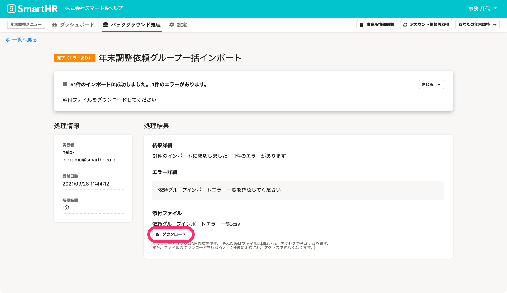
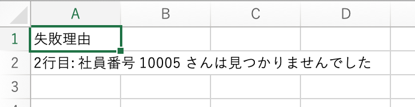
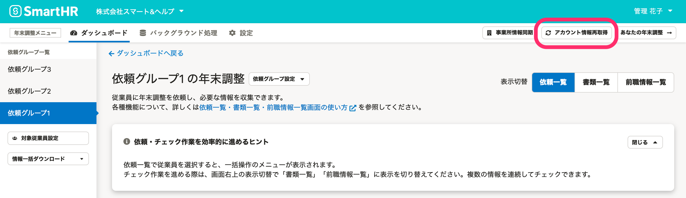
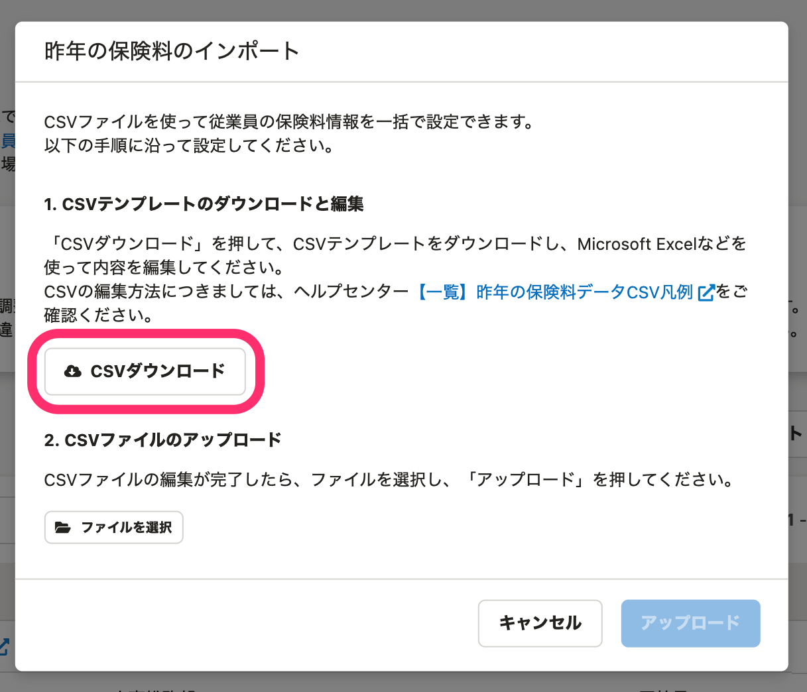
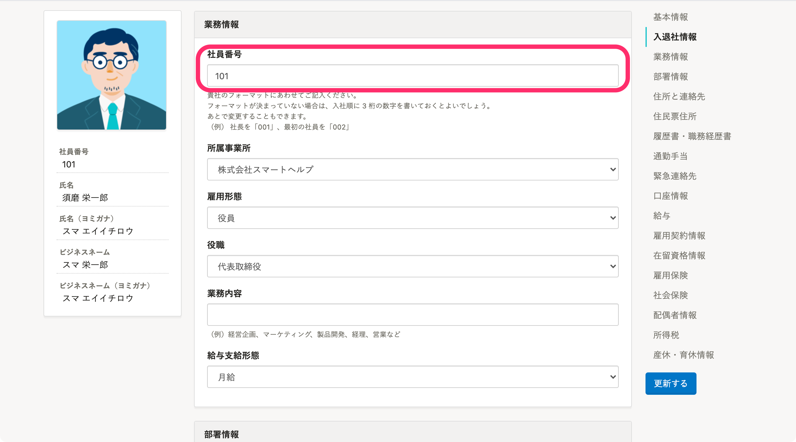
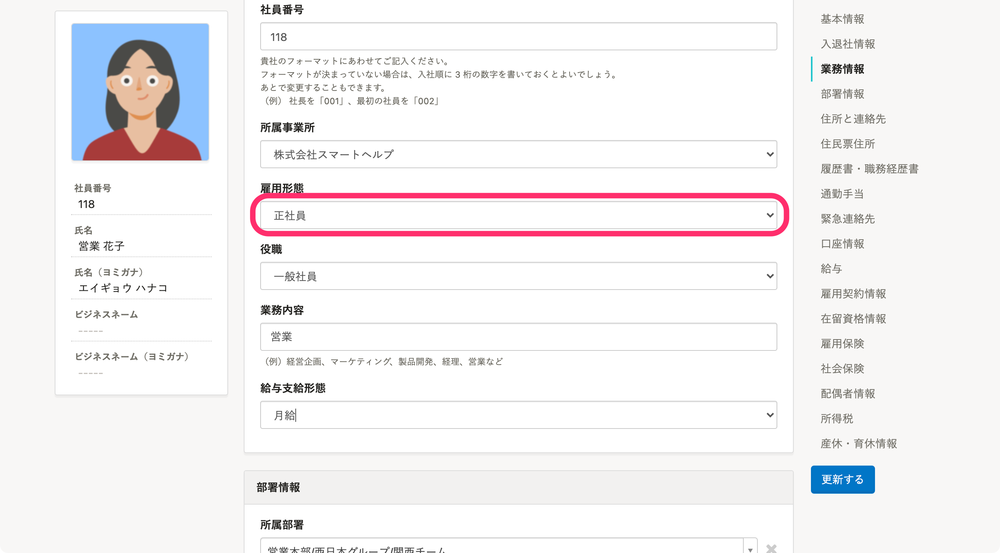
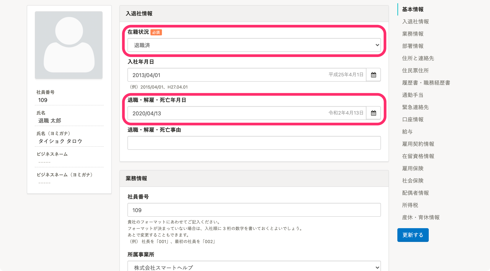

:::alert
当ページで案内しているSmartHRの年末調整機能の内容は、2021年（令和3年）版のものです。
2022年（令和4年）版の年末調整機能の公開時期は秋頃を予定しています。
なお、画面や文言、一部機能は変更になる可能性があります。
公開時期が決まり次第、[アップデート情報](https://smarthr.jp/update)でお知らせします。
:::

年末調整機能でCSVファイルのインポートや依頼グループへの従業員追加をした際に発生する主なエラーと、対処法を案内します。

:::tips
エラーメッセージは、バックグラウンド処理詳細画面からダウンロードできるファイルで確認できます。

バックグラウンド処理画面の概要や操作方法について、詳しくは以下のヘルプページをご覧ください。
[バックグラウンド処理画面の使い方](https://knowledge.smarthr.jp/hc/ja/articles/4405483938073)
:::

# 団体保険料・昨年の保険料CSVファイルのインポート時

団体保険料・昨年の保険料CSVファイルのインポート時に発生する主なエラーと対処法です。

:::related
[団体保険のデータをインポートする](https://knowledge.smarthr.jp/hc/ja/articles/360036159813)
[年末調整機能で昨年分の保険や住宅借入金控除の申告情報を表示する](https://knowledge.smarthr.jp/hc/ja/articles/360035370453)
:::

## 対象ファイル：団体保険料（すべてのファイル形式で共通）

### エラー：取り込みに失敗しました

保険会社から受け取ったDATファイルを開いたり、編集・加工したりはせず、受け取ったままの状態で再度インポートを試してください。

上記を試してもエラーが発生する場合は、CSVファイル形式でのインポートをご検討ください。

[【一覧】団体保険料データCSV凡例](https://knowledge.smarthr.jp/hc/ja/articles/360035370093)

## 対象ファイル：団体保険料（LINC形式、損保標準形式）

### エラー：原因不明なエラーが発生しました

保険会社から受け取ったファイルを加工しているかどうかによって必要な対処が異なります。

■ファイルを加工していない場合

年末調整機能の **［アカウント情報再取得］** を実行して、再度、インポートを試してください。

再度エラーが発生した場合は、保険会社に「ファイルがLINC形式または損保標準形式かどうか」を確認してください。

ファイル形式に問題がないことが確認できてもエラーが解消しない場合は、対象のバックグラウンド処理詳細のページURLを添えてチャットサポートまでお問い合わせください。

チャットサポートの利用条件や操作方法は、以下のヘルプページをご覧ください。

[チャットによるサポートを利用する](https://knowledge.smarthr.jp/hc/ja/articles/360026265673)

■ファイルを加工している場合

保険会社から受け取ったDATファイルを開いたり、編集・加工したりはせず、受け取ったままの状態で再度インポートを試してください。

上記を試してもエラーが発生する場合は、CSVファイル形式でのインポートをご検討ください。

[【一覧】団体保険料データCSV凡例](https://knowledge.smarthr.jp/hc/ja/articles/360035370093)

## 対象ファイル：団体保険料（LINC形式）

### エラー：データのフォーマットが正しくありません

保険会社から受け取ったファイルを加工しているかどうかによって必要な対処が異なります。

■ファイルを加工していない場合

年末調整機能の **［アカウント情報再取得］** を実行して、再度、インポートを試してください。

再度エラーが発生する場合は、保険会社に「ファイルがLINC形式かどうか」を確認してください。

ファイル形式に問題ないことが確認できてもエラーが解消しない場合は、対象のバックグラウンド処理詳細のページURLを添えてチャットサポートまでお問い合わせください。

チャットサポートの利用条件や操作方法は、以下のヘルプページをご覧ください。

[チャットによるサポートを利用する](https://knowledge.smarthr.jp/hc/ja/articles/360026265673)

■ファイルを加工している場合

保険会社から受け取ったDATファイルを開いたり、編集・加工したりはせず、受け取ったままの状態で再度インポートを試してください。

上記を試してもエラーが発生する場合は、CSVファイル形式でのインポートをご検討ください。

[【一覧】団体保険料データCSV凡例](https://knowledge.smarthr.jp/hc/ja/articles/360035370093)

## 対象ファイル：団体保険料（CSV形式）

### エラー：原因不明なエラーが発生しました

年末調整機能の **［アカウント情報再取得］** を実行して、再度、インポートを試してください。

それでもエラーが解消しない場合は、対象のバックグラウンド処理詳細のページURLを添えてチャットサポートまでお問い合わせください。

チャットサポートの利用条件や操作方法は、以下のヘルプページをご覧ください。

[チャットによるサポートを利用する](https://knowledge.smarthr.jp/hc/ja/articles/360026265673)

### エラー：支払い開始日の書式が不正です

 **［個人年金保険保険料n:支払い開始日］** に日付と判定できない文字の入力があります。

CSVファイルに誤りがないか確認し、再度、インポートを試してください。

### エラー：インポートするデータがありませんでした

CSVファイルに「社員番号」以外のデータが入力されていません。

該当従業員の情報を入力して、再度、インポートを試してください。

### エラー：該当する従業員が見つかりませんでした

CSVファイルに「SmartHRに登録されている社員番号と一致する従業員情報」がありません。

正しい社員番号を入力して、再度、インポートを試してください。

:::alert
### バックグラウンド処理詳細画面からダウンロードできるファイルで確認できないエラー
「一般の生命保険料・介護医療保険料・個人年金保険料」に3種類合計で21個以上、「地震保険料控除」に合計11個以上の情報が入ったCSVファイルをインポートすると、収集情報の **［保険情報］** がエラーになり、操作できなくなります。
このエラーはダウンロードしたエラー内容のファイルには記載がなく、収集情報画面でしか確認できません。
エラーが発生して操作できなくなった場合は、一度、インポートした団体保険料を削除してください。
再度インポートを試す際には、「一般の生命保険料・介護医療保険料・個人年金保険料」に3種類合計で21個以上、「地震保険料控除」に合計11個以上の情報が入っていないことを確認のうえ、操作してください。
:::

## 対象ファイル：昨年の保険料

### エラー：不正なヘッダが含まれています

CSVファイルのヘッダに誤りがないか確認し、再度、インポートを試してください。

ヘッダを含んだサンプルファイルは、 **［昨年の保険料のインポート］** 画面にある **［CSVダウンロード］** からダウンロードできます。

:::related
[【一覧】昨年の保険料データCSV凡例](https://knowledge.smarthr.jp/hc/ja/articles/360035370113)
:::

### エラー：社員番号nに対する「一般の生命保険料・介護医療保険料・個人年金保険料」の件数が多すぎます

「一般の生命保険料・介護医療保険料・個人年金保険料」に合計21個以上、「地震保険料控除」に合計11個以上の情報が入ったCSVファイルをインポートすると、収集情報の **［保険情報］** がエラーになり、操作できなくなります。

また、このエラーはダウンロードしたエラー内容のファイルには記載がなく、収集情報画面でしか確認できません。

エラーが発生して操作できなくなった場合は、一度、インポートした団体保険料を削除してください。

再度インポートを試す際には、「一般の生命保険料・介護医療保険料・個人年金保険料」に合計21個以上、「地震保険料控除」に合計11個以上の情報が入っていないことを確認のうえ、操作してください。

# 従業員情報の同期時

## エラー：アカウントが未設定です

SmartHRに登録している従業員情報に紐づくアカウント（メールアドレスアカウントまたは社員番号アカウント）がないためエラーが発生しています。

対象の従業員をSmartHRに招待するか、社員番号アカウントを作成してから、再度、従業員情報の同期を試してください。

[従業員をSmartHRに招待する](https://knowledge.smarthr.jp/hc/ja/articles/360026264133)

[社員番号アカウントを作成する](https://knowledge.smarthr.jp/hc/ja/articles/360026263373)

## エラー：原因不明なエラーが発生しました

年末調整機能の **［アカウント情報再取得］** を実行し、再度、従業員情報の同期を試してください。

それでも解消しない場合は、対象のバックグラウンド処理詳細のページURLを添えてチャットサポートまでお問い合わせください。

チャットサポートの利用条件や操作方法は、以下のヘルプページをご覧ください。

[チャットによるサポートを利用する](https://knowledge.smarthr.jp/hc/ja/articles/360026265673)

## エラーは発生していないが、同期されていない場合

以下いずれかの原因が考えられます。

### 社員番号が登録されていない

SmartHRの **［従業員リスト］** で対象の従業員情報編集ページを開き、 **［業務情報］ > ［社員番号］** に社員番号を登録し、再度、従業員情報の同期を試してください。

### 年末調整の対象にならない雇用形態（業務委託・派遣社員）が指定されている

SmartHRの **［従業員リスト］** で対象の従業員情報編集ページを開き、 **［業務情報］>［雇用形態］** を「業務委託」または「派遣社員」以外に変更し、再度、従業員情報の同期を試してください。

### 在籍状況が「退職済」になっている、または［退職・解雇・死亡年月日］に過去の日付が登録されている

SmartHRの **［従業員リスト］** で対象の従業員情報編集ページを開き、以下のとおり情報が登録されているか確認のうえ、再度、従業員情報の同期を試してください。

-  **［入退社情報］>［在籍状況］** が「在籍中」または「休職中」
    - 在籍状況を変更する場合、追加利用料金が発生する可能性があります
-  **［入退社情報］>［退職・解雇・死亡年月日］** が「空欄」または「未来の日付」

# マイナンバー同期時

## エラー：マイナンバーはシステムエラーにより取り込みに失敗しました

SmartHRから年末調整機能にマイナンバー情報を取り込むにあたり、何らかのシステムエラーが発生しています。
ユーザーさまで対処できない事象のため、対象のバックグラウンド処理詳細のページURLを添えてチャットサポートまでお問い合わせください。

チャットサポートの利用条件や操作方法は、以下のヘルプページをご覧ください。

[チャットによるサポートを利用する](https://knowledge.smarthr.jp/hc/ja/articles/360026265673)

# 依頼グループへの従業員追加時

## エラー：アカウントが未設定です

SmartHRに登録している従業員情報に紐づくアカウント（メールアドレスアカウントまたは社員番号アカウント）がないためエラーが発生しています。

対象の従業員をSmartHRに招待するか、社員番号アカウントを作成してから、再度、追加を試してください。

[従業員をSmartHRに招待する](https://knowledge.smarthr.jp/hc/ja/articles/360026264133)

[社員番号アカウントを作成する](https://knowledge.smarthr.jp/hc/ja/articles/360026263373)

## エラー：雇用形態が「業務委託」「派遣社員」です

SmartHRの **［従業員リスト］** で対象の従業員情報編集ページを開き、 **［業務情報］>［雇用形態］** を「業務委託」または「派遣社員」以外に変更し、再度、追加を試してください。

## エラー：従業員が見つかりませんでした

CSVファイルに「SmartHRに登録されている社員番号と一致する従業員情報」がないため、エラーが発生しています。

正しい社員番号を入力して、再度、追加を試してください。

:::tips
社員番号が0からはじまっている場合は、CSVファイルに入力している社員番号の先頭の「0」が消えていないか（ゼロ落ちしていないか）確認してください。
また、書式は「文字列」に設定し、「0」がある状態のデータで追加してください。
:::

## エラー：原因不明なエラーが発生しました

年末調整機能の **［アカウント情報再取得］** を実行して、再度、追加を試してください。

それでも解消しない場合は、対象のバックグラウンド処理詳細のページURLを添えてチャットサポートまでお問い合わせください。

チャットサポートの利用条件や操作方法は、以下のヘルプページをご覧ください。

[チャットによるサポートを利用する](https://knowledge.smarthr.jp/hc/ja/articles/360026265673)

## エラーは発生していないが、追加されていない場合

在籍状況が **［退職済み］** になっていることが原因として考えられます。

SmartHRの **［従業員リスト］** で対象の従業員情報編集ページを開き、以下のとおり情報が登録されているか確認のうえ、再度、従業員情報の同期を試してください。

-  **［入退社情報］>［在籍状況］** が「在籍中」または「休職中」
    - 在籍状況を変更する場合、追加利用料金が発生する可能性があります
-  **［入退社情報］>［退職・解雇・死亡年月日］** が「空欄」または「未来の日付」

# ヒントメッセージ設定時

## エラー：原因不明なエラーが発生しました

年末調整機能の **［アカウント情報再取得］** を実行して、再度、インポートを試してください。

それでも解消しない場合は、対象のバックグラウンド処理詳細のページURLを添えてチャットサポートまでお問い合わせください。

チャットサポートの利用条件や操作方法は、以下のヘルプページをご覧ください。

[チャットによるサポートを利用する](https://knowledge.smarthr.jp/hc/ja/articles/360026265673)
