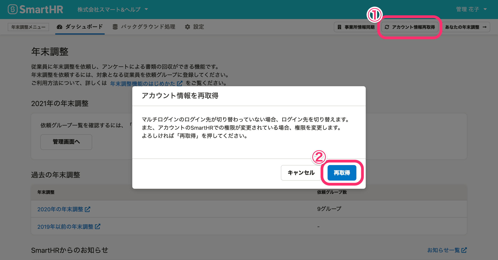
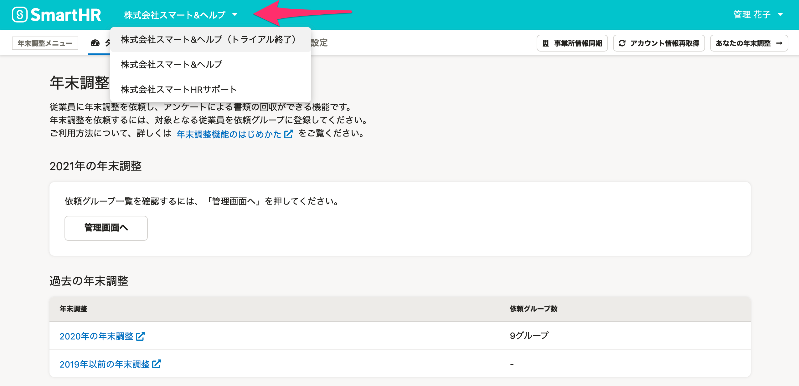

:::alert
当ページで案内しているSmartHRの年末調整機能の内容は、2021年（令和3年）版のものです。
2022年（令和4年）版の年末調整機能の公開時期は秋頃を予定しています。
なお、画面や文言、一部機能は変更になる可能性があります。
公開時期が決まり次第、[アップデート情報](https://smarthr.jp/update)でお知らせします。
:::

# A. 表示されている画面によって原因と対処法が異なります。

## 他の従業員の年末調整画面が表示されている場合

原因として、直前に共有端末を利用していた方がSmartHRをログアウトしていないことが考えられます。

共有端末での利用については、以下の注意点があります。

:::alert
共有端末でのクラウドサービスの利用は、場合によっては不具合が生じる可能性があり、推奨していません。
共有端末を利用したことに関する情報漏洩・不利益などの一切の損害については、弊社では責任を負いかねますのでご了承ください。
[共有端末でのSmartHR利用の際の注意点](https://knowledge.smarthr.jp/hc/ja/articles/360057452354)
:::

### 対処法

年末調整メニューの **［アカウント情報再取得］** をクリックし、確認画面で **［再取得］** をクリックしてください。

アカウントにを現在ログインしているアカウントに切り替えます。

## 自社とは違う企業の年末調整画面が表示されている場合

原因として、複数の企業でSmartHRを利用している「マルチログインアカウント」の方が、ログイン先の企業アカウントを変更できていないことが考えられます。

:::related
[マルチログインアカウントとは](https://knowledge.smarthr.jp/hc/ja/articles/360026262853)
:::

### 対処法

年末調整画面上部に表示されている **［会社名］** をクリックすると、プルダウンメニューに企業アカウントが表示されます。

ログイン先の企業アカウントを選択し、画面表示を切り替えます。

#### それでも企業アカウントの切り替えが反映されない場合

企業アカウントを切り替えてログインしていても、年末調整機能に企業アカウントの切り替えが反映されない場合があります。

この場合は、年末調整メニューの **［アカウント情報再取得］** をクリックし、確認画面で **［再取得］** をクリックして企業アカウントを切り替えてください。

