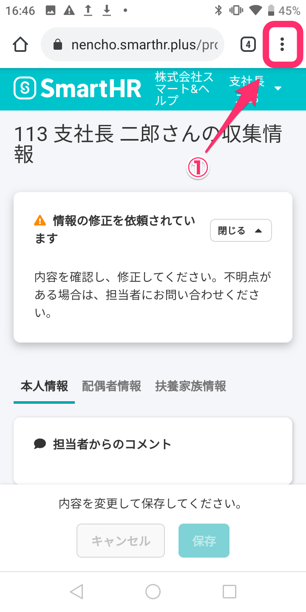
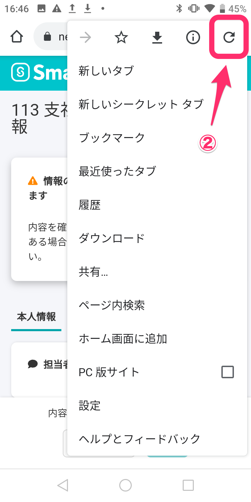
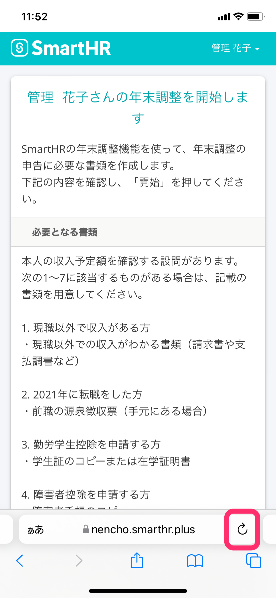
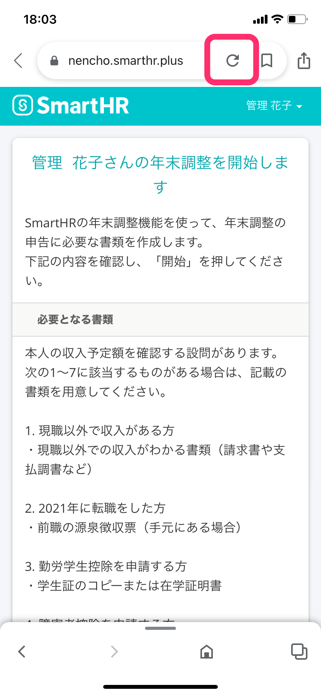
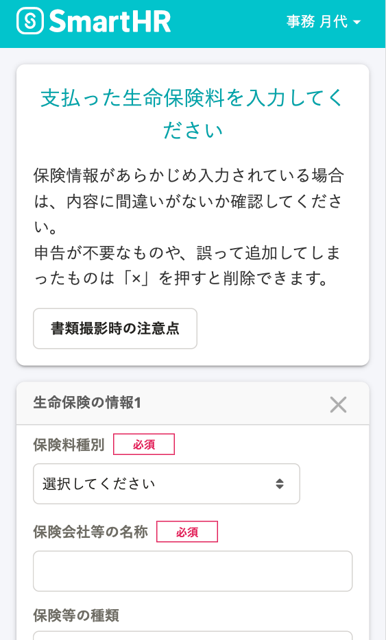
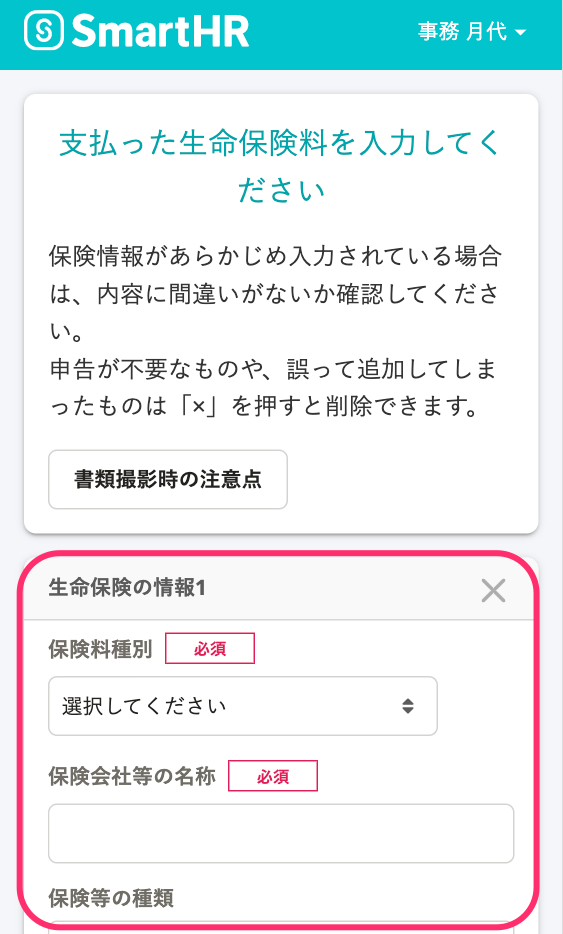
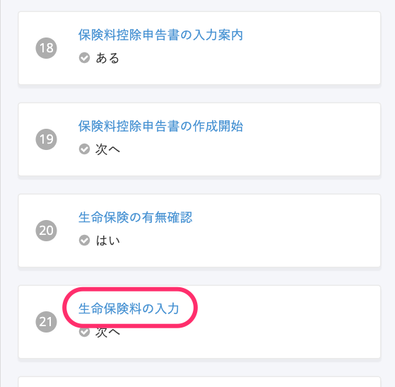
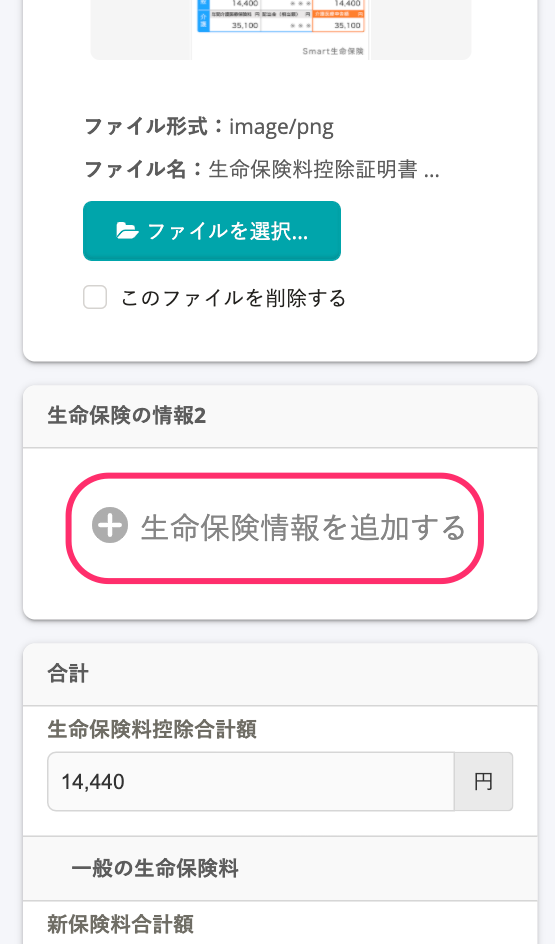

:::alert
当ページで案内しているSmartHRの年末調整機能の内容は、2021年（令和3年）版のものです。
2022年（令和4年）版の年末調整機能の公開時期は秋頃を予定しています。
なお、画面や文言、一部機能は変更になる可能性があります。
公開時期が決まり次第、[アップデート情報](https://smarthr.jp/update%E2%80%9D)でお知らせします。
:::

# A. SmartHRの動作環境で利用しているか確認のうえ、ブラウザのリロード（再読込）をお試しください。

年末調整のアンケート内「生命保険などの情報入力」画面で同事象が発生してしまう場合は、「生命保険などの情報入力画面で同事象が発生する場合」に記載の内容をお試しください。

# 動作環境の確認

SmartHRの動作環境については、下記のヘルプページを参照してください。

:::related
[SmartHRの動作環境は？](https://knowledge.smarthr.jp/hc/ja/articles/360035170054)
:::

# アップロードできるファイル形式とサイズ

年末調整機能でアップロードできるファイルの形式とサイズは以下の通りです。

:::tips
年末調整機能では、1つのページで一度に保存できるサイズの上限を30MBとしています。
例：収集情報画面で「生命保険等の証明書」と「住宅ローン控除の必要書類」の画像を添付して保存する場合や、年末調整のアンケート画面で「生命保険等の証明書」を複数添付して次の設問に進む場合などは、添付画像のファイルサイズの合計は30MB以下である必要があります。
:::

| 項目 | ファイル形式 | 一度に保存できるサイズ上限 |
| :-- | :-- | :-- |
| 生命保険等の証明書 | jpeg（jpg）, png, pdf | 30MB |
| 源泉徴収票 | jpeg（jpg）, png, pdf |
| 障害者手帳 | jpeg（jpg）, png, pdf |
| 勤労学生の学生手帳 | jpeg（jpg）, png, pdf |
| 配偶者や扶養家族が海外居住の場合の必要書類 | jpeg（jpg）, png, pdf |
| 住宅ローン控除の必要書類 | jpeg（jpg）, png, pdf |

# ブラウザのリロード（再読込）方法

スマートフォンでのリロード（再読込）方法を案内します。

※ 端末によっては別の方法となる場合があります。

## Google Chrome（Android）

### 1.［︙］メニューをタップ

### 2.［更新ボタン］をタップ

## Safari（iPhone）

### ［更新ボタン］をタップ

## Google Chrome（iPhone）

### ［更新ボタン］をタップ

# 生命保険などの情報入力画面で同事象が発生する場合

以下の設問で同事象が発生する場合も、SmartHRの動作環境の確認と、ブラウザのリロード（再読込）をお試しください。

- 「支払った生命保険料を入力してください」
- 「支払った地震保険料を入力してください」
- 「個人で支払った国民年金・国民年金基金・国民健康保険・介護保険料の保険料を入力してください」
- 「掛金を入力してください」

例：「支払った生命保険料を入力してください」の設問

## 生命保険などの情報を複数入力しようとしている場合

動作環境であっても、利用端末のスペックや通信環境、画像データのサイズによっては同様の事象が起こることがあります。

その場合は、次に案内する、生命保険などの情報を1つずつ入力・保存を繰り返す方法を試してください。

それでも改善しない場合は、お手数ですがパソコンやタブレットなど他の端末を利用してアンケートを回答してください。

:::tips
生命保険料の入力を例に操作手順を案内していますが、その他の保険の場合も操作手順は同じです。
:::

### 1.［生命保険の情報1］をすべて入力し、画面最下部にある［次へ］をタップ

 **［生命保険の情報1］** をすべて入力し、 **［次へ］**  をタップすると次の設問が表示されます。

### 2\. 回答履歴の［生命保険料入力］をタップ

次の設問には回答せず、画面下にある回答履歴の **［生命保険料入力］** をタップして、生命保険料を入力する設問に戻ります。（パソコン利用の場合、回答履歴は画面の左側にあります。）

### 3.［＋生命保険情報を追加する］をタップし、［生命保険の情報2］を入力して［次へ］をタップ

 **［＋生命保険情報を追加する］** をタップし、生命保険情報を入力して **［次へ］** をタップしてください。

生命保険情報が3つ以上ある場合は、手順2と3を繰り返し、生命保険情報を1つずつ入力・保存してください。
