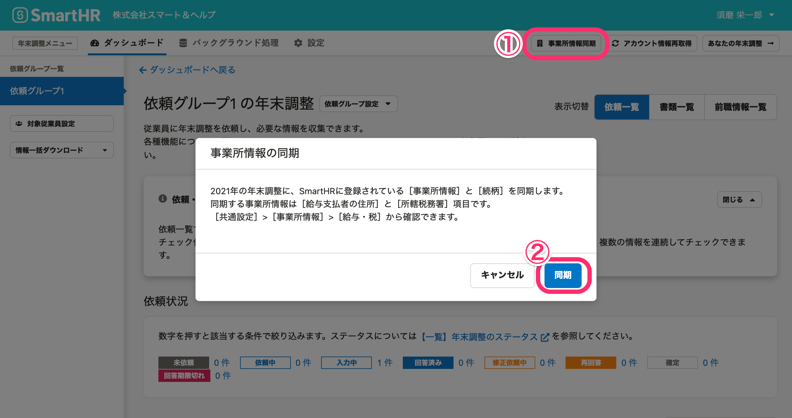

:::alert
当ページで案内しているSmartHRの年末調整機能の内容は、2021年（令和3年）版のものです。
2022年（令和4年）版の年末調整機能の公開時期は秋頃を予定しています。
なお、画面や文言、一部機能は変更になる可能性があります。
公開時期が決まり次第、[アップデート情報](https://smarthr.jp/update)でお知らせします。
:::

# A. はい、 増やせます。

下記ヘルプページを参照して、SmartHRに任意の続柄を追加設定してください。

そのあとに、年末調整メニューにある **［事業所情報同期］>［同期］** をクリックすると、追加した続柄が年末調整機能に反映されます。

:::related
[続柄のマスターデータを管理する](https://knowledge.smarthr.jp/hc/ja/articles/360026104434)
:::

