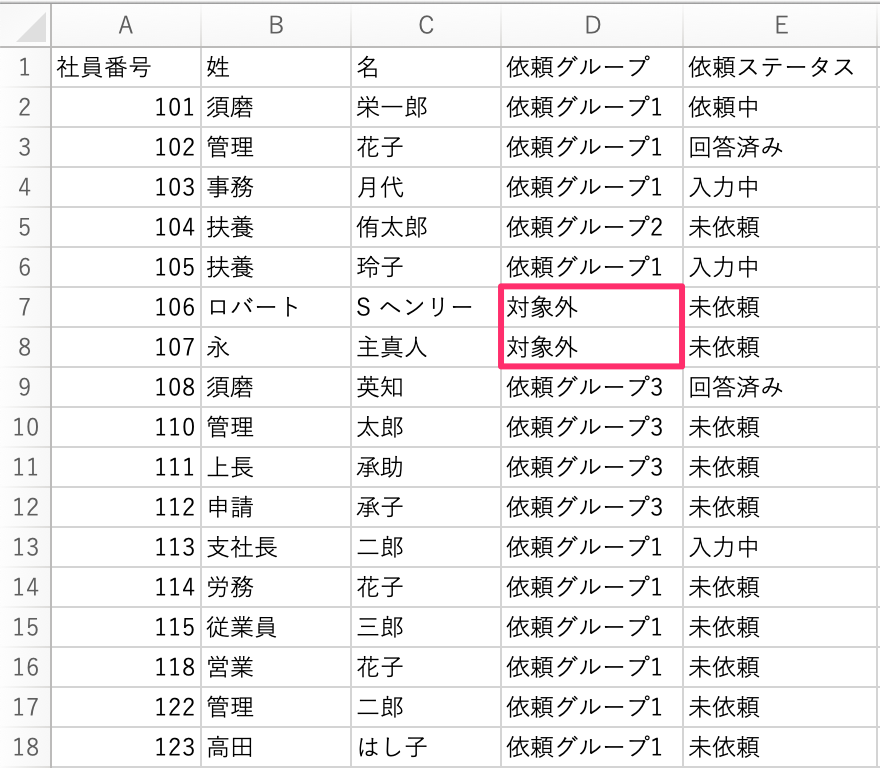

:::alert
当ページで案内しているSmartHRの年末調整機能の内容は、2021年（令和3年）版のものです。
2022年（令和4年）版の年末調整機能の公開時期は秋頃を予定しています。
なお、画面や文言、一部機能は変更になる可能性があります。
公開時期が決まり次第、[アップデート情報](https://smarthr.jp/update)でお知らせします。
:::

# A. 年末調整の対象外設定をして年末調整の依頼ができないようにするか、削除したい従業員をまとめた依頼グループを作成して管理してください。

従業員情報を同期すると、削除した従業員が新しい依頼グループに入った状態で追加されます。

年末調整の依頼一覧に従業員を表示させたくない（年末調整の対象としたくない）場合は、従業員の削除ではなく、以下いずれかの対応をお願いします。

## 年末調整の対象外とする

従業員を対象外にする方法は、下記のヘルプページをご覧ください。

:::related
[従業員を年末調整の「対象外」にする](https://knowledge.smarthr.jp/hc/ja/articles/360039790773)
:::

該当する理由がない場合は、任意の対象外理由を設定してください。

対象外になった従業員には、年末調整の依頼はされません。

## 削除したい従業員をまとめた依頼グループを作成して管理する

従業員は1つの依頼グループに入っていると他のグループに表示されないため、削除したい従業員をまとめた依頼グループを作成して管理する方法もあります。

### 1.［対象従業員設定］をクリック

 **［対象従業員設定］** をクリックします。

### 2.［ダウンロード］をクリック

画面中央にある **［ダウンロード］** をクリックすると、 **［従業員一覧のダウンロード］** というダイアログが表示されます。

 **［ダウンロード］** をクリックすると、バックグラウンド処理が始まります。

年末調整メニューの **［バックグラウンド処理］>［依頼名］** をクリックすると処理結果の画面に移動します。

添付ファイル項目の下にある **［ダウンロード］** をクリックしてCSVファイルをダウンロードします。

### 3\. CSVファイルを編集する

CSVファイルを開き、対象外としたい従業員の依頼グループ列に **「依頼グループ名（例：対象外 等）」** を入力します。

依頼グループ列に入力した依頼グループ名が、新しい依頼グループとして登録されます。

:::alert
依頼グループの変更ができるのは、依頼ステータスが「未依頼」の従業員です。
:::

### 4\. CSVファイルをインポートする

画面右側にある **［インポート▼］>［依頼グループをインポート］** をクリックします。

 **［ファイルを選択］** をクリックし、編集したCSVファイルを添付します。

 **［アップロード］** をクリックすると、バックグラウンド処理が始まります。

バックグラウンド処理の状況は、先ほどと同じ手順で確認してください。

バックグラウンド処理の完了後、 **［依頼グループ一覧］** にCSVファイルで指定した依頼グループ（対象外）が作成され、従業員が割り振られたことが確認できます。

依頼グループに振り分けた従業員は、「未依頼」のままにしておく、従業員を全選択して対象外の設定をするなど、貴社の運用にあわせて管理してください。
