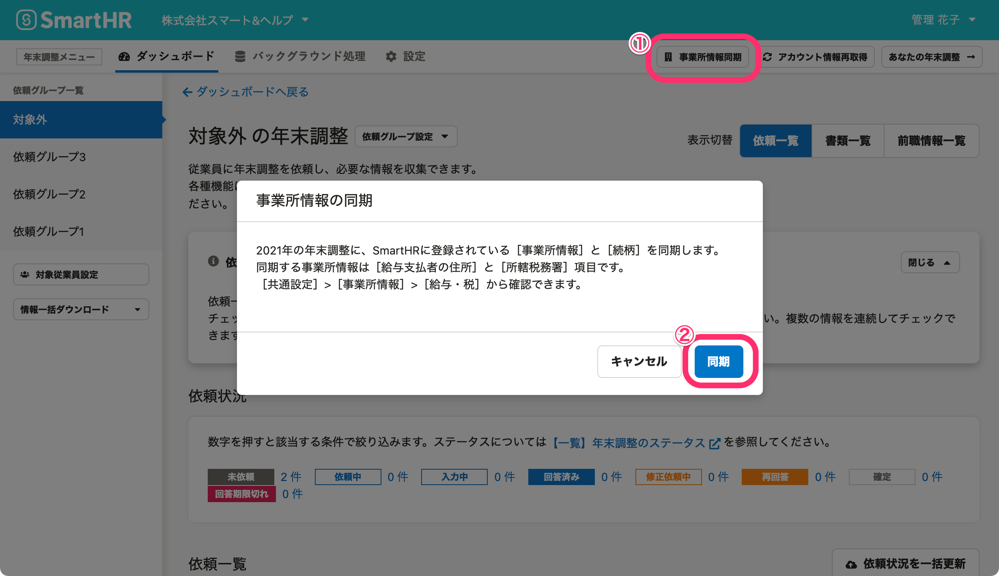

:::alert
当ページで案内しているSmartHRの年末調整機能の内容は、2021年（令和3年）版のものです。
2022年（令和4年）版の年末調整機能の公開時期は秋頃を予定しています。
なお、画面や文言、一部機能は変更になる可能性があります。
公開時期が決まり次第、[アップデート情報](https://smarthr.jp/update)でお知らせします。
:::

# A. いいえ、自動で反映されません。年末調整の依頼グループ作成後に、事業所情報や従業員情報を変更した場合、下記の手順で最新の情報を反映させる必要があります。

## 事業所情報を変更した場合

事業所情報を変更した場合は、手動で更新する必要があります。

年末調整メニューの右側にある［ **事業所情報同期］** をクリックすると、 **［事業所情報の同期］** 画面が表示されるので **［同期］** をクリックします。

事業所情報の住所や管轄は、 **［共通設定］>［事業所情報］>［給与・税］** に登録されている情報が反映されます。

:::related
[年末調整の書類に反映される事業所情報を確認する](https://knowledge.smarthr.jp/hc/ja/articles/360035342214)
:::

## 従業員情報を変更した場合

年末調整機能内の従業員情報を最新にする方法は、2つあります。

年末調整のアンケートに含まれない内容の場合、管理者が従業員情報を同期する必要があります。

### 年末調整のアンケートに従業員が回答して修正する

生年月日や住所など、年末調整のアンケートに含まれる内容を変更する場合は、従業員が年末調整のアンケートで最新の情報を入力すると修正できます。

### 対象となる従業員を削除し、従業員情報を同期する

管理者側で事前に修正が必要な場合は、依頼グループから対象の従業員の依頼を一度削除し、再度、従業員情報を同期することで、追加時点での情報に更新できます。

削除と同期の手順は、下記のヘルプページをご覧ください。

:::related
[年末調整の依頼一覧から従業員を削除する](https://knowledge.smarthr.jp/hc/ja/articles/360035370413)
:::
