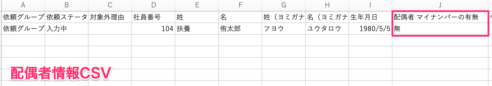

:::alert
当ページで案内しているSmartHRの年末調整機能の内容は、2021年（令和3年）版のものです。
2022年（令和4年）版の年末調整機能の公開時期は秋頃を予定しています。
なお、画面や文言、一部機能は変更になる可能性があります。
公開時期が決まり次第、[アップデート情報](https://smarthr.jp/update)でお知らせします。
:::

# A. 収集情報CSVファイルで確認できます。

マイナンバーの同期を実行したか（マイナンバーを年末調整機能に取り込んでいるか）は、収集情報CSVファイルの **［マイナンバーの有無］** 項目の結果で確認できます。

本人情報CSV、配偶者情報CSV、扶養家族情報CSVのいずれかのCSVファイルを確認してください。

| **マイナンバーの取り込み状況を確認したい対象** | **対象CSVファイル名** | **対象項目名** |
| --- | --- | --- |
|   本人のマイナンバー   |   本人情報CSV（今年、来年）   | マイナンバーの有無 |
| 配偶者のマイナンバー | 配偶者情報CSV（今年、来年） | 配偶者 マイナンバーの有無 |
| 扶養家族のマイナンバー | 扶養家族情報CSV（今年、来年） | 扶養家族 マイナンバーの有無 |

対象項目に「有」と表示されている場合、対象者のマイナンバーを年末調整機能に同期しています。

「無」と表示されている場合は、対象者マイナンバーを年末調整機能に同期していない、もしくは同期しているがSmartHRにマイナンバーがありません。

:::alert
**SmartHRにマイナンバーがない状態でも対象項目に「有」と表示される場合があります**
年末調整機能の仕様上、一度同期したマイナンバーは年末調整機能から削除できません。
年末調整機能にマイナンバーを同期したあと、SmartHRからマイナンバーを削除しても、収集情報CSVファイルのマイナンバーの有無項目には「有」と表示されます。
マイナンバーの同期後にマイナンバーを削除した従業員がいる場合は注意してください。
:::

例：配偶者情報CSVの **［配偶者 マイナンバーの有無］** 項目

収集情報CSVファイルのダウンロード手順は以下のヘルプページを参照してください。

[特定の依頼グループの収集情報をダウンロードする](https://knowledge.smarthr.jp/hc/ja/articles/360055844513)

[情報一括ダウンロードの使い方](https://knowledge.smarthr.jp/hc/ja/articles/4405396080025)

マイナンバーを年末調整機能に同期するための設定や手順は以下のヘルプページを参照してください。

[Q. マイナンバーを年末調整の書類に印字できますか？](https://knowledge.smarthr.jp/hc/ja/articles/360037874034)
