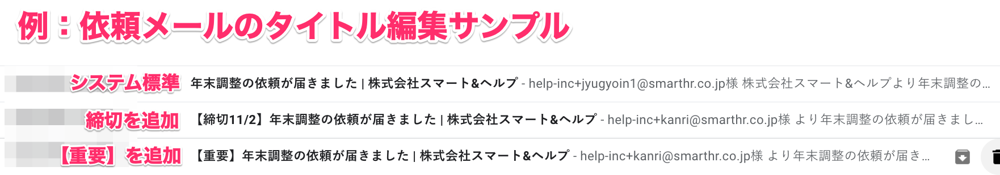
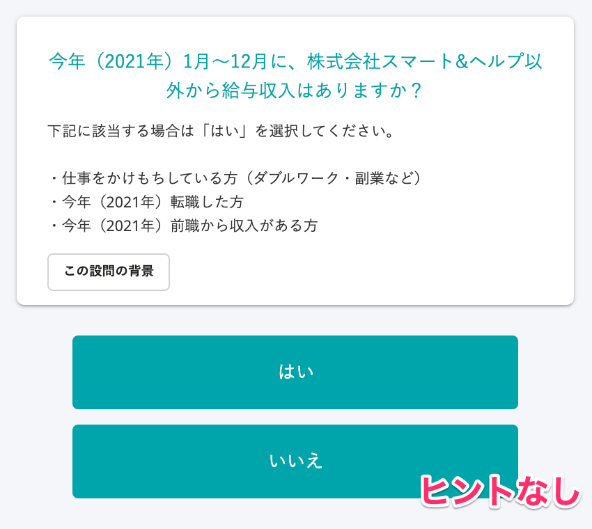
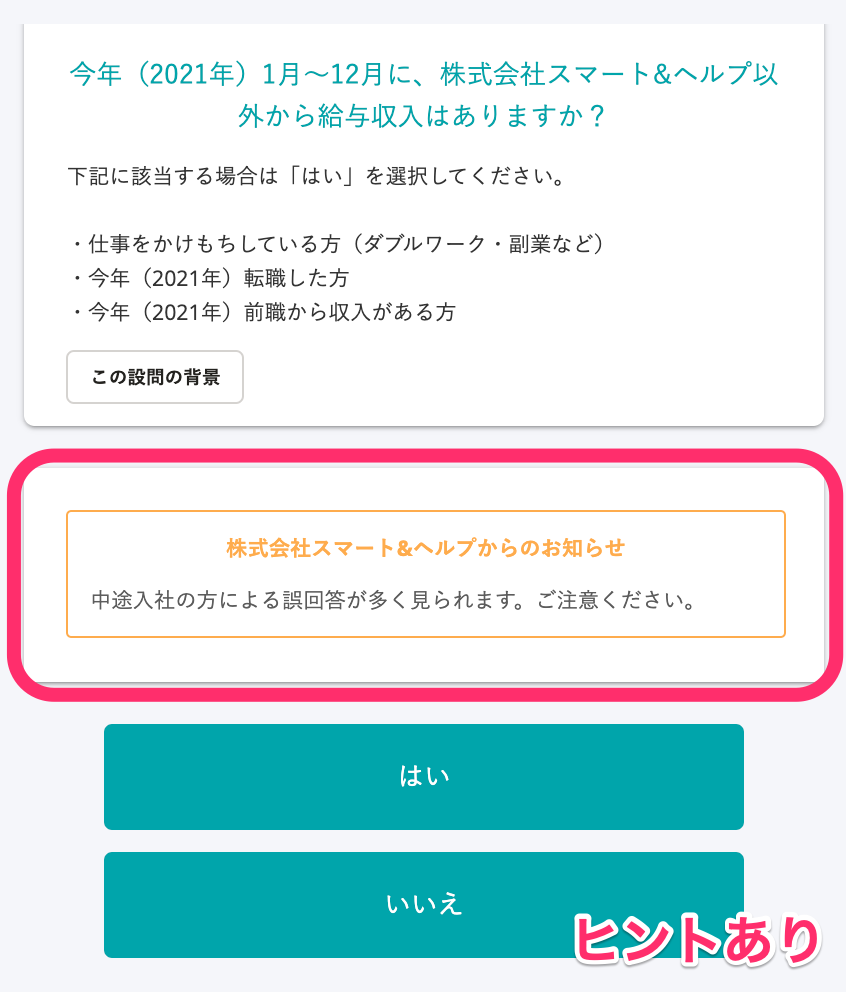
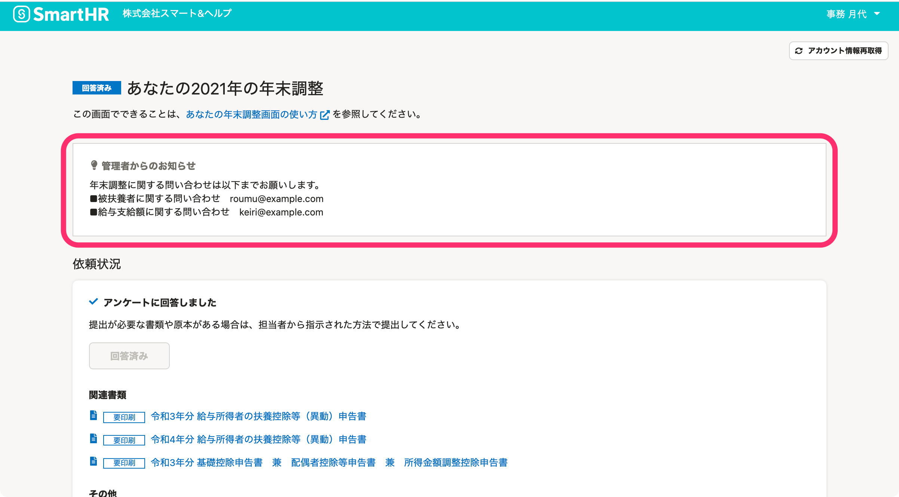

:::alert
当ページで案内しているSmartHRの年末調整機能の内容は、2021年（令和3年）版のものです。
2022年（令和4年）版の年末調整機能の公開時期は秋頃を予定しています。
なお、画面や文言、一部機能は変更になる可能性があります。
公開時期が決まり次第、[アップデート情報](https://smarthr.jp/update)でお知らせします。
:::

# A. はい、年末調整に関する連絡事項を従業員へ伝える方法は、3通りあります。

用途にあわせてご活用ください。

## 通知（メール）を編集する

依頼グループ名横の **［依頼グループ設定▼］>［メールフォーマット設定］** から、従業員へ送付される通知内容を編集できます。

編集できる通知は下記の通りです。

- 依頼通知（担当者が従業員に年末調整の依頼をしたときに送付）
- 確定通知（担当者が年末調整を確定したタイミングで送付）
- 依頼再通知（担当者が従業員に依頼の再通知をしたときに送付）
- 未提出通知（担当者が設定した締め切りまでに、年末調整の提出がなかったときに送付）

:::tips
メールタイトルに「締切日」や「【重要】」というキーワードを入れると、従業員に締切や重要度がより伝わり、効果的です。

:::

詳しくは下記のヘルプページをご覧ください。

:::related
[年末調整の通知設定をする](https://knowledge.smarthr.jp/hc/ja/articles/360053201294)
[年末調整の再通知と締切を設定する](https://knowledge.smarthr.jp/hc/ja/articles/360037373434)
[【一覧】年末調整機能で届く通知（メール）の内容](https://knowledge.smarthr.jp/hc/ja/articles/360039321893)
:::

## アンケート画面にヒントメッセージを設定する

依頼グループ名横の **［依頼グループ設定▼］>［アンケートのヒントメッセージ設定］** または **［アンケートのヒントメッセージ一括設定（CSV）］** から、年末調整のアンケート画面に、任意のヒントメッセージを設定できます。

アンケート回答時の注意事項や、企業独自の特記事項がある場合にヒントメッセージをご活用ください。

なお、ヒントメッセージはすべての設問に設定可能です。

:::tips
ヒントメッセージを活用すると、アンケートの差し戻しや従業員からの問い合わせ減少などの効果を見込めます。

:::

設問ごとにヒントメッセージを設定する方法と、CSVファイルで一括設定する方法があります。

詳しくは下記のヘルプページをご覧ください。

:::related
[アンケート画面のヒントを追加・編集する](https://knowledge.smarthr.jp/hc/ja/articles/360034870854)
:::

## 従業員ダッシュボードに管理者からのお知らせを表示する

依頼グループ名横の **［依頼グループ設定▼］>［管理者からのお知らせ設定］** から、従業員ダッシュボードに常時表示する「管理者からのお知らせ」を設定できます。

:::tips
社内の問い合わせ窓口の案内、原本の提出締切日の周知など、従業員から問い合わせが多い内容を掲示することをおすすめします。
:::

詳しくは下記のヘルプページをご覧ください。

:::related
[従業員の年末調整画面に管理者からのお知らせを設定する](https://knowledge.smarthr.jp/hc/ja/articles/360053347974)
:::
