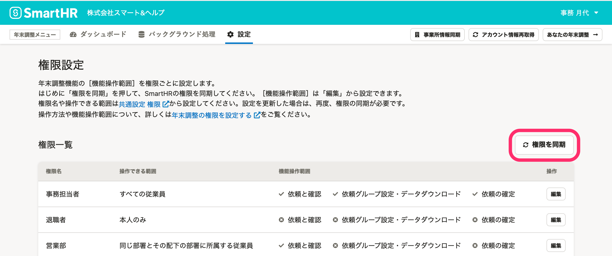

:::alert
当ページで案内しているSmartHRの年末調整機能の内容は、2021年（令和3年）版のものです。
2022年（令和4年）版の年末調整機能の公開時期は秋頃を予定しています。
なお、画面や文言、一部機能は変更になる可能性があります。
公開時期が決まり次第、[アップデート情報](https://smarthr.jp/update)でお知らせします。
:::

# A. いいえ、自動では反映されません。年末調整機能の権限設定画面で［権限を同期］をクリックして反映してください。

SmartHRの権限設定を変更した際は、必ず年末調整機能に権限を同期してください。

権限設定は、同期完了後に即時反映されます。

年末調整機能に権限を同期するには、権限設定画面にある **［権限を同期］** をクリックしてください。

