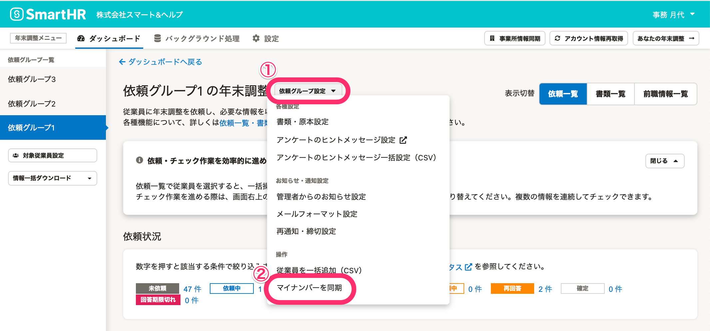

:::alert
当ページで案内しているSmartHRの年末調整機能の内容は、2021年（令和3年）版のものです。
2022年（令和4年）版の年末調整機能の公開時期は秋頃を予定しています。
なお、画面や文言、一部機能は変更になる可能性があります。
公開時期が決まり次第、[アップデート情報](https://smarthr.jp/update)でお知らせします。
:::

# A. いいえ、年末調整機能ではマイナンバーの収集はできません。

年末調整をきっかけに家族情報を追加した場合は、以下の流れに沿ってSmartHRに家族情報を追加し、マイナンバー機能で収集してください。

## マイナンバーを収集し、年末調整機能に反映するまでの流れ

### 1\. SmartHRに扶養家族の情報を追加する

下記のヘルプページを参照して、操作を進めてください。

:::related
[家族情報を追加・編集・削除する](https://knowledge.smarthr.jp/hc/ja/articles/360035423833)
:::

### 2\. SmartHRでマイナンバーを収集する

扶養家族の情報を追加できたら、下記のヘルプページに記載の手順でマイナンバーを収集します。

:::related
[追加された被扶養者のマイナンバー収集する](https://knowledge.smarthr.jp/hc/ja/articles/360026107054)
:::

### 3\. 年末調整機能にマイナンバー情報を同期する

SmartHRでマイナンバーを収集後、年末調整機能にマイナンバー情報を同期します。

依頼一覧の依頼グループ名の横にある **［依頼グループ設定▼］** から **［マイナンバーを同期］** をクリックすると、収集したマイナンバーが年末調整機能に反映されます。

