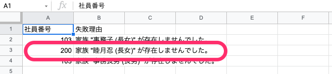
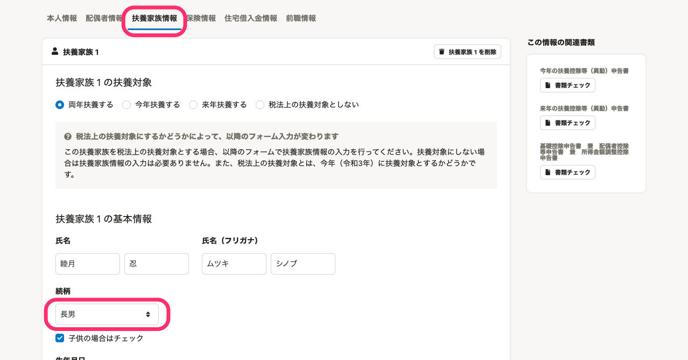
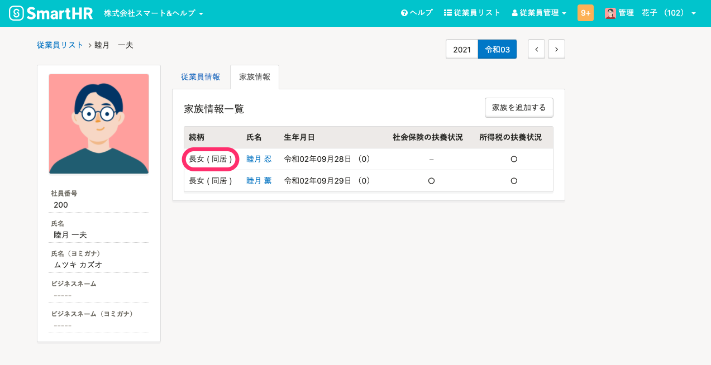
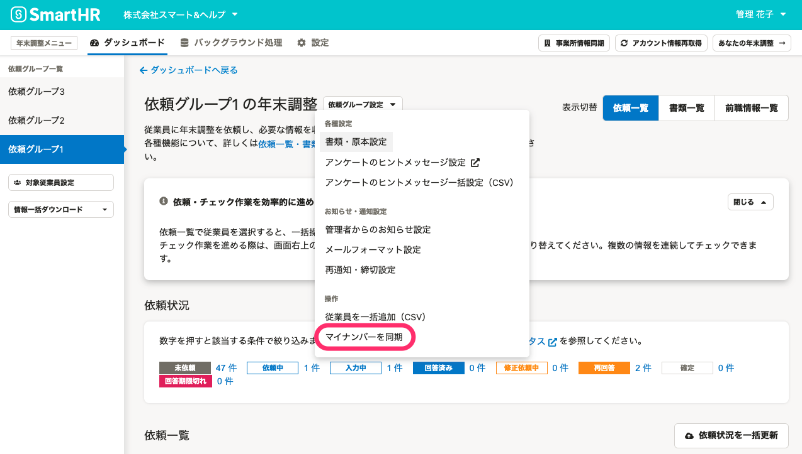
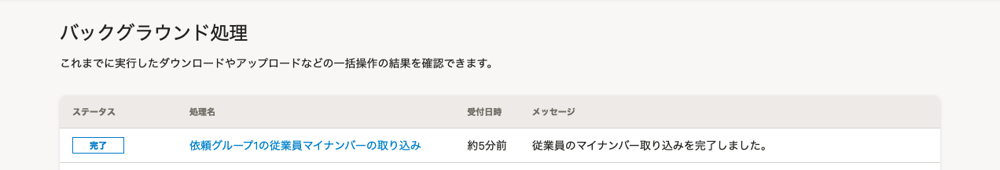

:::alert
当ページで案内しているSmartHRの年末調整機能の内容は、2021年（令和3年）版のものです。
2022年（令和4年）版の年末調整機能の公開時期は秋頃を予定しています。
なお、画面や文言、一部機能は変更になる可能性があります。
公開時期が決まり次第、[アップデート情報](https://smarthr.jp/update)でお知らせします。
:::

# A. SmartHRに登録している従業員情報・家族情報と年末調整のアンケート回答内容を確認し、登録されている情報が一致するように情報を修正してください。

依頼グループの従業員のマイナンバーを同期した際に、取り込み対象がいないと［マイナンバー取り込み失敗理由］のCSVファイルに「〜が存在しませんでした」というエラーが表示されます。

このページでは、 CSVファイルにエラーが表示されていた場合の対応方法を説明します。

:::related
[マイナンバーを申告書に反映させる方法とマイナンバー関連のよくある質問](https://knowledge.smarthr.jp/hc/ja/articles/360037874034)
:::

# エラーの理由

マイナンバーの取り込みエラーが発生する主な理由は、下記のとおりです。

## 依頼グループに従業員を振り分けたあと、SmartHRの従業員情報・家族情報を登録・変更した

SmartHRに登録した従業員情報は、自動で年末調整機能には反映されません。

依頼グループに従業員を振り分けたあと、SmartHRの従業員情報・家族情報を登録・変更した場合は、年末調整の従業員情報も修正する必要があります。

## 従業員が年末調整のアンケートで回答した内容と、SmartHRに登録している従業員情報・家族情報が異なる

従業員が年末調整のアンケートで回答した内容と、SmartHRに登録している従業員情報・家族情報が異なる場合や、年末調整のアンケートで従業員が家族情報を削除した場合に、エラーメッセージが表示されます。

SmartHRの従業員情報・家族情報と年末調整のアンケート回答を確認し、正しい内容に修正が必要です。

#### エラーの例

「従業員が年末調整のアンケートに回答した名前や続柄が、SmartHRに登録している従業員情報・家族情報と異なる」場合、従業員マイナンバーの取り込み結果に、エラーが表示されます。

**年末調整のアンケートに回答された内容**

従業員が扶養家族である子供の続柄を「長男」と回答しています。

**SmartHRに登録されている従業員の家族情報**

SmartHRの家族情報では、続柄は「長女」で登録しています。

上記の場合、従業員に確認し、SmartHRの従業員情報・家族情報と年末調整のアンケート回答のいずれかを、正しい内容に修正する必要があります。

# SmartHRに登録している情報を修正する場合

SmartHRに登録している従業員情報・家族情報を修正後、対象となる従業員を年末調整の依頼グループから一度削除してください。

その後、 **［対象従業員設定］** 画面の **［従業員情報を同期］** をクリックし、再度対象となる従業員の情報を年末調整機能に取り込んでください。

従業員の削除と同期の手順は、下記のヘルプページをご覧ください。

:::related
[年末調整の依頼一覧から従業員を削除する](https://knowledge.smarthr.jp/hc/ja/articles/360035370413)
[年末調整の対象となる従業員を確認する](https://knowledge.smarthr.jp/hc/ja/articles/360035370493)
:::

# 年末調整のアンケート回答内容を修正する場合

## 1\. 年末調整のアンケート回答内容を修正する

従業員に修正依頼を行なう方法と、管理者が直接収集情報を修正する方法の2つがあります。

### 従業員にアンケートの修正依頼を行なう

従業員にアンケート回答内容の修正依頼をする場合は、下記のヘルプページをご確認ください。

:::related
[従業員に年末調整の修正依頼を出す](https://knowledge.smarthr.jp/hc/ja/articles/360057982273)
:::

### 管理者が直接収集情報を修正する

管理者が従業員から収集した情報を直接修正する場合は、下記のヘルプページをご確認ください。

従業員本人に関する情報は、収集情報画面の **［本人情報］** から、家族に関する情報は収集情報画面の **［配偶者情報］［扶養家族情報］** から修正が可能です。

:::related
[収集情報を直接編集する](https://knowledge.smarthr.jp/hc/ja/articles/360035657114)
:::

## 2\. 依頼一覧画面の［依頼グループ設定］>［マイナンバーを同期］をクリック

依頼一覧画面の **［依頼グループ設定］** \> **［マイナンバーを同期］** をクリックし、マイナンバー情報を再度同期します。

 **［バックグラウンド処理］** 画面で、取り込みが **［完了］** と表示されていることを確認してください。

