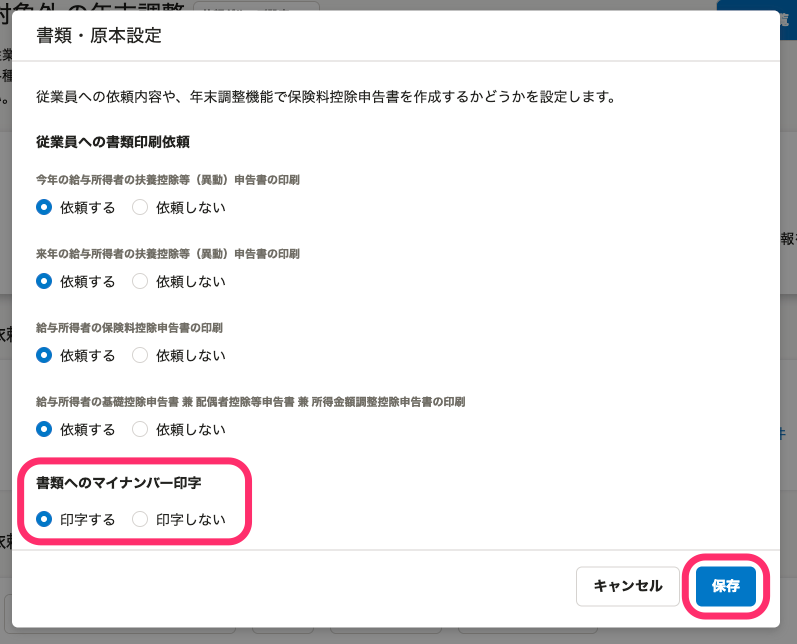

:::alert
当ページで案内しているSmartHRの年末調整機能の内容は、2021年（令和3年）版のものです。
2022年（令和4年）版の年末調整機能の公開時期は秋頃を予定しています。
なお、画面や文言、一部機能は変更になる可能性があります。
公開時期が決まり次第、[アップデート情報](https://smarthr.jp/update)でお知らせします。
:::

# A.［書類へのマイナンバー印字］設定をしてから、年末調整機能に［マイナンバーの同期］をしてください。する必要があります。

マイナンバーを年末調整の書類に印字するには、依頼一覧画面の **［依頼グループ設定▼］メニュー**  の **［書類・原本設定］** で **［書類へのマイナンバー印字］** 欄の **［印字する］** を選択している必要があります。

そのうえで、SmartHRから年末調整機能に **［マイナンバーの同期］** をすると、年末調整の書類にマイナンバーが印字されます。

:::tips
初期設定で **［書類へのマイナンバー印字］** は **［印字する］** 設定が適用されています。
初期設定のまま進める場合は、下記の「3. マイナンバーを同期する」から操作してください。
現在の印字設定を確認したい場合や、設定の変更が必要な場合は、下記の「1. 依頼一覧画面の［依頼グループ設定］>［書類・原本設定］をクリック」から操作してください。
:::

## 1\. 依頼一覧画面の［依頼グループ設定▼］>［書類・原本設定］をクリック

依頼一覧画面の **［依頼グループ設定▼］>［書類・原本設定］** をクリックします。

## 2\. ［書類へのマイナンバー印字］欄の［印字する］を選択し、［保存］をクリック

 **［書類へのマイナンバー印字］** 欄の **［印字する］** を選択し、 **［保存］** をクリックします。

## 3\. マイナンバーを同期する

依頼一覧画面の **［依頼グループ設定▼］>［マイナンバーを同期］** をクリックすると、 **［マイナンバー情報を同期］** 画面が表示されます。

 **［同期］** をクリックすると、SmartHRに登録されている従業員のマイナンバーを、年末調整機能に取り込むバックグラウンド処理が始まります。

## 4\. バックグラウンド処理の完了を待ち、結果を確認する

バックグラウンド処理が完了すると、管理者宛に通知が届きます。

また、年末調整メニューの **［バックグラウンド処理］** からも状況・結果を確認できます。

### 取り込みがエラーになる場合

マイナンバーを同期できない従業員がいた場合、 **［マイナンバー取り込み失敗理由］** のCSVファイルをダウンロードして理由を確認してください。

:::tips
被扶養者のマイナンバーは姓・名・続柄をキーにして同期します。
取り込み対象がない場合「〜が存在しませんでした」というエラーが表示されます。
[Q. 年末調整機能にマイナンバー情報を同期して「〜が存在しませんでした」というエラーがでたら？](https://knowledge.smarthr.jp/hc/ja/articles/360037548814)
:::

### 取り込みに成功した場合

マイナンバーは書類の確認画面上では＊印で表示されています。

管理者が書類一覧から **［ダウンロード］** を行ない、バックグラウンド処理画面からPDFをダウンロードして印刷すると、実際のマイナンバーが表示されます。

:::alert
管理者以外の権限で **［ダウンロード］** を行ない、バックグラウンド処理画面からPDFをダウンロードした場合は、実際のマイナンバーは表示されません（ただし、従業員本人の書類の場合は、マイナンバーは表示されます）。
ただし、管理者が **［ダウンロード］** を実行し、管理者以外の権限でバックグラウンド処理画面からPDFをダウンロードした場合は、マイナンバーが表示されます。
:::
