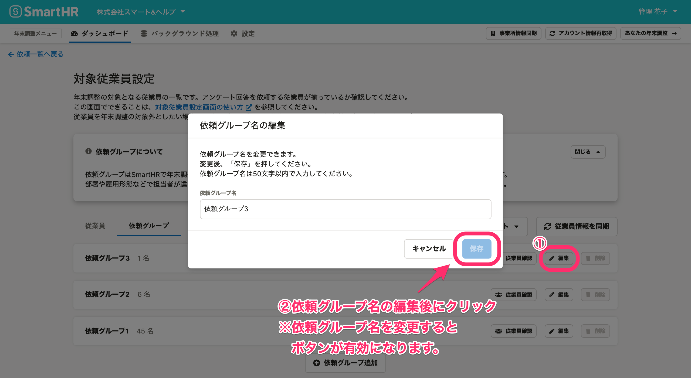

:::alert
当ページで案内しているSmartHRの年末調整機能の内容は、2021年（令和3年）版のものです。
2022年（令和4年）版の年末調整機能の公開時期は秋頃を予定しています。
なお、画面や文言、一部機能は変更になる可能性があります。
公開時期が決まり次第、[アップデート情報](https://smarthr.jp/update)でお知らせします。
:::

# A. はい、できます。

依頼グループ一覧の下部にある **［対象従業員設定］** をクリックし、 **［依頼グループ］** タブに表示を切り替え、 **［編集］** をクリックしてください。

 **［依頼グループ名の編集］** 画面が表示されるので、任意の依頼グループ名を入力して **［保存］** をクリックしてください。

