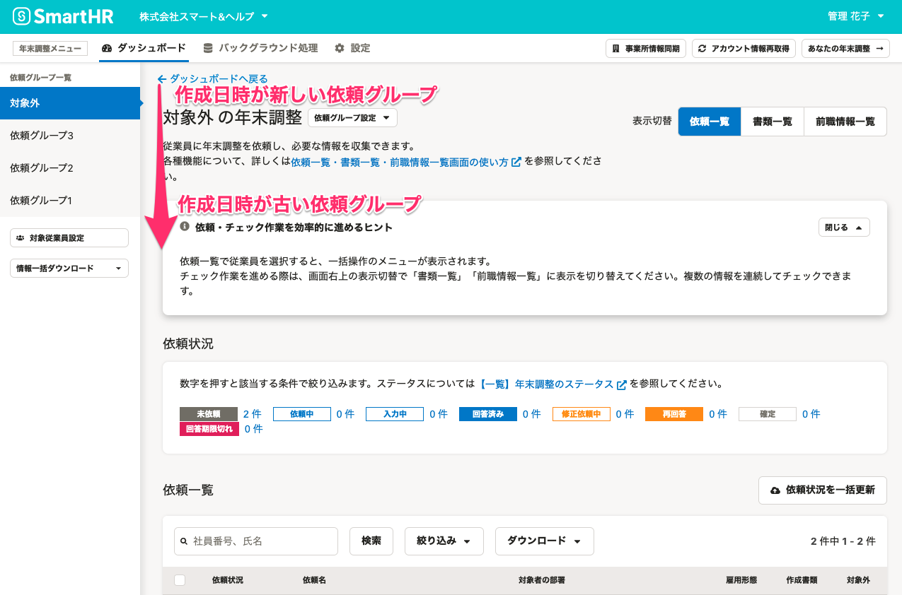
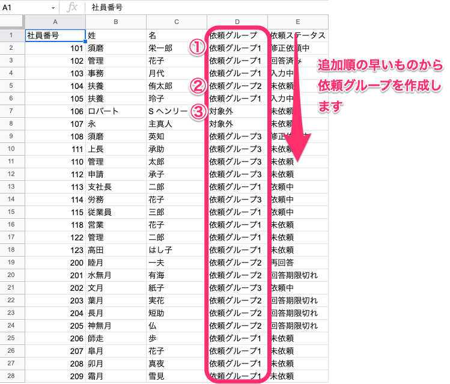

:::alert
当ページで案内しているSmartHRの年末調整機能の内容は、2021年（令和3年）版のものです。
2022年（令和4年）版の年末調整機能の公開時期は秋頃を予定しています。
なお、画面や文言、一部機能は変更になる可能性があります。
公開時期が決まり次第、[アップデート情報](https://smarthr.jp/update)でお知らせします。
:::

# A. いいえ、年末調整機能の［依頼グループ一覧］に表示している依頼グループは、並び替えはできません。

依頼グループの並び替えが必要な場合は、依頼グループ名を変更し、従業員の依頼グループを一括変更するなどの方法で対応をお願いします。

依頼グループ名の編集や依頼グループの一括変更について、詳しくは下記のヘルプページをご覧ください。

:::related
[年末調整の依頼グループを一括で設定する](https://knowledge.smarthr.jp/hc/ja/articles/4403662363161)
:::

なお、表示順についての仕様は下記の通りです。

 **［依頼グループ一覧］** の依頼グループは、上から順に作成日時が新しいものを表示します。

CSVファイルを使って一括で依頼グループを追加する場合、追加順の早いものから依頼グループを作成します。

下図のCSVファイルを取り込んだ場合、依頼グループは「依頼グループ1」「依頼グループ2」「対象外」の順に作成されます。

