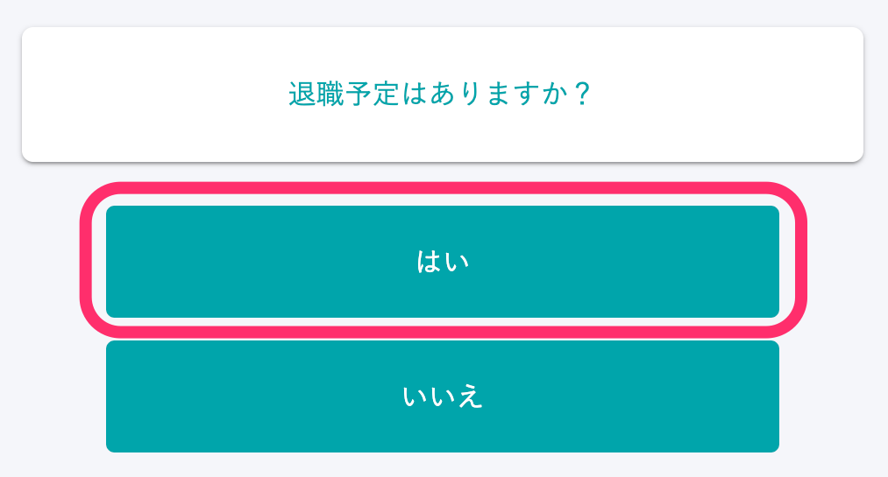

:::alert
当ページで案内しているSmartHRの年末調整機能の内容は、2021年（令和3年）版のものです。
2022年（令和4年）版の年末調整機能の公開時期は秋頃を予定しています。
なお、画面や文言、一部機能は変更になる可能性があります。
公開時期が決まり次第、[アップデート情報](https://smarthr.jp/update)でお知らせします。
:::

# A. 「現在の会社を退職し、SmartHRで年末調整をしない可能性がある」従業員に表示されるステータスです。

「退職対象外候補」は、従業員が年末調整の退職予定を確認する設問で「はい」を選択し、年末調整を終了した場合に表示されます。

ステータスについての詳細は下記のヘルプページを参照してください。

:::related
[【一覧】年末調整のステータス](https://knowledge.smarthr.jp/hc/ja/articles/360034870834)
:::
