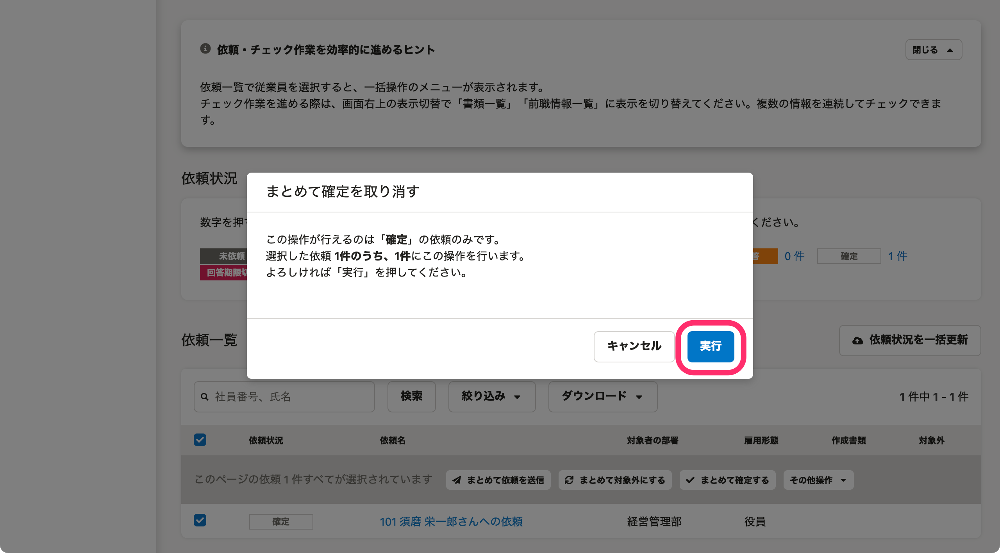

:::alert
当ページで案内しているSmartHRの年末調整機能の内容は、2021年（令和3年）版のものです。
2022年（令和4年）版の年末調整機能の公開時期は秋頃を予定しています。
なお、画面や文言、一部機能は変更になる可能性があります。
公開時期が決まり次第、[アップデート情報](https://smarthr.jp/update)でお知らせします。
:::

# A. はい、確定は取り消しできます。

依頼一覧で該当の依頼にチェックを入れ、 **［その他操作▼］>［まとめて確定を取り消す］** から操作してください。

 **［その他操作▼］** のメニューは、依頼一覧で依頼にチェックを入れると、項目名の下に表示されます。

 **［実行］** をクリックすると、「確定」を取り消します。

確定を取り消すと、ステータスは「回答済み」「再回答」など、ひとつ前のステータスに戻ります。
