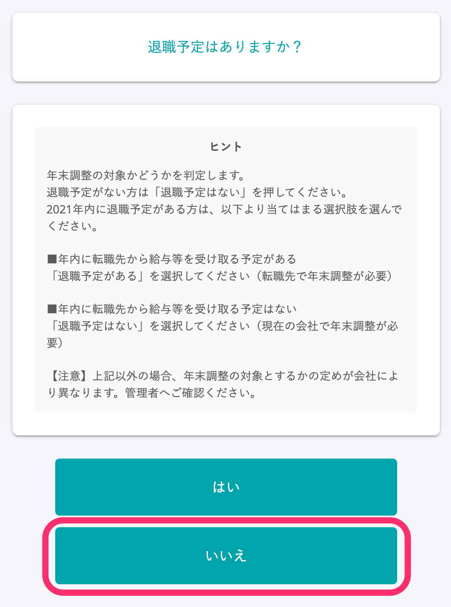
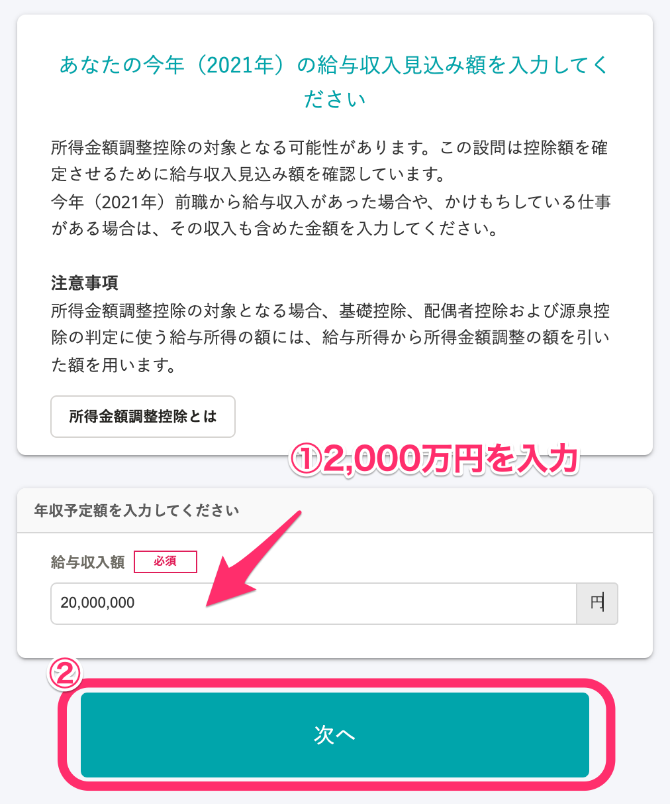
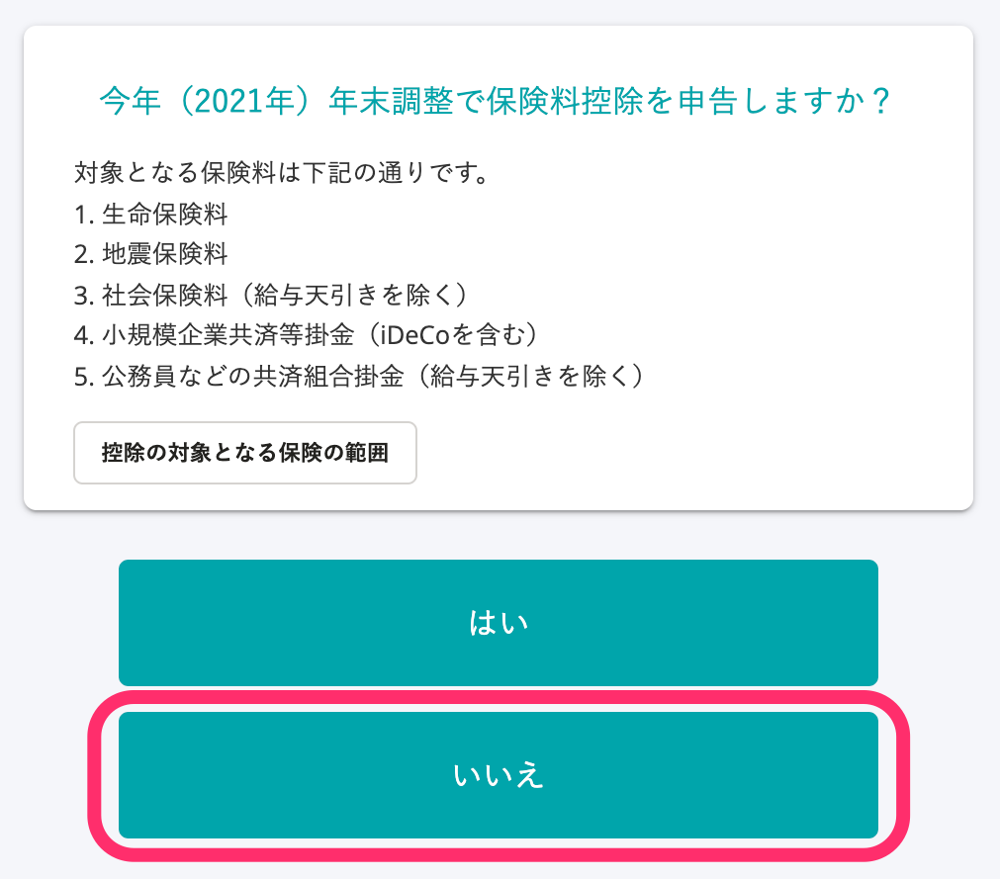
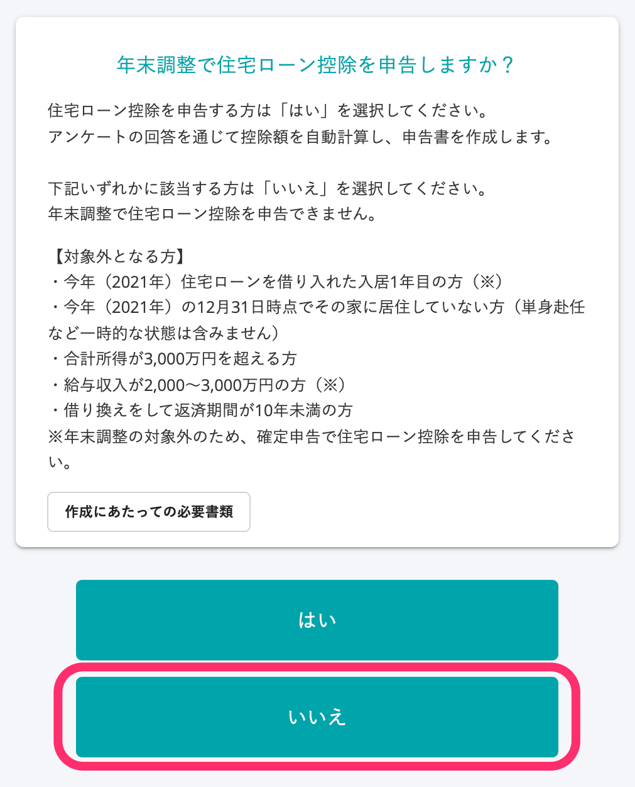

:::alert
当ページで案内しているSmartHRの年末調整機能の内容は、2021年（令和3年）版のものです。
2022年（令和4年）版の年末調整機能の公開時期は秋頃を予定しています。
なお、画面や文言、一部機能は変更になる可能性があります。
公開時期が決まり次第、[アップデート情報](https://smarthr.jp/update)でお知らせします。
:::

# A. 年末調整のアンケートを従業員に依頼し、従業員が最後まで回答すると「来年の給与所得者の扶養控除等（異動）申告書」が作成できます。

従業員が下記に該当する場合は、年末調整のアンケートで「来年の給与所得者の扶養控除等（異動）申告書」を作成してください。

- 今年の収入が2,000万円を超えるなどの理由で年末調整は不要だが、来年の扶養控除等（異動）申告書を作成したい場合
- 12月入社（翌年給与支給）で年末調整は不要だが、来年の扶養控除等（異動）申告書を作成したい場合

:::tips
「来年の給与所得者の扶養控除等（異動）申告書」のみ作成が必要な従業員は、依頼グループをわけて管理することをおすすめします。
また、対象従業員への案内は、管理者からのお知らせやアンケート画面のヒントメッセージをご活用ください。
お知らせ機能やヒントメッセージの活用については、下記のヘルプページでをご覧ください。
:::
:::related
[従業員の年末調整画面に管理者からのお知らせを設定する](https://knowledge.smarthr.jp/hc/ja/articles/360053347974)
[アンケート画面のヒントを追加・編集する](https://knowledge.smarthr.jp/hc/ja/articles/360034870854)
:::

# 注意事項

## 従業員を年末調整の「対象外」にすると、アンケートの依頼ができません。

誤って従業員を年末調整の「対象外」としてしまった場合は、依頼ステータスを「未依頼」に戻し、再度、依頼をしてください。

対象外のままだと、「来年の給与所得者の扶養控除等（異動）申告書」を作成できません。

詳しくは、下記のヘルプページをご覧ください。

:::related
[「対象外候補」の従業員に再度年末調整の依頼をする](https://knowledge.smarthr.jp/hc/ja/articles/360034870754)
[Q. 年末調整の対象従業員を間違って「対象外」にしてしまった場合は？](https://knowledge.smarthr.jp/hc/ja/articles/360058085913)
:::

## 年末調整のアンケートに回答すると、仕様上、不要な書類も作成します。

大変申し訳ございませんが、「来年の給与所得者の扶養控除等（異動）申告書」だけを作成することはできません。

従業員が年末調整のアンケートに回答すると、下記の書類を自動で作成します。

- 今年の給与所得者の扶養控除等（異動）申告書
- 来年の給与所得者の扶養控除等（異動）申告書
- 給与所得者の基礎控除申告書 兼 配偶者控除等申告書 兼 所得金額調整控除申告書

「来年の給与所得者の扶養控除等（異動）申告書」以外の書類が不要な場合は、下記のヘルプページを参考に書類を削除してください。

:::related
[年末調整で作成された書類を削除する](https://knowledge.smarthr.jp/hc/ja/articles/360040698513)
:::

## 保険料控除や住宅ローン控除についての設問は回答不要です。

年末調整のアンケートで保険料や住宅借入金等特別控除の情報を入力すると、「給与所得者の保険料控除等申告書」や「給与所得者の（特定増改築等）住宅借入金等特別控除申告書」が作成されてしまいます。

そのため、「保険料控除を申告しますか？」「住宅ローン控除を申告しますか？」の設問には、「いいえ」と回答するよう案内してください。

詳細は下記をご覧ください。

# 「来年の給与所得者の扶養控除等（異動）申告書」のみ必要な場合に回答が不要な設問

「来年の給与所得者の扶養控除等（異動）申告書」のみが必要な場合は、年末調整のアンケートにすべて回答する必要はありせん。

特に保険料控除や住宅ローン控除に関する設問は多くの情報を入力する必要があるため、従業員の年末調整の負担を軽減するためにも、回答しなくてよい設問にはヒントメッセージなどで案内をつけることをおすすめします。

なお、設問2と設問53は、申告書を作成するために、下記のように回答をお願いします。

## 設問2「退職予定はありますか？」に「いいえ」と回答する

アンケートを最後まで進めるために、設問2「退職予定はありますか？」には「いいえ」（退職予定がなく、年末調整の対象である）を選択する必要があります。

## 設問53「あなたの今年（2021年）の給与収入見込み額を入力してください」で［給与収入額］欄に「2,000万円」と入力する

今年の給与収入額が2,000万円を超える見込み場合、 **［給与収入額］** 欄には「2,000万円」と入力し、 **［次へ］** をクリックするよう案内してください。

 **［給与収入額］** 欄には、2,000万円を超える金額を入力できません。

:::tips
なお、この設問は所得金額調整控除の対象となる可能性がある従業員にのみ表示されます。
:::

## 設問101「今年（2021年）年末調整で保険料控除を申告しますか？」に「いいえ」と回答する

「いいえ」を選択するよう案内してください。

「はい」と回答すると、保険料の入力に関する設問に進み、対象従業員が回答する必要のない設問に移動してしまいます。

## 設問200「年末調整で住宅ローン控除を申告しますか？」に「いいえ」と回答する

「いいえ」を選択するよう案内をしてください。

「はい」と回答すると、住宅ローン控除に関する設問に進み、対象従業員が回答する必要のない設問に移動してしまいます。

:::alert
各種控除証明書や、住宅ローン控除申告書、前職の源泉徴収票などは、従業員が確定申告をする際に使用するため、会社には提出しないよう案内をお願いします。
:::
