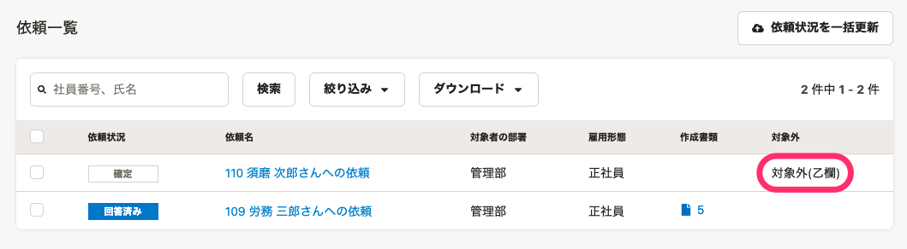
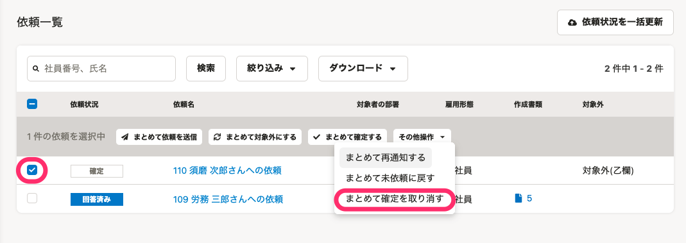
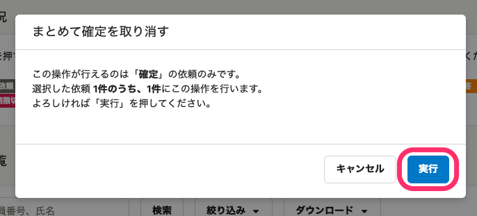
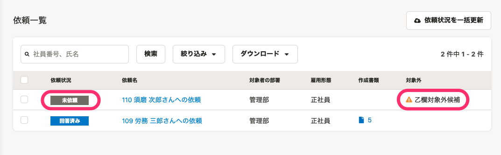
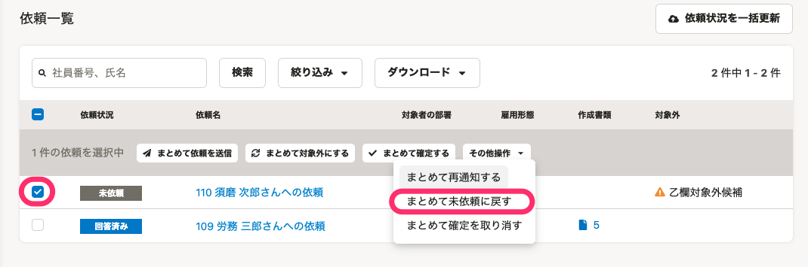
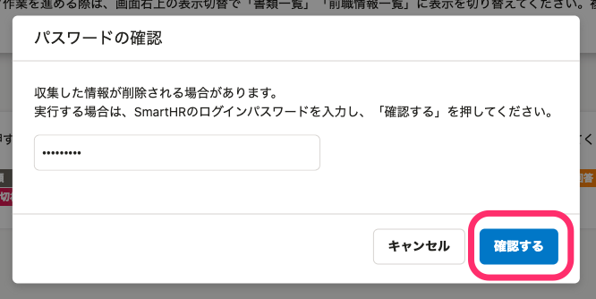
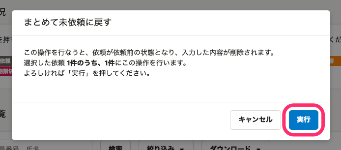
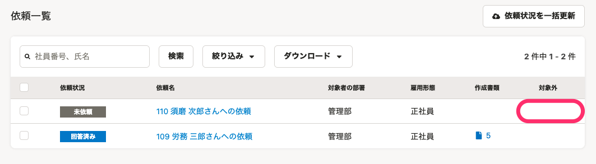

:::alert
当ページで案内しているSmartHRの年末調整機能の内容は、2021年（令和3年）版のものです。
2022年（令和4年）版の年末調整機能の公開時期は秋頃を予定しています。
なお、画面や文言、一部機能は変更になる可能性があります。
公開時期が決まり次第、[アップデート情報](https://smarthr.jp/update)でお知らせします。
:::

# A. 対象外を取り消す（表示を消す）には、依頼ステータスの「確定」を取り消し、年末調整の依頼を「未依頼」に戻してください。

## 1\. 対象の依頼にチェックを入れ、［その他操作▼］>［まとめて確定を取り消す］をクリック

対象の依頼にチェックを入れると、項目名の下にメニューが表示されます。

 **［その他操作▼］** をクリックし、 **［まとめて確定を取り消す］** を選択すると確認画面が表示されます。

## 2.［実行］をクリック

内容を確認し、 **［実行］** をクリックするとバックグラウンド処理を開始し、依頼一覧画面に戻ります。

バックグラウンド処理が完了すると、依頼ステータスと **［対象外］** 欄の表示が変わります。

:::tips
**確定を取り消したあとの依頼ステータスは？**
対象外にする操作をした時点の依頼ステータスに戻ります。
例：依頼ステータスが「未依頼」の状態で対象外にしていた場合、確定を取り消したあとは「未依頼」に戻ります。
:::

## 3\. 対象の依頼にチェックを入れ、［その他操作▼］>［まとめて未依頼に戻す］の順にクリック

対象の従業員にチェックを入れると、項目名の下にメニューが表示されます。

 **［その他操作▼］** をクリックし、 **［まとめて未依頼に戻す］** を選択するとパスワードの確認画面が表示されます。

## 4\. ログインパスワードを入力し、［確認する］をクリック

SmartHRのログインパスワードを入力して **［確認する］** をクリックすると、まとめて未依頼に戻すための実行画面が表示されます。

## 5.［実行］をクリック

内容を確認し、 **［実行］** をクリックすると、バックグラウンド処理が始まります。

## 6\. 対象外の表示がないことを確認する

バックグラウンド処理完了後、依頼一覧の **［対象外］** 欄に対象外の表示がないことを確認します。

