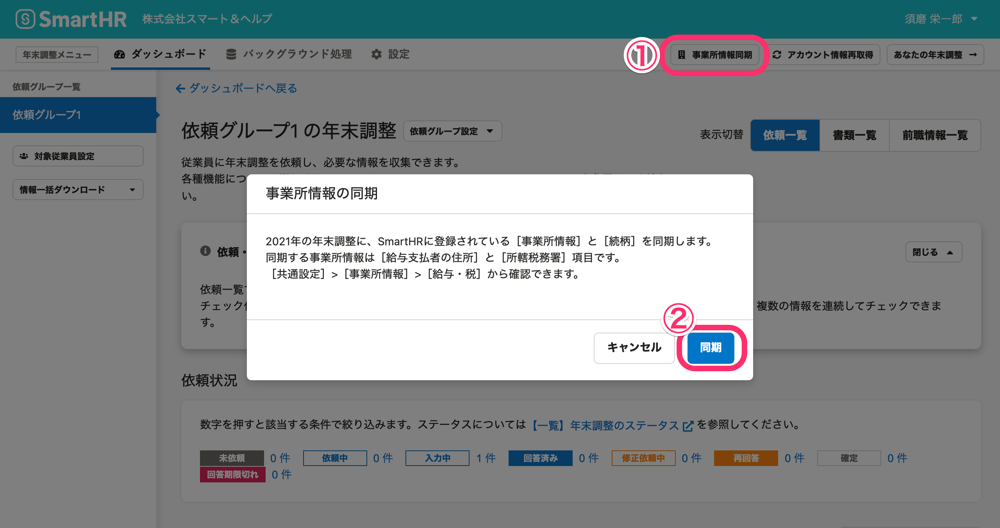
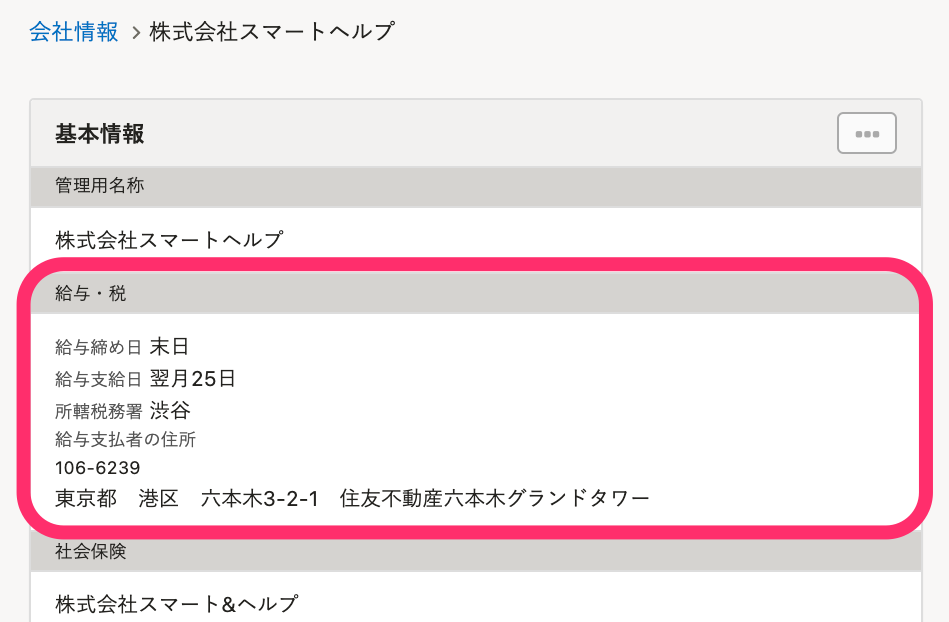

:::alert
当ページで案内しているSmartHRの年末調整機能の内容は、2021年（令和3年）版のものです。
2022年（令和4年）版の年末調整機能の公開時期は秋頃を予定しています。
なお、画面や文言、一部機能は変更になる可能性があります。
公開時期が決まり次第、[アップデート情報](https://smarthr.jp/update)でお知らせします。
:::

# A. いいえ、自動では反映されません。

年末調整メニューの **［事業所情報同期］>［同期］** をクリックして、年末調整機能に最新の情報を反映してください。

なお、同期される情報は、 **［共通設定］>［会社情報］>［事業所情報］>［給与・税］** で設定している内容です。

