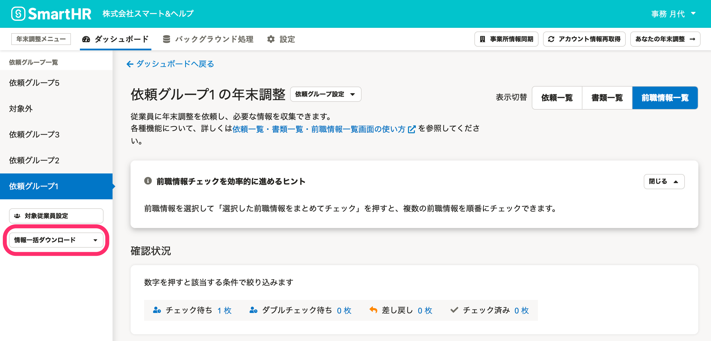
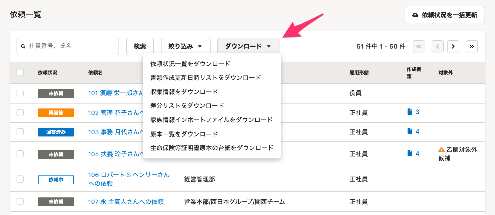
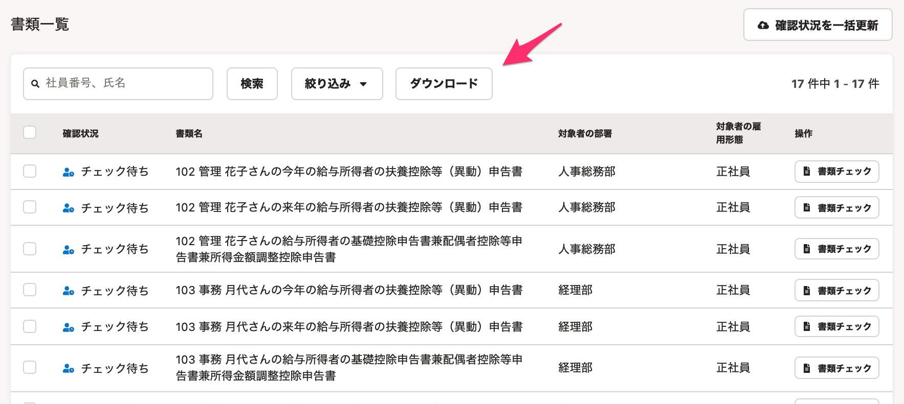

:::alert
当ページで案内しているSmartHRの年末調整機能の内容は、2021年（令和3年）版のものです。
2022年（令和4年）版の年末調整機能の公開時期は秋頃を予定しています。
なお、画面や文言、一部機能は変更になる可能性があります。
公開時期が決まり次第、[アップデート情報](https://smarthr.jp/update)でお知らせします。
:::

# A. はい、各種ダウンロードメニューからダウンロードできます。

すべての依頼グループのデータをダウンロードする場合は、 **［情報一括ダウンロード▼］** からダウンロードしてください。

特定の依頼グループのデータをダウンロードする場合は、依頼一覧画面にある **［ダウンロード▼］** からダウンロードしてください。

特定の依頼グループの年末調整書類をダウンロードする場合は、書類一覧画面にある **［ダウンロード］** からダウンロードできます。

SmartHRからダウンロードできるCSVファイルについては、下記ヘルプページを参照してください。

[【一覧】年末調整機能でダウンロードできるCSVファイルと使用例](https://knowledge.smarthr.jp/hc/ja/articles/4405369856281)
