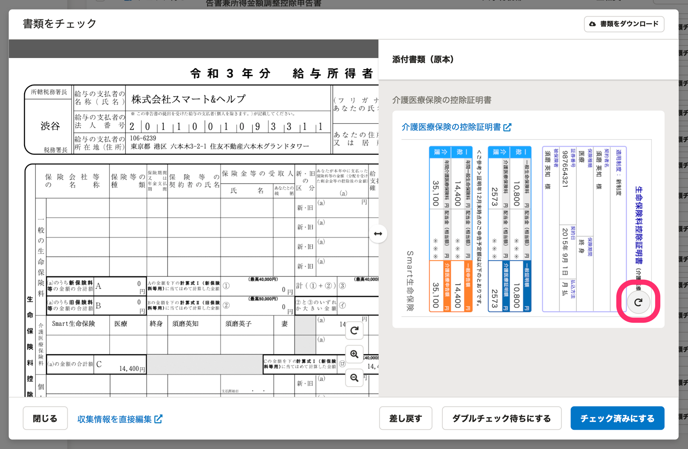
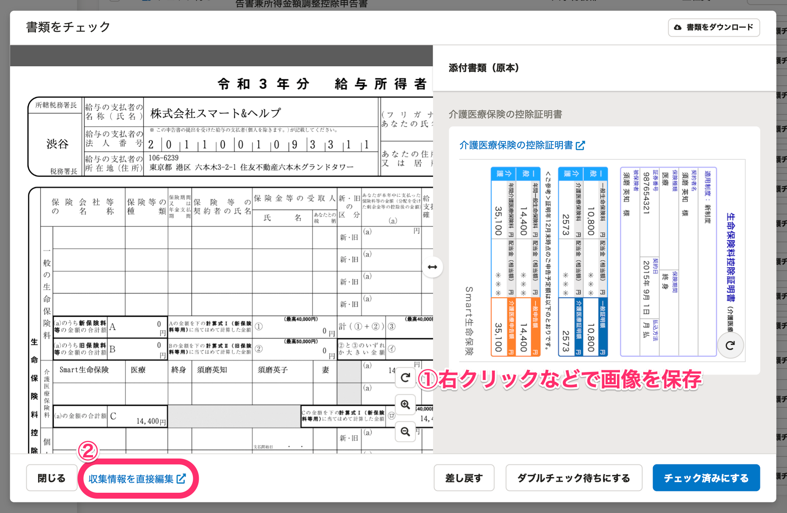
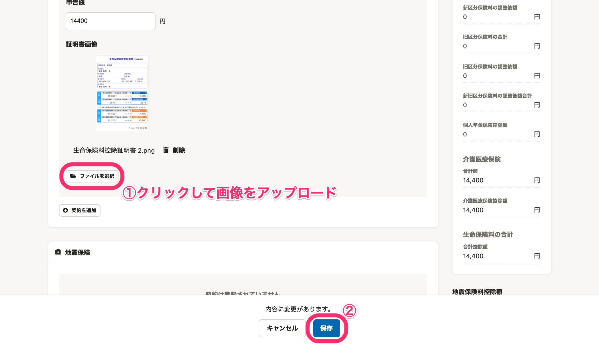
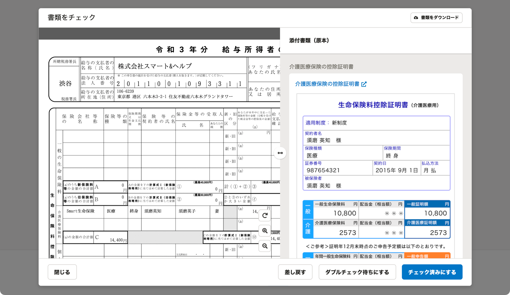

:::alert
当ページで案内しているSmartHRの年末調整機能の内容は、2021年（令和3年）版のものです。
2022年（令和4年）版の年末調整機能の公開時期は秋頃を予定しています。
なお、画面や文言、一部機能は変更になる可能性があります。
公開時期が決まり次第、[アップデート情報](https://smarthr.jp/update)でお知らせします。
:::
:::tips
内容確認のために向きを変えたい場合は、添付書類（原本）の **［回転ボタン］** をクリックして画像を回転してください。

:::

# A. はい、画像をダウンロードして向きを変更後、保存してアップロードし直してください。

原本画像はアップロードした際の画像データの向きで保存されます。

書類プレビュー画面で右クリックなどで画像を保存し、 **［収集情報を直接編集］** をクリックします。

収集情報の **［保険情報］** タブにある証明書画像の **［ファイルを選択］** から、向きを変えて保存した画像ファイルをアップロードし、画面最下部の **［保存］** をクリックします。

再度、書類プレビュー画面を開くと、原本画像はアップロードした画像と同じ向きになっています。

