:::alert
当ページで案内しているSmartHRの年末調整機能の内容は、2021年（令和3年）版のものです。
2022年（令和4年）版の年末調整機能の公開時期は秋頃を予定しています。
なお、画面や文言、一部機能は変更になる可能性があります。
公開時期が決まり次第、[アップデート情報](https://smarthr.jp/update)でお知らせします。
:::

# A. 配偶者の所得条件とアンケート回答手順を確認してください。

扶養控除等（異動）申告書や配偶者控除等申告書に配偶者の情報を表示するための所得条件を満たしていないか、年末調整のアンケートの回答内容に不備がある可能性があります。

下記の所得条件、アンケート回答手順を確認し、必要に応じて収集情報を修正してください。

# 配偶者が記載される所得条件

## 扶養控除等（異動）申告書（A欄：源泉控除対象配偶者欄）

下記の令和3年（2021年）分の所得条件を満たすと、扶養控除等（異動）申告書のA欄に配偶者情報が表示されます。

| **配偶者の所得条件** | 95万円以下（給与収入のみの場合、収入が150万円以下） |
| --- | --- |
| **従業員の所得条件** | 900万円以下（給与収入のみの場合、収入が1,095万円以下） |

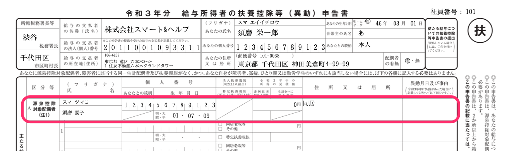

下記の令和4年（2022年）分の所得条件を満たすと、扶養控除等（異動）申告書のA欄に配偶者情報が表示されます。

| **配偶者の所得条件** | 95万円以下（給与収入のみの場合、収入が150万円以下） |
| --- | --- |
| **従業員の所得条件** | 900万円以下（給与収入のみの場合、収入が1,095万円以下） |

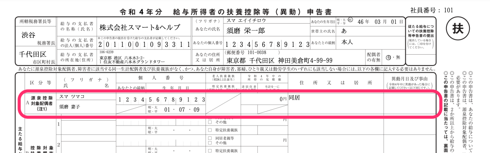

## 配偶者控除等申告書

下記の令和3年（2021年）分の所得条件を満たすと、配偶者控除等申告書に配偶者情報が表示されます。

| **配偶者の所得条件** | 133万円以下（給与収入のみの場合、収入が201万5,999円以下） |
| --- | --- |
| **従業員の所得条件** | 1,000万円以下（給与収入のみの場合、収入が1,195万円以下） |

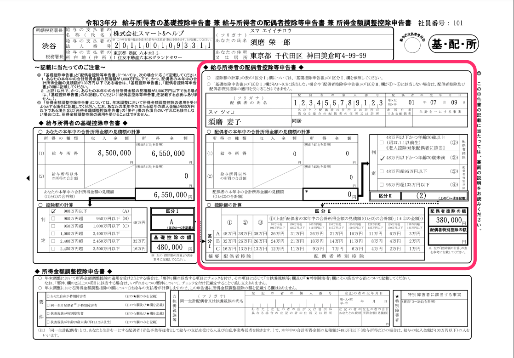

# 扶養控除等（異動）申告書に配偶者を表示したい場合の年末調整のアンケート回答手順

## 従業員本人の所得に関する設問

#### 給与以外の収入がある場合

**設問42「給与収入以外の収入はありますか？」に「はい」と回答する**

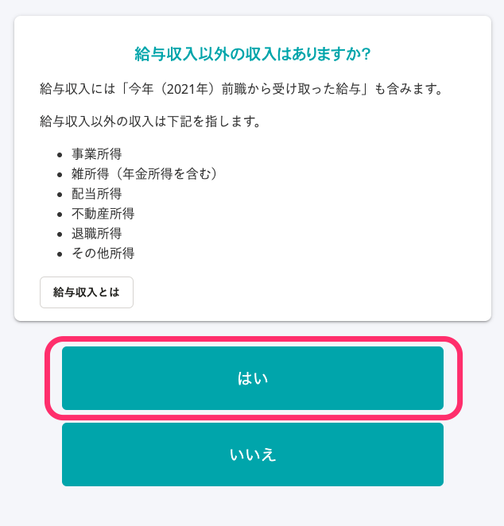

**設問43「収入の内訳を入力してください」に、給与収入や事業所得などの収入内訳を入力し、「所得見積合計額」が900万円以下であることを確認する**

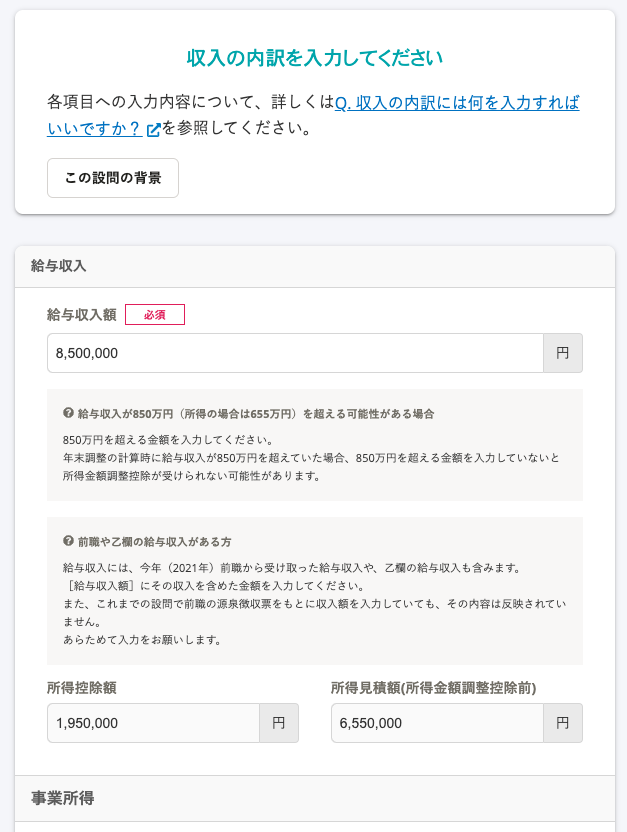

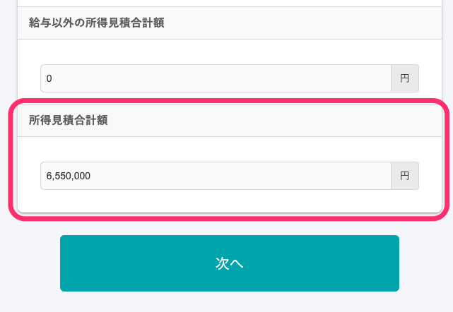

**設問34「あなたの来年（2022年）の年収見込み額を選択してください。年収には給与収入以外の収入を含みます」に「A：給与収入1,095万円以下（給与以外の収入がある場合は、合計所得900万円以下）」と回答する**

#### 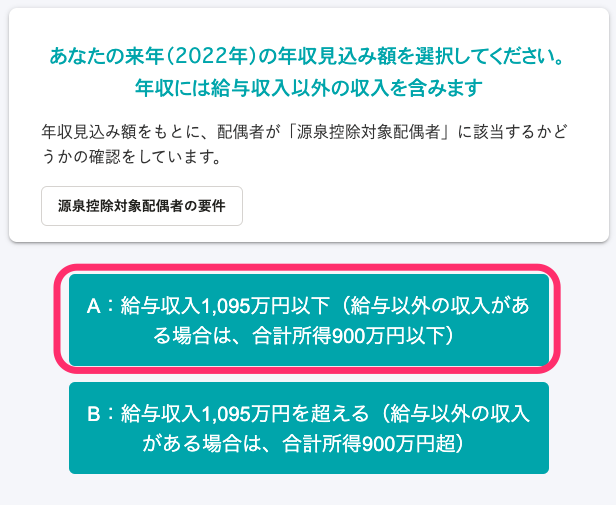

#### 給与収入以外の収入がない場合

**設問42「給与収入以外の収入はありますか？」に「いいえ」と回答する**

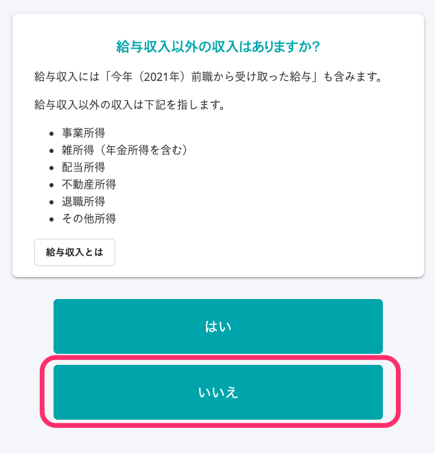

**設問30「今年（2021年）の給与収入を選択してください。給与収入には、今年（2021年）前職から受け取った給与収入や、乙欄の給与収入も含みます」に「A」または「B」と回答する**

#### 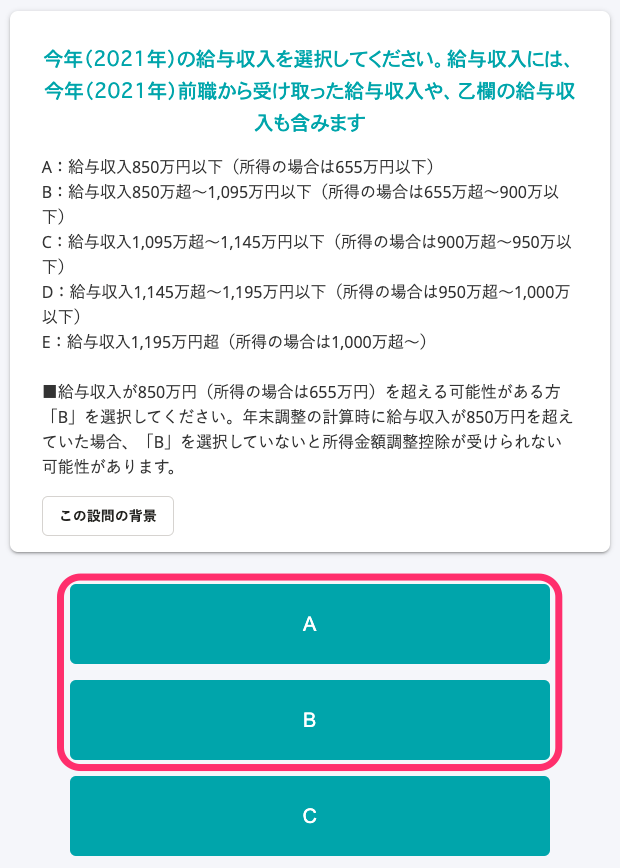

**設問34「あなたの来年（2022年）の年収見込み額を選択してください。年収には給与収入以外の収入を含みます」に「A：給与収入1,095万円以下（給与以外の収入がある場合は、合計所得900万円以下）」と回答する**

#### 

## 配偶者の所得に関する設問

**設問26 「配偶者はいますか？」に「はい」と回答する**

※今年（2021年）配偶者と死別した場合も、「はい」と回答してください。

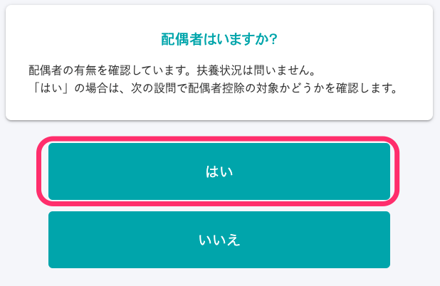

**設問54「配偶者の情報を入力してください」に情報を入力する**

 **［配偶者を扶養対象とする年］** には、「両年扶養する」「今年扶養する」「来年扶養する」のいずれかを選択します。

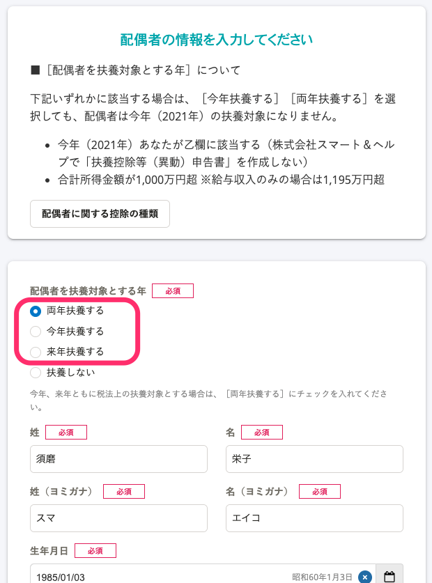

扶養する年の所得見積の内訳を入力し、「所得見積合計額」欄が95万円以下（給与収入のみの場合、収入が150万円以下）であることを確認します。

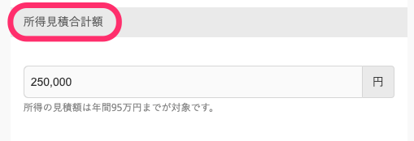

# 配偶者控除等申告書に表示したい場合の年末調整のアンケート回答手順

配偶者控除等申告書への表示や控除適用に関わる従業員のアンケートは、下記のヘルプページをご覧ください。

:::related
[Q. 配偶者控除が適用されていない場合、アンケートはどう修正したらいいですか？](https://knowledge.smarthr.jp/hc/ja/articles/4404573121433)
:::

# アンケート回答後に収集情報を修正して、書類に配偶者を表示する方法

## 従業員に書類を差し戻して情報を修正してもらう

詳しくは下記ヘルプページの **「** **②** **修正する」** をご覧ください。

:::related
[従業員から提出された年末調整を確認する](https://knowledge.smarthr.jp/hc/ja/articles/360034870254)
:::

## 管理者が収集情報を編集する

管理者が、収集情報画面の **［本人情報］** と **［配偶者情報］** を編集して、扶養控除等（異動）（異動）申告書のA欄に配偶者を表示します。

### 本人情報の編集箇所

収集情報画面の **［本人情報］** を表示します。

 **［今年の所得見積］** 欄の **［給与収入］** が1,095万円以下であることを確認します。

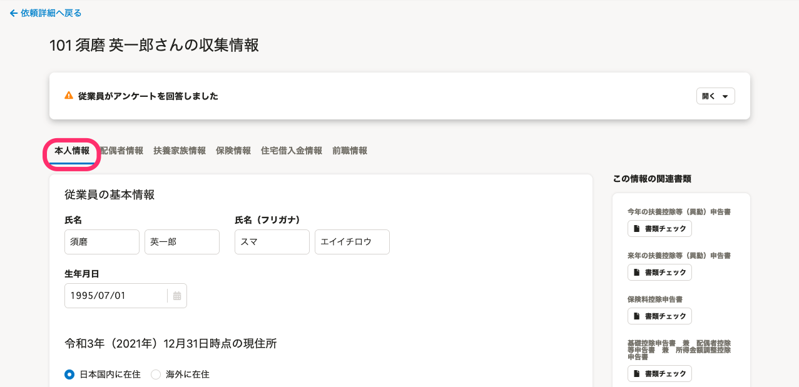

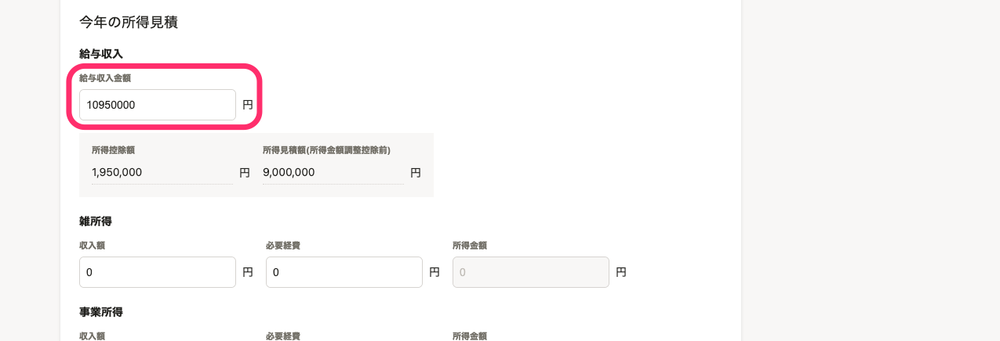

 **［本人情報］** の **［来年の収入］** で、 **［給与収入0～1095万まで（所得の場合900万まで）］** を選択し、 **［保存］** します。

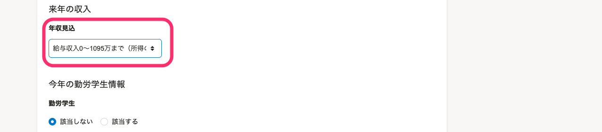

### 配偶者情報の編集箇所

 **［配偶者情報］** タブを表示し、 **［**  **配偶者の有無］［配偶者を扶養対象とする年］** 設定します。

 **［配偶者を扶養対象とする年］** には、「両年扶養する」「今年扶養する」「来年扶養する」のいずれかを選択してください。

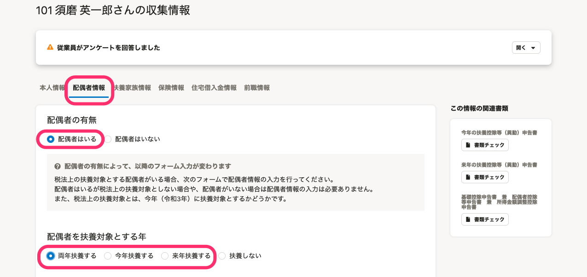

扶養する年の所得見積の内訳を入力します。

 **［所得見積合計額］** 欄が95万円以下（給与収入のみの場合、収入が150万円以下）であることを確認して、 **［保存］** します。

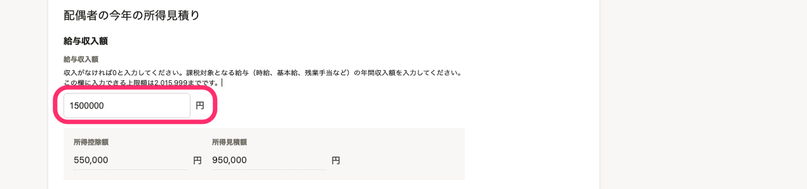

:::tips
配偶者控除等申告書の修正方法は、所得要件のみ異なりますが、上記「アンケート回答後に収集情報を修正して、書類に配偶者を表示する方法」と操作手順は同様です。
:::
