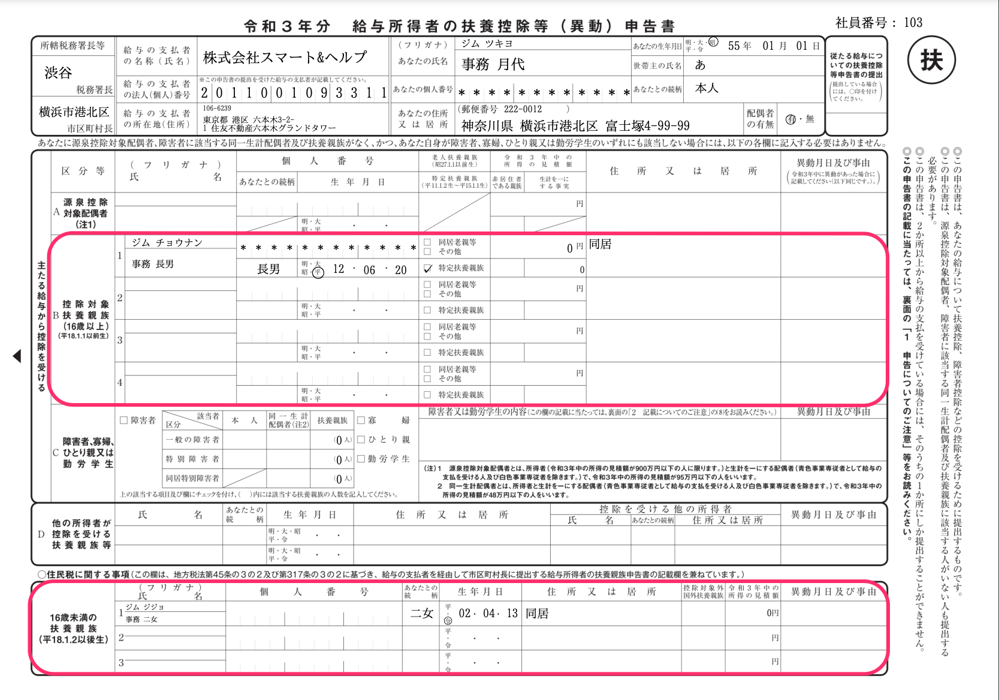
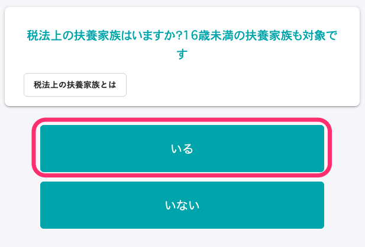
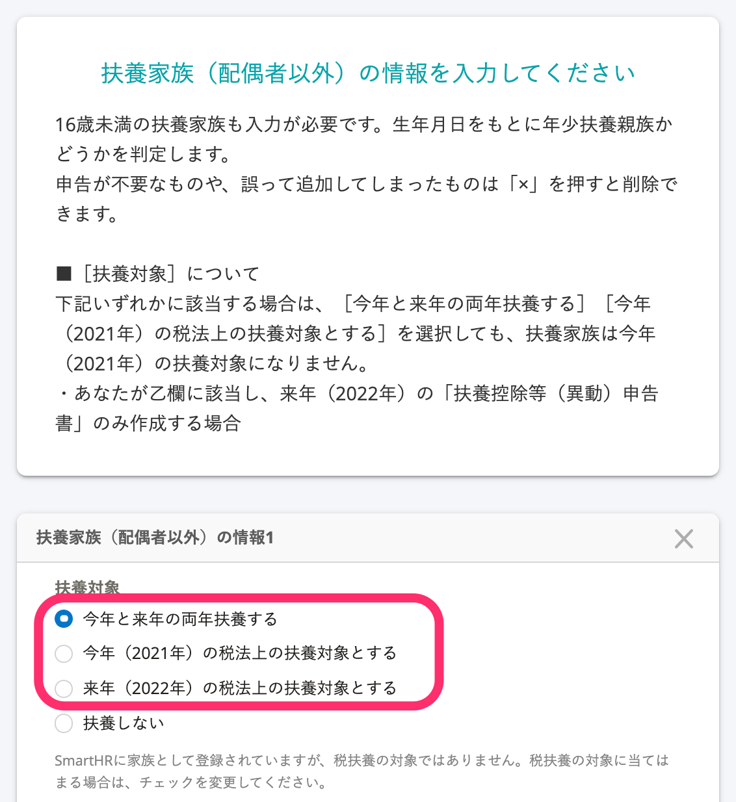
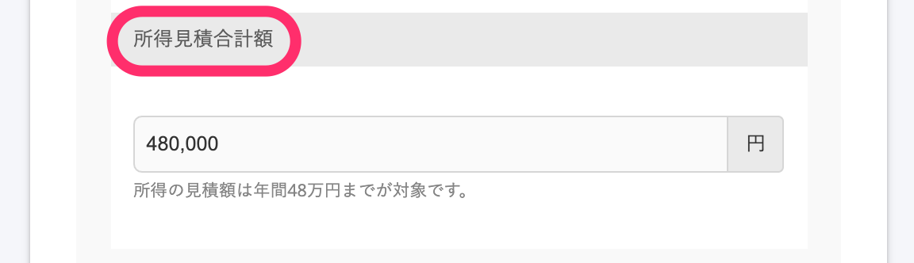
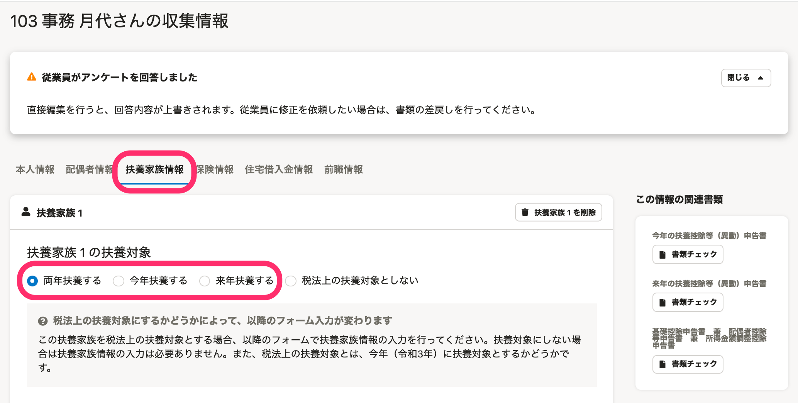
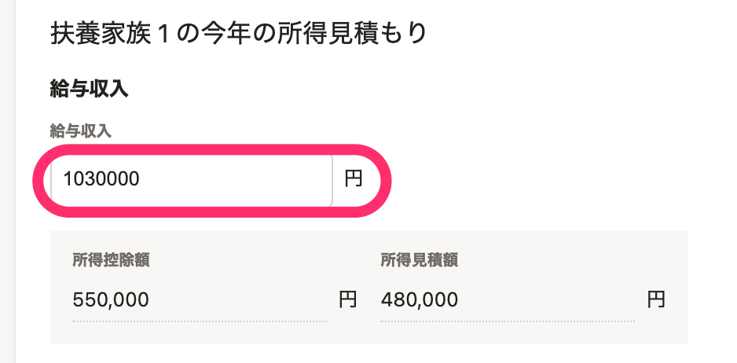
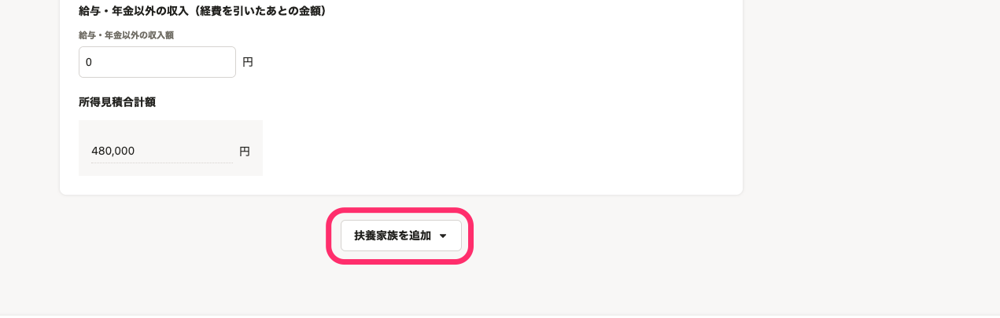

:::alert
当ページで案内しているSmartHRの年末調整機能の内容は、2021年（令和3年）版のものです。
2022年（令和4年）版の年末調整機能の公開時期は秋頃を予定しています。
なお、画面や文言、一部機能は変更になる可能性があります。
公開時期が決まり次第、[アップデート情報](https://smarthr.jp/update)でお知らせします。
:::

# A. 配偶者以外の扶養家族が記載される所得条件とアンケート回答手順を確認し、収集情報を修正してください。

扶養控除等（異動）申告書に配偶者以外の扶養家族を表示するための所得条件を満たしていないか、年末調整のアンケートの回答内容に不備があると、年末調整の書類に配偶者以外の扶養家族は表示されません。

下記を確認し、必要に応じて収集情報を修正してください。

# 配偶者以外の扶養家族が記載される所得条件

## 扶養控除等（異動）申告書（B欄：控除対象扶養親族（16歳以上）、16歳未満の扶養親族）

下記の令和3年（2021年）分の所得条件を満たすと、扶養控除等（異動）申告書のB欄および16歳未満の扶養親族欄に配偶者以外の扶養家族情報が表示されます。

| **扶養家族の所得条件** | 48万円以下（給与収入のみの場合、収入が103万円以下） |
| --- | --- |
| **従業員の所得条件** | なし |

# 年末調整のアンケート回答手順

## 設問38 「税法上の扶養家族はいますか？16歳未満の扶養家族も対象です」に「いる」と回答する

## 設問40 「扶養家族（配偶者以外）の情報を入力してください」に必要情報を入力する

配偶者以外の扶養家族について、必要情報を1人ずつ入力してください。

生年月日をもとに年少扶養親族かどうかを判定するため、16歳未満の扶養家族も入力が必要です。

 **［扶養対象］** には、「今年と来年の両年扶養する」「今年（2021年）の税法上の扶養対象とする」「来年（2022年）の税法上の扶養対象とする」のいずれかを選択します。

扶養する年の所得見積の内訳を入力し、「所得見積合計額」欄が48万円以下（給与収入のみの場合、収入が103万円以下）であることを確認します。

# アンケート回答後に収集情報を修正して、書類に配偶者以外の扶養家族を表示する方法

## 従業員に書類を差し戻して情報を修正してもらう

詳しくは下記ヘルプページの **「2. 書類を修正する」** をご覧ください。

:::related
[従業員から提出された年末調整を確認する](https://knowledge.smarthr.jp/hc/ja/articles/360034870254)
:::

## 管理者が収集情報を編集する

管理者が、収集情報画面の **［扶養家族情報］** を編集して、扶養控除等（異動）申告書に配偶者以外の扶養家族を表示します。

### 扶養家族情報の編集箇所

対象の従業員の収集情報画面で、 **［扶養家族情報］** タブを表示します。

 **［扶養家族nの扶養対象］** には、「両年扶養する」「今年扶養する」「来年扶養する」のいずれかを選択してください。

扶養する年の所得見積の内訳を入力します。

 **［所得見積合計額］** 欄が48万円以下（給与収入のみの場合、収入が103万円以下）であることを確認して、 **［保存］** します。

扶養家族を追加する場合は、 **［扶養家族を追加▼］** から追加入力してください。

