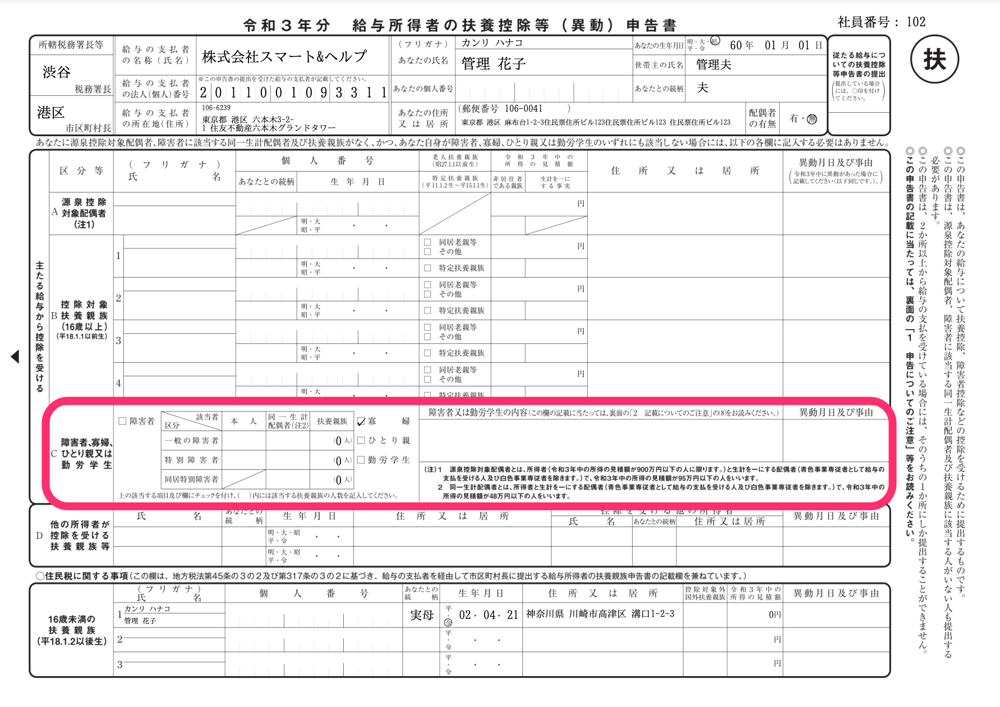
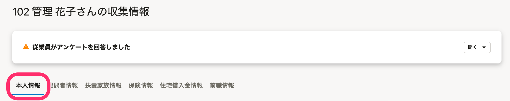
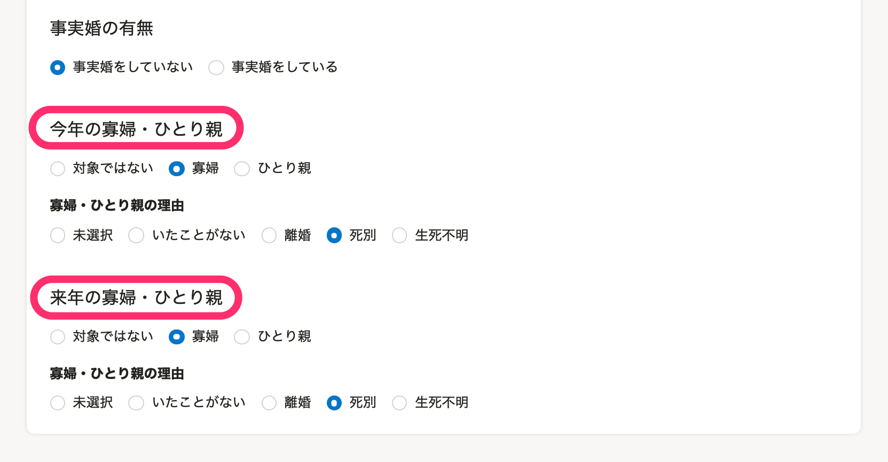
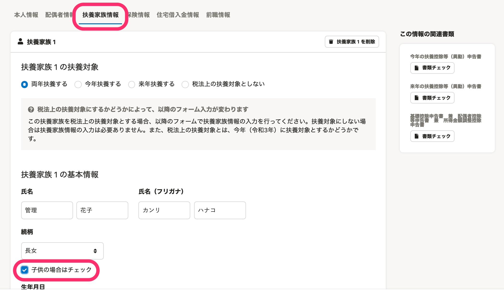

:::alert
当ページで案内しているSmartHRの年末調整機能の内容は、2021年（令和3年）版のものです。
2022年（令和4年）版の年末調整機能の公開時期は秋頃を予定しています。
なお、画面や文言、一部機能は変更になる可能性があります。
公開時期が決まり次第、[アップデート情報](https://smarthr.jp/update)でお知らせします。
:::

# A. 寡婦・ひとり親の表示条件とアンケート回答手順を確認し、収集情報を修正してください。

扶養控除等（異動）申告書に寡婦・ひとり親を表示するための条件を満たしていないか、年末調整のアンケートの回答内容に不備がある可能性があります。

下記を確認し、必要に応じて収集情報を修正してください。

# 寡婦・ひとり親が表示される条件

## 表示先：扶養控除等（異動）申告書（C欄：障害者、寡婦、寡夫又は勤労学生欄）

下記の条件を満たすと、扶養控除等（異動）申告書のC欄に寡婦・ひとり親の情報が表示されます。

## 寡婦の表示条件

| **アンケート回答者の性別** | **事実婚の有無確認** | **配偶者の有無確認** | **本人の所得確認** | **扶養家族情報の入力画面** |
| --- | --- | --- | --- | --- |
|   女性   | 事実婚していない | 離婚後、再婚していない | 500万円以下 | 子供以外の扶養親族を登録 |
| 女性 | 事実婚していない | 死別後、再婚していない（生死不明も含む） | 500万円以下 | 子供以外の扶養親族を登録 |
| 女性 | 事実婚していない | 死別後、再婚していない（生死不明も含む） | 500万円以下 | 扶養親族を登録しない |

## ひとり親の表示条件

| **事実婚の有無確認** | **配偶者の有無確認** | **本人の所得確認** | **扶養家族情報の入力画面** |
| --- | --- | --- | --- |
| 事実婚していない | いたことはない | 500万円以下 | 子供を登録 |
| 事実婚していない | 離婚後、再婚していない | 500万円以下 | 子供を登録 |
| 事実婚していない | 死別後、再婚していない（生死不明も含む） | 500万円以下 | 子供を登録 |

:::related
[Q. 寡婦控除、ひとり親控除とは、どのようなものですか。｜日本年金機構](https://www.nenkin.go.jp/faq/jukyushatodoke/roureinenkin/fuyoushinkoku/20141022-02.html)
:::

# 年末調整のアンケート回答手順

上記の表示条件を1つでも満たしていない場合、書類に寡婦・ひとり親は表示されず、控除の適用がされません。

扶養控除等（異動）申告書への表示や控除適用に関わるアンケート内容は、下記のヘルプページをご覧ください。

:::related
[Q. 寡婦・ひとり親控除が適用されていない場合、アンケートはどう修正したらいいですか？](https://knowledge.smarthr.jp/hc/ja/articles/4404565167513)
:::

# アンケート回答後に収集情報を修正して、書類に寡婦・ひとり親を表示する方法

## 従業員に書類を差し戻して情報を修正してもらう場合

詳しくは下記ヘルプページの「2. 書類を修正する」をご覧ください。

:::related
[従業員から提出された年末調整を確認する](https://knowledge.smarthr.jp/hc/ja/articles/360034870254)
:::

## 管理者が収集情報を編集する場合

管理者が収集情報画面の **［本人情報］** と **［扶養家族情報］** を編集すると、扶養控除等（異動）申告書のC欄に寡婦・ひとり親を表示できます。

### 本人情報の編集箇所

収集情報画面の **［本人情報］** タブを表示し、［ **事実婚の有無］［今年の寡婦・ひとり親］［来年の寡婦・ひとり親］［寡婦・ひとり親控除の理由］** を編集します。

:::alert
### 寡婦・ひとり親の表示の有無は、控除条件に関係なく設定できるため、書類確認時は注意してください
 **［今年の寡婦・ひとり親］［来年の寡婦・ひとり親］** の項目で、 **「寡婦」** または **「ひとり親」** を選択すると、所得条件や扶養親族の条件を満たしていない場合でも、寡婦・ひとり親の対象として自動で書類に反映されます。
 **［対象ではない］** を選択すると、所得条件や扶養親族の条件を満たしている場合でも、寡婦・ひとり親控除の対象として判定されません。
寡婦・ひとり親控除の対象となる従業員が、書類の提出・再提出などを行なった際に、寡婦・ひとり親控除の対象外になっていた場合は、該当項目のチェックと従業員への確認をお願いします。

:::

### 扶養家族情報の編集箇所

収集情報画面の **［扶養家族情報］** タブを表示し、対象となる扶養家族の情報を編集します。

扶養家族が子供の場合は、 **［続柄］** 欄の **［子供の場合はチェック］** に必ずチェックを入れてください。

チェックの有無で、登録者が子供かどうかを判定します。

:::alert
収集情報画面から編集する場合、 **［扶養家族情報］** に寡婦・ひとり親控除を受けるための情報を入力しただけでは、控除対象として判定されません。
必ず **［本人情報］** で **「寡婦」** または **「ひとり親」** を選択してください。
:::

「給与所得者の基礎控除申告書 兼 給与所得者の配偶者控除等申告書 兼 所得金額調整控除申告書」での寡婦・ひとり親の判定については、下記のヘルプページをご覧ください。

:::related
[「給与所得者の基礎控除申告書 兼 給与所得者の配偶者控除等申告書 兼 所得金額調整控除申告書」への合計所得金額の表示仕様](https://knowledge.smarthr.jp/hc/ja/articles/360056738313)
:::
