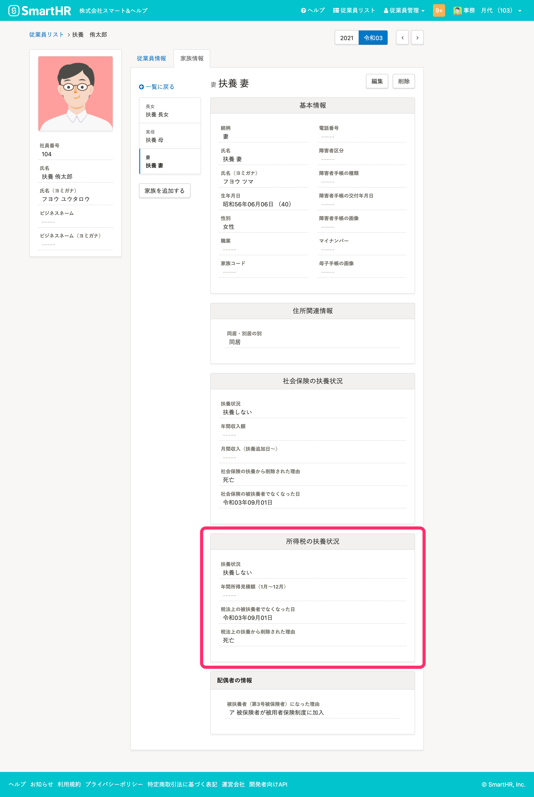
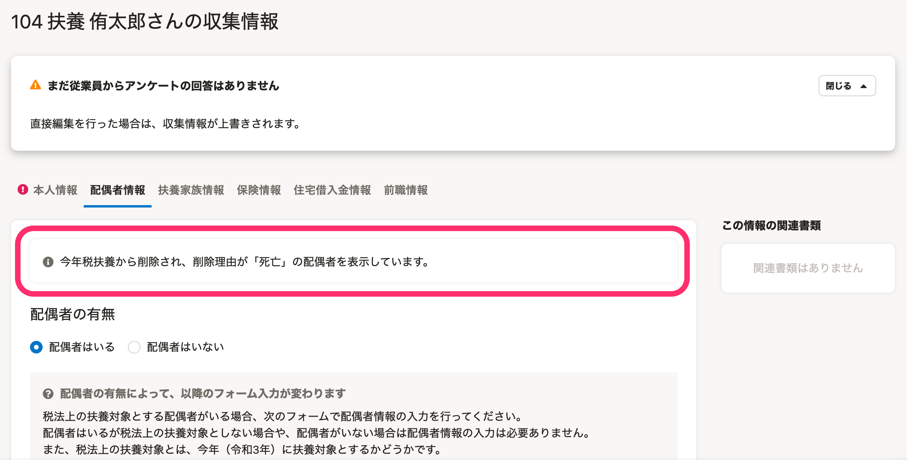
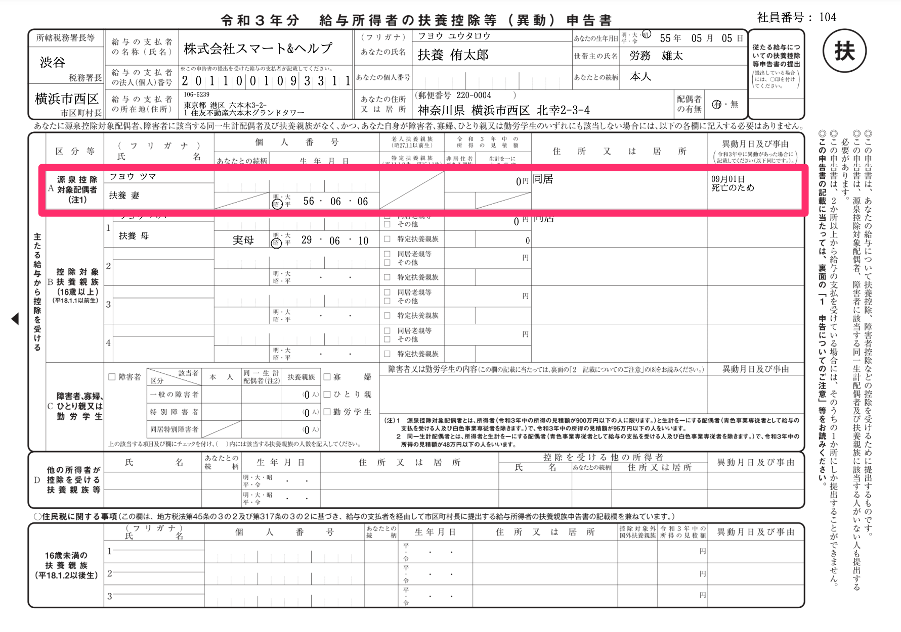
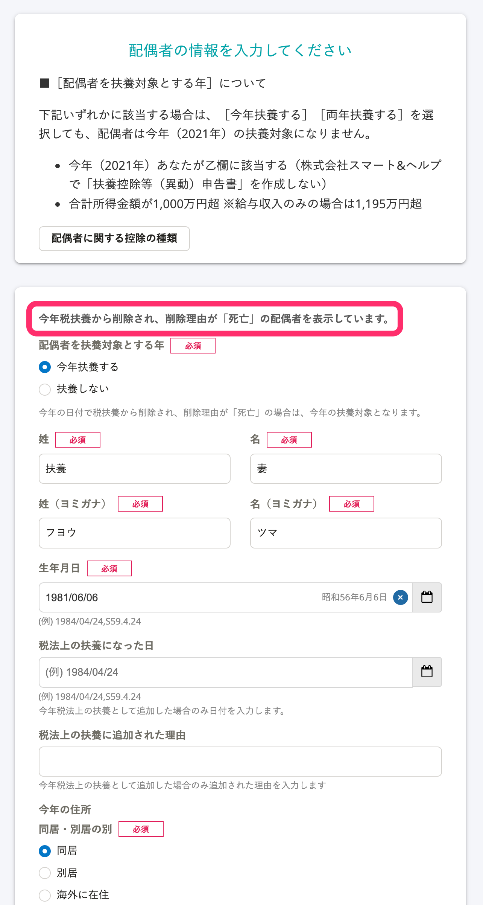
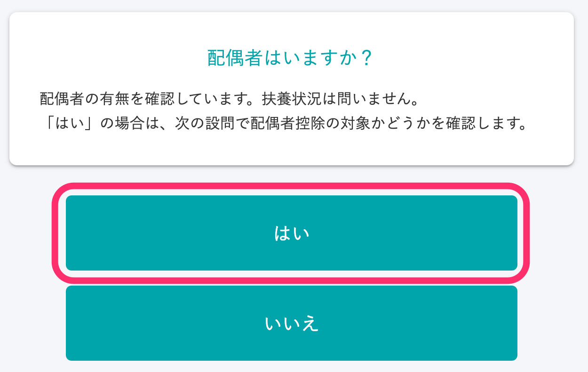
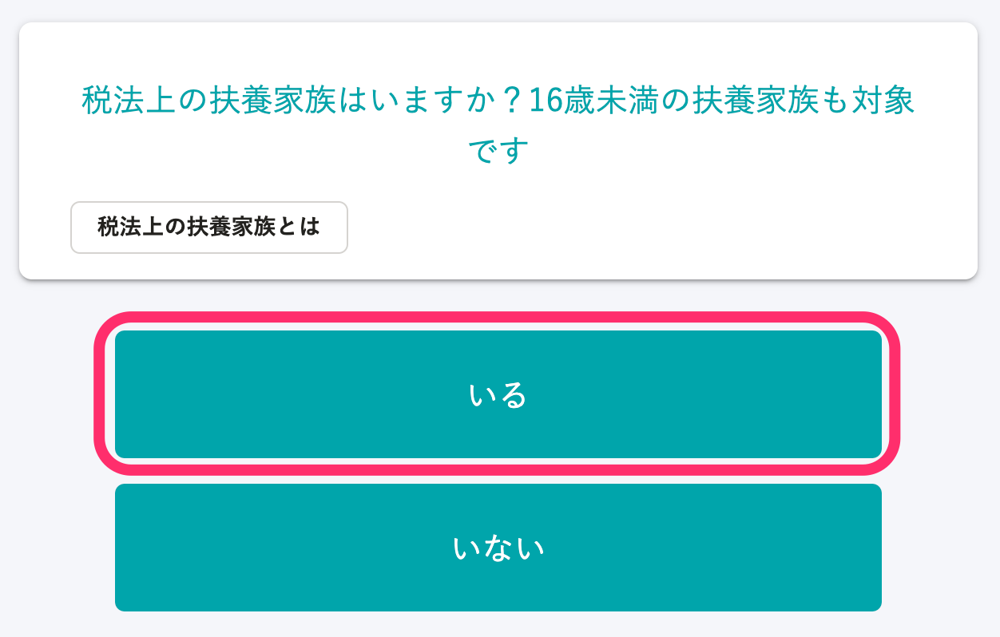

:::alert
当ページで案内しているSmartHRの年末調整機能の内容は、2021年（令和3年）版のものです。
2022年（令和4年）版の年末調整機能の公開時期は秋頃を予定しています。
なお、画面や文言、一部機能は変更になる可能性があります。
公開時期が決まり次第、[アップデート情報](https://smarthr.jp/update)でお知らせします。
:::

# A. SmartHRの従業員情報として［家族情報］の［所得税の扶養状況］に以下3つの情報がすべて登録されている必要があります。

-  **［扶養状況］** が「扶養しない」
-  **［税法上の被扶養者でなくなった日］** が「当年の日付」
-  **［税法上の扶養から削除された理由］** が「死亡」

:::tips
上記3つの情報が登録されている **［家族情報］** をSmartHRから削除していても、過去に家族情報が登録されていた事実があれば、今年亡くなった扶養親族として年末調整機能に取り込みます。
:::

なお、すでに年末調整機能に従業員情報を取り込み、依頼グループを作成している場合は、「あとから年末調整機能に情報を反映させる方法」の内容を参考に、年末調整機能に従業員情報を取り込み直してください。

## 年末調整機能での今年亡くなった配偶者・扶養親族情報の表示

今年亡くなった配偶者・扶養親族の情報は、年末調整機能の画面や書類では下図のとおり表示します。

### 年末調整の収集情報画面

例：今年亡くなった配偶者の場合、収集情報画面上部に"今年税扶養から削除され、削除理由が「死亡」の配偶者を表示しています。"というメッセージが表示されます。

### 給与所得者の扶養控除等（異動）申告書

例：今年亡くなった配偶者の場合、［A：源泉控除対象配偶者欄］に、異動月日及び事由を添えて表示します。

### 年末調整のアンケート画面（従業員から見える内容）

例：今年亡くなった配偶者の場合、配偶者の情報を入力する画面上部に"今年税扶養から削除され、削除理由が「死亡」の配偶者を表示しています。"というメッセージが表示されます。

## あとから年末調整機能に情報を反映させる方法

すでに年末調整機能に従業員情報を取り込んでいる状態でSmartHRの **［家族情報］** を更新しても、年末調整機能の情報は更新されません。

情報を反映させるには、年末調整機能の収集情報に直接入力する方法と、SmartHRの **［家族情報］** を更新後、年末調整機能から従業員情報を一度削除し、あらためて追加する方法があります。

状況に応じて、いずれかの方法で対処してください。

### 収集情報を直接編集する

収集情報画面で以下に沿って情報を入力し、 **［保存］** をクリックしてください。

■配偶者の場合

- 収集情報画面で **［配偶者情報］** のタブをクリックして、画面表示を切り替える
-  **［配偶者の有無］** で **［配偶者はいる］** を選択
-  **［配偶者を扶養対象とする年］** で **［今年扶養する］** を選択
-  **［税法上の扶養になった日］** に「死亡した日付」を入力
-  **［税法上の扶養になった理由］** に「死亡」を入力

■扶養親族の場合

- 収集情報画面で **［扶養家族情報］** のタブをクリックして、画面表示を切り替える
-  **［扶養家族nの扶養対象］** で **［今年扶養する］** を選択
-  **［税法上の扶養になった日］** に「死亡した日付」を入力
-  **［税法上の扶養になった理由］** に「死亡」を入力

:::tips
扶養家族情報が1人も登録されていない場合は、画面下部にある **［扶養家族を追加▼］>［従業員の扶養家族を追加］** をクリックしてから操作をはじめてください。
:::
:::alert
#### 収集情報を直接編集する方法で対処する場合の注意点
**1\. 従業員が年末調整のアンケートに「配偶者・扶養親族はいる」と回答すること**
従業員が年末調整のアンケートに回答する際、配偶者・扶養親族の有無を確認する設問で **［はい］** （配偶者・扶養親族はいる）と回答する必要があります。
 **［いいえ］** を選択してしまうと、今年亡くなった配偶者・扶養親族を年末調整書類に反映できないため、ヒントメッセージ設定で補足する、事前に対象従業員に連絡するなどの対応をしてください。

**2\. 収集情報CSVに、今年亡くなった配偶者・扶養親族は「扶養されている」状態として出力されます**
今年亡くなった配偶者・扶養親族を収集情報から直接登録する場合、仕様上、配偶者・扶養親族を扶養している状態で登録する必要があります。
収集情報CSVを利用する際は、必ず正しい扶養状況を確認してください。
:::

### 従業員情報を年末調整機能から削除し、再度、追加する

以下のヘルプページを参照して、従業員を削除・追加してください。

[年末調整の依頼一覧から従業員を削除する](https://knowledge.smarthr.jp/hc/ja/articles/360035370413)
