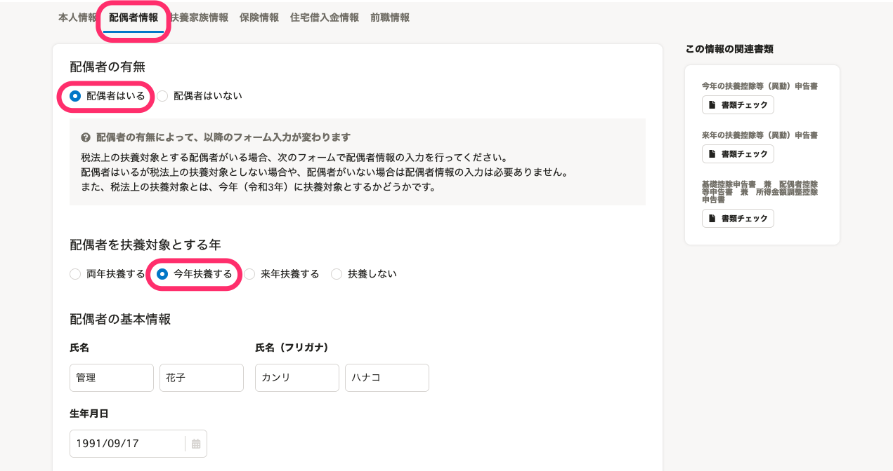
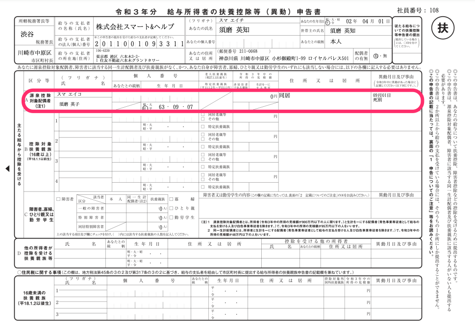
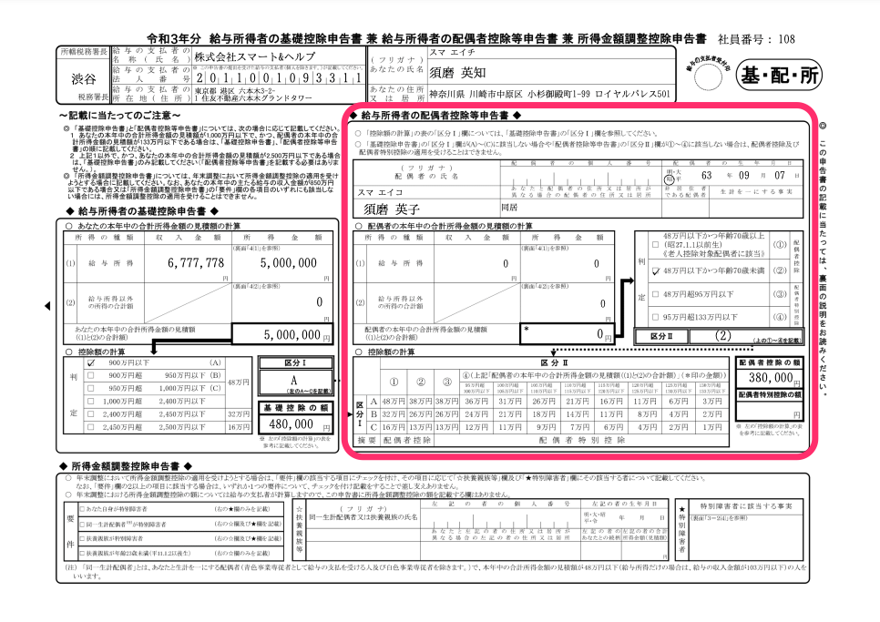
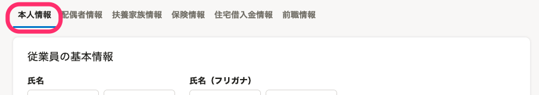
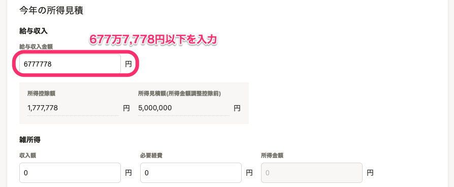
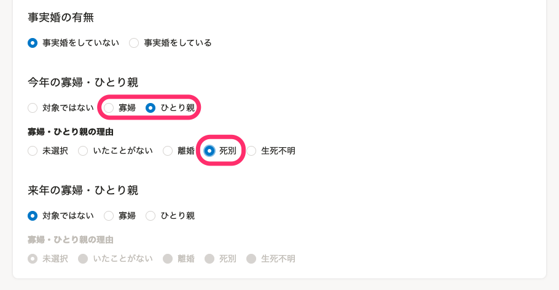
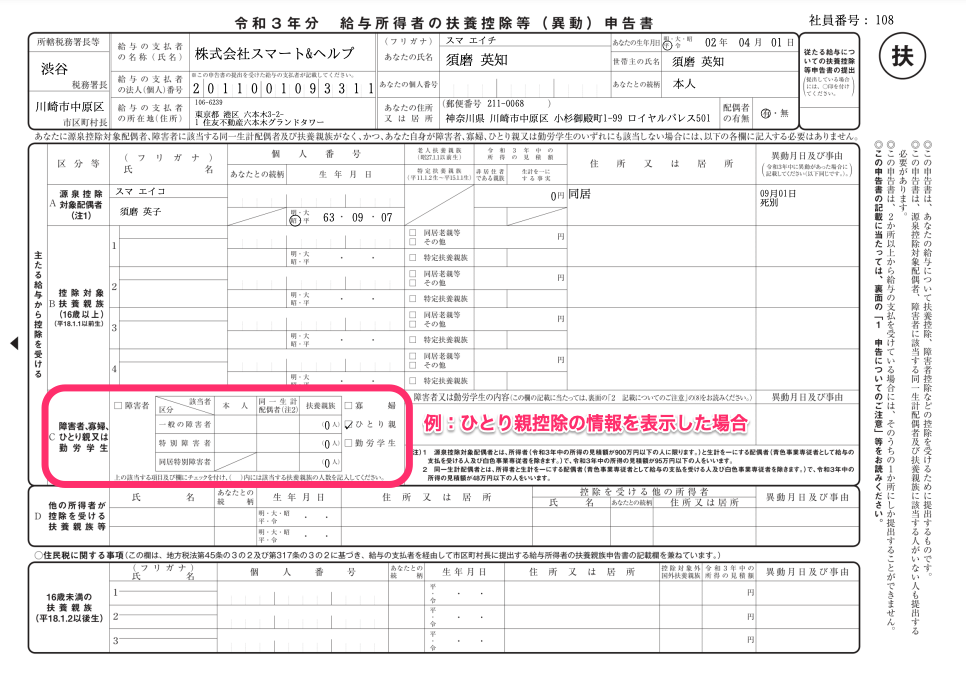

:::alert
当ページで案内しているSmartHRの年末調整機能の内容は、2021年（令和3年）版のものです。
2022年（令和4年）版の年末調整機能の公開時期は秋頃を予定しています。
なお、画面や文言、一部機能は変更になる可能性があります。
公開時期が決まり次第、[アップデート情報](https://smarthr.jp/update)でお知らせします。
:::

# A. はい、双方を適用できます。

:::alert
#### **従業員が年末調整のアンケートに回答するだけでは、双方適用の書類を作成できません**
アンケート回答後に管理者が収集情報を編集する必要があります。
以下の場合に分けて、双方を適用した書類を表示する方法を説明します。
- 扶養控除等申告書（マルフ）や配偶者控除等申告書に配偶者情報が表示されていない場合
- 扶養控除等申告書（マルフ）に寡婦・ひとり親情報が表示されていない場合
:::

# 扶養控除等申告書（マルフ）や配偶者控除等申告書に配偶者情報が表示されていない場合

収集情報画面の **［配偶者情報］** タブを表示し、下記を設定して **［保存］** をクリックします。

-  **［配偶者の有無］** 欄は、 **「配偶者はいる」** を選択する
-  **［配偶者を扶養対象とする年］** 欄は、 **「今年扶養する」** を選択する

配偶者情報が入力されていなければ、配偶者情報を入力してください。

上記を設定すると、書類に双方の控除が適用されます。

年末調整の書類に配偶者が表示されない場合は、以下のヘルプページもあわせてご覧ください。

:::related
[Q. 年末調整の書類に配偶者の情報が表示されない場合は？](https://knowledge.smarthr.jp/hc/ja/articles/360034870674)
:::

# 扶養控除等申告書（マルフ）に寡婦・ひとり親情報が表示されていない場合

収集情報画面の **［本人情報］** タブを表示し、下記を設定して **［保存］** をクリックします。

-  **［給与収入金額］** 欄に677万7,778円以下（ **［所得見積額］** 欄が500万円以下）を入力する
-  **［今年の寡婦・ひとり親］** 欄は、 **［寡婦］** もしくは **［ひとり親］** を選択する
-  **［寡婦・ひとり親の理由］** 欄は、 **［死別］** を選択する

上記を設定すると、書類に寡婦・ひとり親控除が表示されます。

