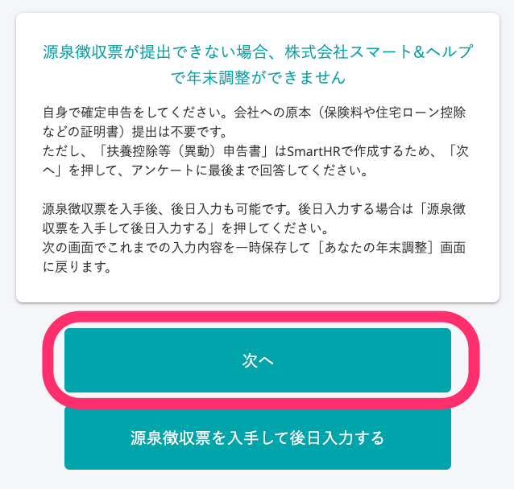

:::alert
当ページで案内しているSmartHRの年末調整機能の内容は、2021年（令和3年）版のものです。
2022年（令和4年）版の年末調整機能の公開時期は秋頃を予定しています。
なお、画面や文言、一部機能は変更になる可能性があります。
公開時期が決まり次第、[アップデート情報](https://smarthr.jp/update)でお知らせします。
:::

# A. 年末調整の対象外となり、従業員は自身で確定申告をする必要があります。

なお、年末調整の書類作成は不要ですが、 **「来年の給与所得者の扶養控除等（異動）申告書」を作成する必要がある**  ため、従業員へは下記の手順でアンケートを回答するよう案内してください。

## 1\. 従業員に年末調整を依頼する

年末調整の依頼について、詳しくは下記のヘルプページをご覧ください。

:::related
[年末調整を依頼する](https://knowledge.smarthr.jp/hc/ja/articles/360035370313)
:::

## 2. 設問「前職から受け取った令和3年（2021年）の「給与所得の源泉徴収票」はありますか？」に「はい」と回答する

従業員が年末調整のアンケートで、設問「前職から受け取った令和3年（2021年）の「給与所得の源泉徴収票」はありますか？」に「はい」と回答します。

前職での雇用形態を確認する設問の後に、設問「令和3年（2021年）の源泉徴収票の内容を入力してください」が表示されます。

## 3\. ［入手できない］を選択し、［次へ］をクリック

前職の源泉徴収票について **［入手できない］** を選択し、 **［最後の給与支給日］** を入力して、 **［次へ］** をクリックします。

## 4\. ［次へ］をクリックし、アンケートを続ける

設問 **［源泉徴収票が提出できない場合、｛会社名｝で年末調整ができません］** が表示されます。

 **［次へ］** と回答し、そのあとの設問をすべてを回答すると、「来年の給与所得者の扶養控除等（異動）申告書」が作成されます。

