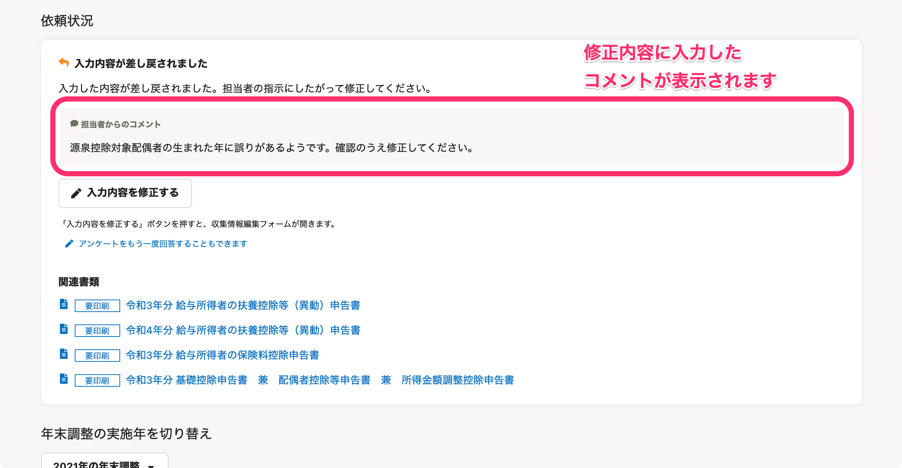

:::alert
当ページで案内しているSmartHRの年末調整機能の内容は、2021年（令和3年）版のものです。
2022年（令和4年）版の年末調整機能の公開時期は秋頃を予定しています。
なお、画面や文言、一部機能は変更になる可能性があります。
公開時期が決まり次第、[アップデート情報](https://smarthr.jp/update%E2%80%9D)でお知らせします。
:::

# A. 「修正依頼」は収集情報単位または該当項目のみ修正が必要なときに利用し、「差し戻し」は書類単位で修正が必要なときに利用します。

年末調整のアンケートで集めた情報を従業員に修正してもらう場合、「修正依頼」と「差し戻し」の2つの方法があります。

どちらも「情報の修正・確認を依頼する」という点では同じですが、修正依頼方法や修正単位の考え方が異なります。

このページでは、「修正依頼」と「差し戻し」の違いについて説明します。

# 修正依頼とは

「修正依頼」とは、必要な情報が不足または誤っている場合に、従業員に対して収集情報単位あるいは該当項目のみ修正や追加での情報提供を依頼する場合が該当します。

例えば、年末調整のアンケートに生命保険情報や住宅ローン情報の入力がなく、「給与所得者の保険料控除等申告書」や「住宅ローン控除申告書」が作成されなかった場合に、従業員に対して収集情報の修正を依頼する場合などです。

なお、修正依頼を行なった場合、依頼ステータスは「修正依頼中」になります。

## 修正依頼の利用例

例えば、「今年、中途入社をした社員が前職情報を入力していなかった場合」などに利用します。

依頼詳細画面下部にある **［修正依頼］** をクリックすると、修正依頼内容の入力画面が表示されます。

 **［修正項目］** と **［修正内容］** を入力し、 **［修正依頼］** をクリックすると、従業員に修正依頼がされます。

:::tips
書類を差し戻している状態でも、修正依頼を出せます。
また、修正依頼は複数出せます。修正依頼が重複した場合、従業員が再回答すると、書類と収集情報の両方に修正した内容が適用されます。
複数回修正依頼を出している状態で、依頼詳細画面の **［修正依頼を取り消す］** をクリックすると、すべての修正依頼が取り消されます。
:::
:::related
[従業員に年末調整の修正依頼を出す](https://knowledge.smarthr.jp/hc/ja/articles/360057982273)
:::

# 差し戻しとは

「差し戻し」とは、従業員による年末調整のアンケート回答の結果、必要な書類はすでに作成されていますが、従業員に書類単位で修正または確認してほしい箇所があり、該当の書類のみ差し戻す場合が該当します。

例えば、作成された「給与所得者の扶養控除等（異動）申告書」の内容に誤りがあるため、コメントをつけて従業員に書類を差し戻す場合などです。

この場合、書類そのものが修正対象になるため、関連する **［本人情報］［配偶者情報］［扶養家族情報］** の項目が差し戻しの対象項目です。

なお、差し戻しをした場合、依頼ステータスは「修正依頼中」になります。

## 差し戻しの利用例

例えば、「給与所得者の扶養控除等（異動）申告書に記載の情報修正を依頼したい場合」などに利用します。

書類チェック画面の右下にある **［差し戻す］** をクリックすると、修正内容の編集画面が表示されます。

「差し戻し」は書類単位で行なうため、 **［修正項目］** 欄には書類に関連する項目に自動でチェックが入ります。

 **［修正内容］** 欄に修正内容を入力し、 **［差し戻す］** をクリックすると、従業員に書類が差し戻されます。

:::tips
依頼詳細画面で **［修正依頼を取り消す］** をクリックしても、修正依頼と並行して「書類の差し戻し」をしていた場合、書類の差し戻しは取り消されません。
:::
:::related
[提出された書類を従業員に差し戻す](https://knowledge.smarthr.jp/hc/ja/articles/360053238834)
:::

# 「修正依頼」「差し戻し」が行なわれた場合の、従業員側の画面表示と修正方法

「修正依頼」「差し戻し」のどちらの方法で依頼を戻したとしても、従業員には同じ画面が表示され、修正の方法も同じです。

従業員に表示される「あなたの年末調整」画面には、「入力内容が差し戻されました」というメッセージと、担当者が **［修正内容］** 欄に入力したコメントが表示されます。

従業員は **［入力内容を修正する］** をクリックして該当の情報を修正するか、 **［アンケートをもう一度回答することもできます］** をクリックして、再度アンケートに回答して情報を修正します。

:::related
[Q. 提出した年末調整が差し戻された場合は？](https://knowledge.smarthr.jp/hc/ja/articles/360035370073)
:::
