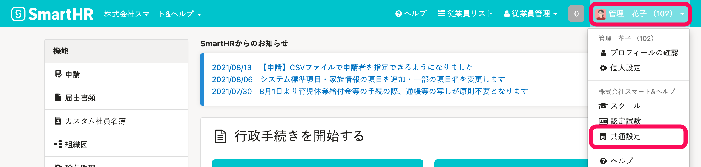

他社のアプリケーションを、SmartHRにインストールする手順を説明します。

# 1.［外部システム連携］画面に移動

画面右上の **［アカウント名▼］** \> **［共通設定］** をクリックします。

画面左下にある **［外部システム連携］** をクリックすると、 **［外部システム連携］** 画面が表示されます。

# 2\. インストール

連携できるアプリケーションが、 **［アプリケーション連携］** に表示されています。

連携したいアプリケーションをインストールしてください。

:::tips
「マネーフォワード クラウド給与連携」には、**アプリケーション連携の権限**が必要です。
以下のページの「各種機能 > アプリケーション連携」の項目をご覧ください。
[手続きや機能の閲覧・作成・更新・削除の権限を設定する](https://knowledge.smarthr.jp/hc/ja/articles/360041268873)
連携方法は、以下のヘルプページをご覧ください。
[【マネーフォワード クラウド給与】連携設定（初回設定）](https://knowledge.smarthr.jp/hc/ja/articles/360050078134)
:::
:::tips
「マネーフォワードクラウド給与連携」以外は、**管理者権限**でのみインストールできます。
[【一覧】管理者権限でのみ利用できる機能](https://knowledge.smarthr.jp/hc/ja/articles/360060310914)
:::

# 3\. インストールされたことを確認

インストールしたアプリケーションが、SmartHRトップページ左の **［機能］** 欄に追加されていることを確認してください。

