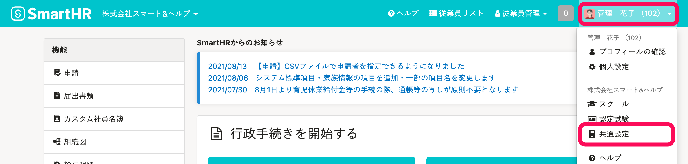
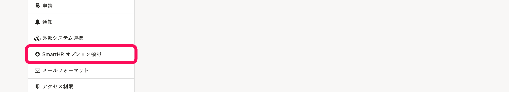
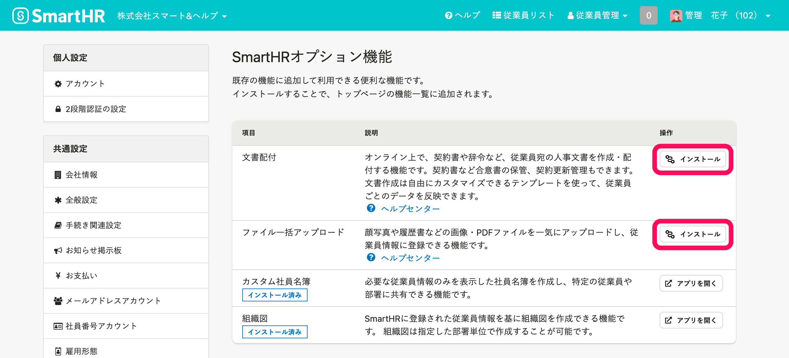
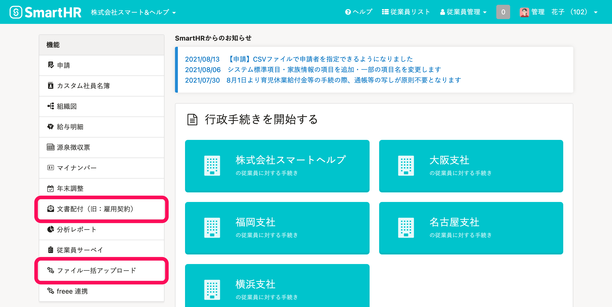

SmartHRオプション機能のインストール手順を説明します。

# SmartHRオプション機能とは？

SmartHRに追加して利用できる機能です。

インストールすると、SmartHRトップページ左の **［機能］** 欄に表示されます。

# インストール手順

## 1.［SmartHR オプション機能］画面に移動

画面右上の **［アカウント名▼］** \> **［共通設定］** をクリックします。

画面左下にある **［SmartHR オプション機能］** をクリックすると、 **［SmartHR オプション機能］** 画面が表示されます。

## 2\. インストール

追加したいオプション機能をインストールしてください。

## 3\. インストールされたことを確認

インストールしたオプション機能が、SmartHRトップページ左の **［機能］** 欄に追加されていることを確認してください。

