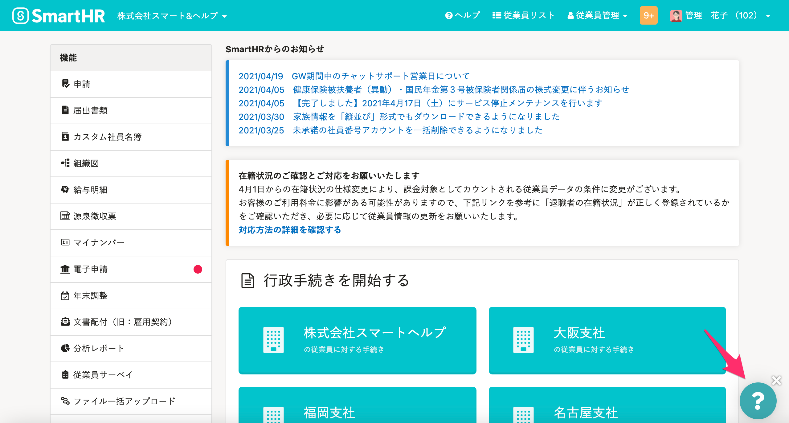

連携機能利用時に予期しないエラーが発生し、再試行しても問題が解消しない場合は、下記の内容を添えてチャットサポートまでお問い合わせください。

1.  実施したかった内容
2.  操作手順
3.  操作日時
4.  予期しないエラーの通知メール文面（スクリーンショットもしくは記載内容をコピー＆ペーストしたもの）

:::tips
上記の情報をあらかじめご用意いただけると、原因の特定に要する時間が短縮できます。
スムーズな案内のために何とぞご協力ください。
:::

チャットサポートへのお問い合わせは、SmartHRトップページの画面右下にある **［チャットアイコン］** をクリックしてください。

チャットサポートの利用方法や、お問い合わせの前に参考にしていただきたいSmartHRの動作環境については、下記のヘルプページをご覧ください。

- [チャットによるサポートを利用する](https://knowledge.smarthr.jp/hc/ja/articles/360026265673)
- [SmartHRの動作環境は？](https://knowledge.smarthr.jp/hc/ja/articles/360035170054)
