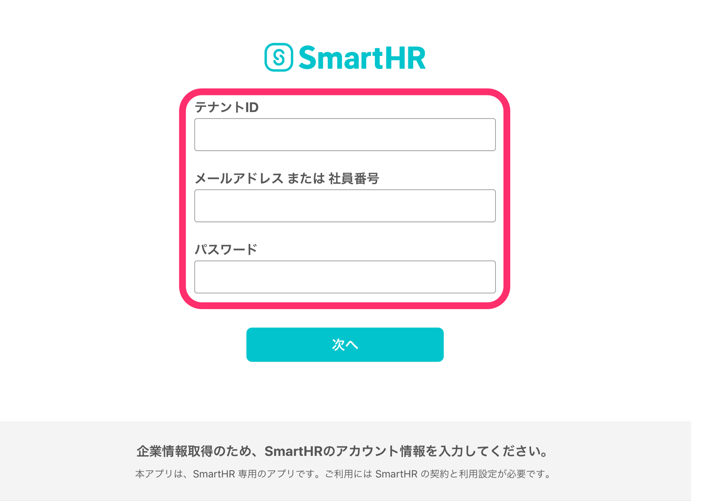
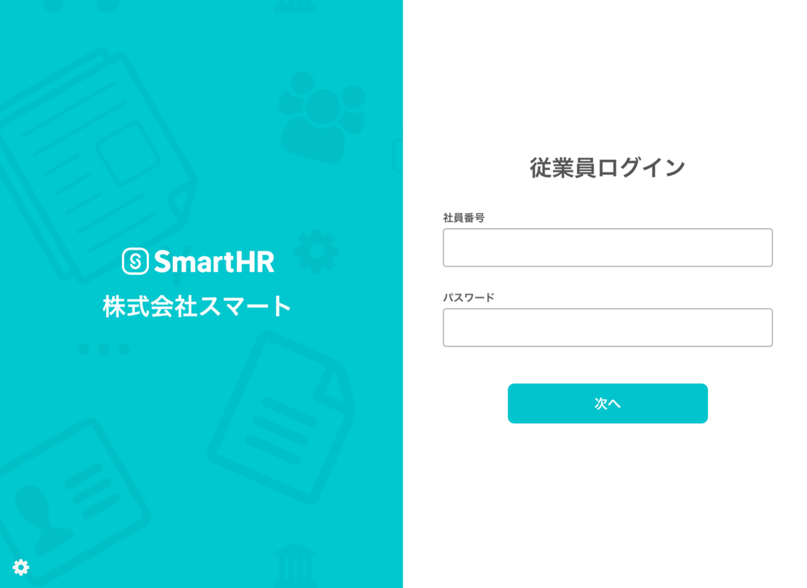

# 店舗管理者向けスマートHRとは

- PCやスマートフォンをお持ちでない従業員さまも、社員番号アカウントを利用して情報を提出できます。
- 入力した個人情報はiPad本体に残らないため、身分証明書の画像なども安心してご登録いただけます。

# アプリの初期設定方法

App Storeにて「店舗管理者向けスマートHR」をダウンロードします。

本アプリはiPad専用アプリとなり、無料でダウンロードできます。

## 1\. テナントIDとアカウント情報を入力し、 \[次へ\] ボタンをタップ

**\[テナントID\]** にサブドメイン、**\[メールアドレス および 社員番号\]** と **\[パスワード\]** には管理者権限をお持ちの方のアカウント情報を入力し **\[次へ\]** ボタンをタップします。

サブドメインを確認する方法は、下記のページをご覧ください。

[サブドメイン（テナントID）とは](https://knowledge.smarthr.jp/hc/ja/articles/360026264893)

## 2\. 初期設定の完了を確認する

従業員のログイン画面に遷移ができると初期設定は完了です。

# 初期設定がエラーとなった時の対応方法

## 「アクセスできません」と表示される場合

ご利用のお申込みをいただいていない可能性がございます。

[iPad用アプリに関するお問い合わせ](https://smarthr.jp/ipad-contact) のページよりお問合せいただくか、チャットサポート宛にご連絡ください。

## 「メールアドレスまたはパスワードが違います」と表示される場合

下記いずれかの可能性が考えられるため、社内の管理者の方にお問い合わせください。

- 入力頂いたアカウント情報が管理者権限ではない可能性
- アカウント情報が間違っている可能性

# 従業員さまへのアナウンス方法

本アプリは社員番号でのログインにのみ対応しておりますので、情報入力を依頼する場合は社員番号アカウントを事前に作成します。

社員番号アカウントの作成方法について詳しくは、以下のページをご覧ください。

[社員番号アカウントを作成する](https://knowledge.smarthr.jp/hc/ja/articles/360026263373)

別途メール・書面などで、下記の情報をお伝えください。

- 社員番号
- 初期パスワード
