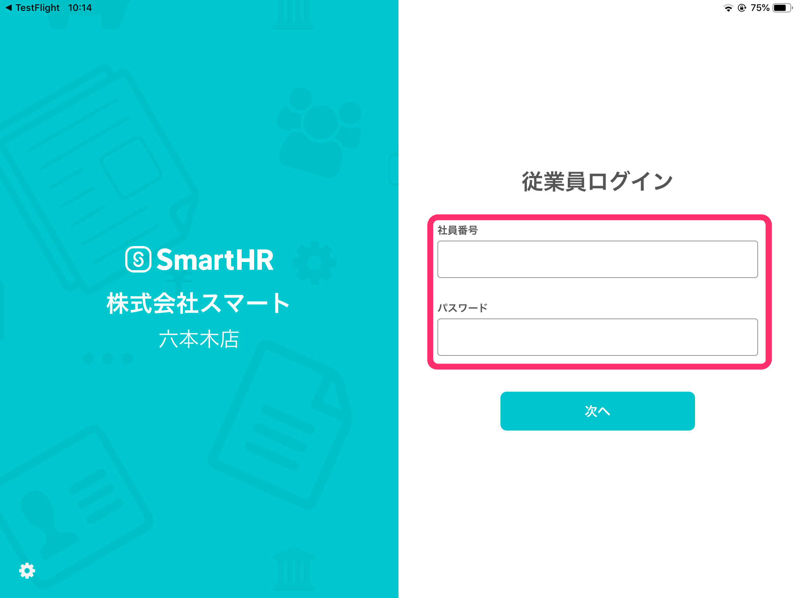
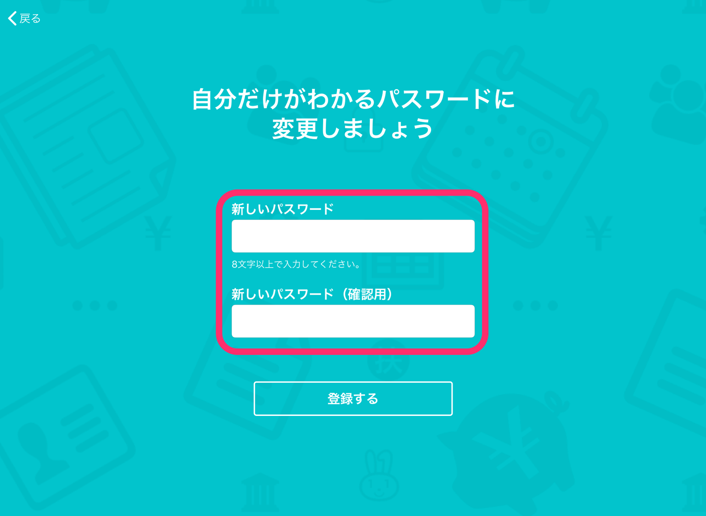
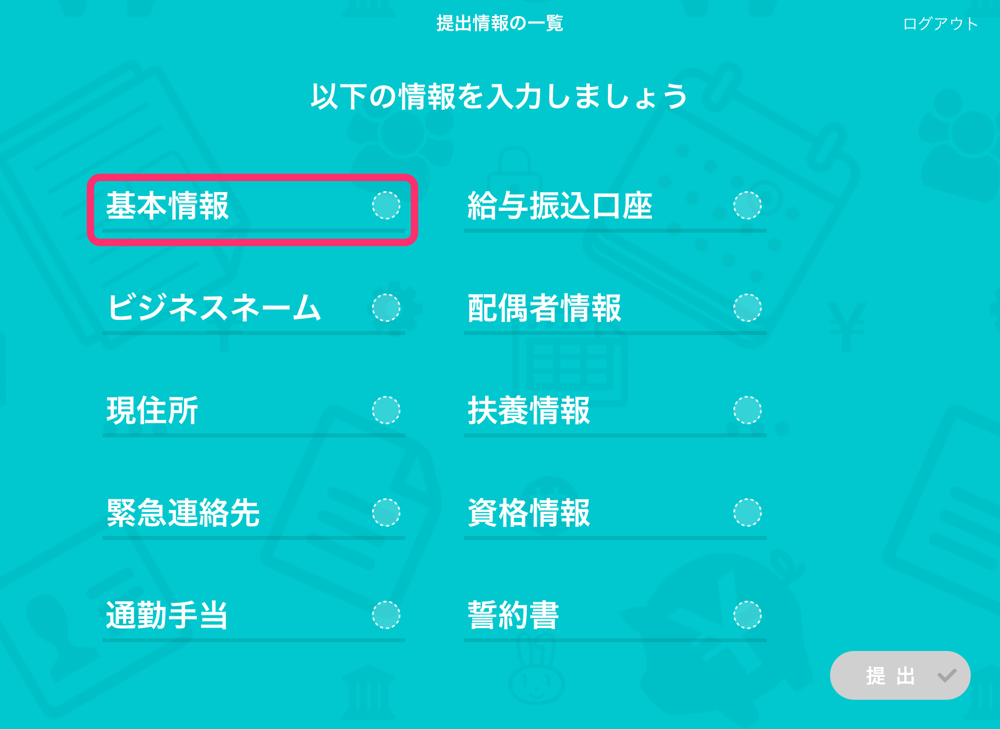
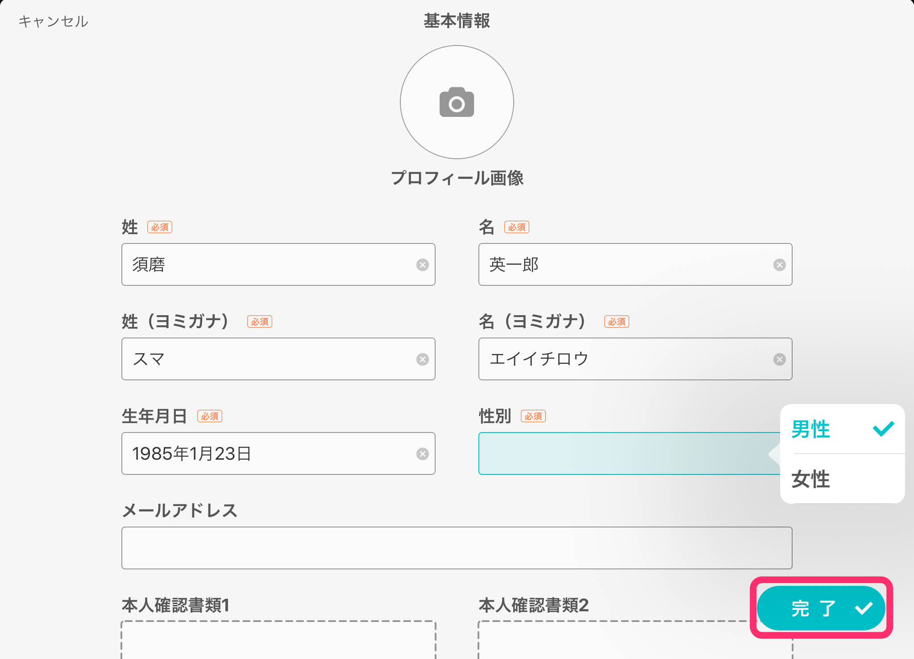
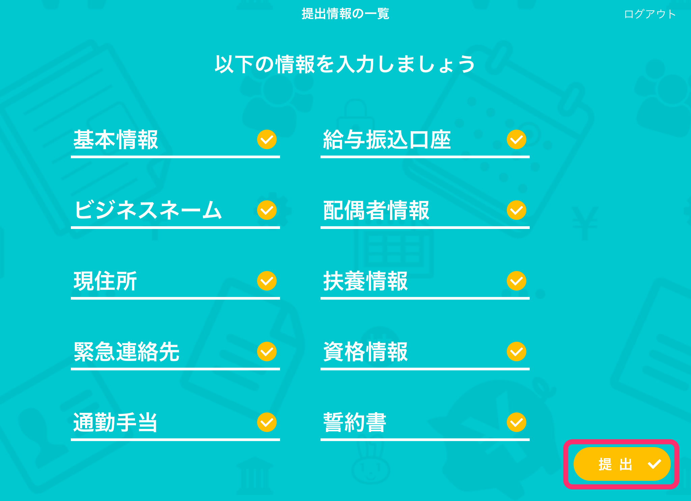
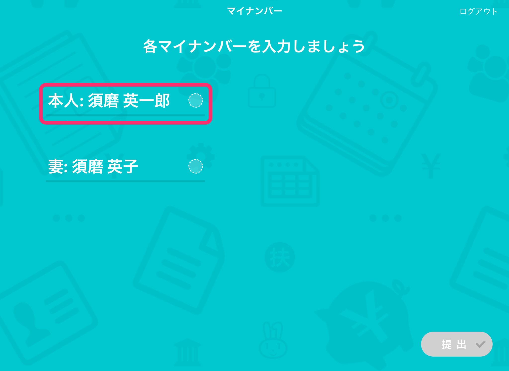

# 店舗管理者向けスマートHRとは

- PCやスマートフォンをお持ちでない従業員さまも、社員番号アカウントを利用して情報を提出できます。
- 入力した個人情報はiPad本体に残らないため、身分証明書の画像なども安心してご登録いただけます。

# 利用方法

## 1\. 店舗管理者向けスマートHR（iPadアプリ）を開く

店舗管理者向けスマートHR（iPadアプリ）を開きます。

## 2\. 社員番号と初期パスワードを入力します

管理者（労務担当者）より案内された、社員番号と初期パスワードを入力します。

## 3\. パスワードを設定する

初期パスワードとは異なるパスワードを入力し、パスワードを設定してください。

## 4\. 各項目の情報を入力する

管理者（労務担当者）から提出を求められている項目の一覧画面が表示されますので、各項目をタップしご自身の情報を入力してください。

## 5\. \[完了\] をタップする

すべての入力項目に情報入力が完了したら **\[完了\]** をタップします。

## 6\. \[提出\] をタップする

すべての項目が完了したら **\[提出\]** をタップします。

# マイナンバーの入力依頼があった場合

管理者（労務担当者）からマイナンバーの提出も求められている場合は、マイナンバーの入力画面が表示されます。

自分または被扶養者（配偶者含む）の氏名をタップし、入力画面へ進んでください。

:::tips
- 入力を途中で中断する際には、必ずホームボタンをおしてアプリを切り替えてください。次回ログイン時には再度パスワードの入力が必要となります。
- 既に従業員情報が入力されている場合、内容に間違いが無いか必ず確認してください。
- 先に項目を確認し、必要な情報を揃えた上でご入力ください。（身分証明書、社会保険番号、年金手帳または基礎年金番号通知書など）
:::

# 設定したパスワードを忘れた場合

貴社の管理者宛にお問い合わせください。
