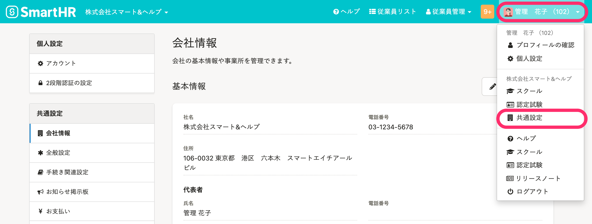
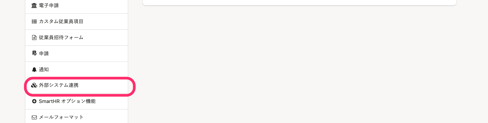
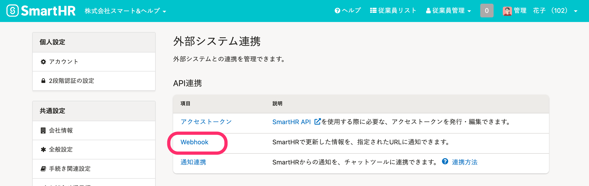
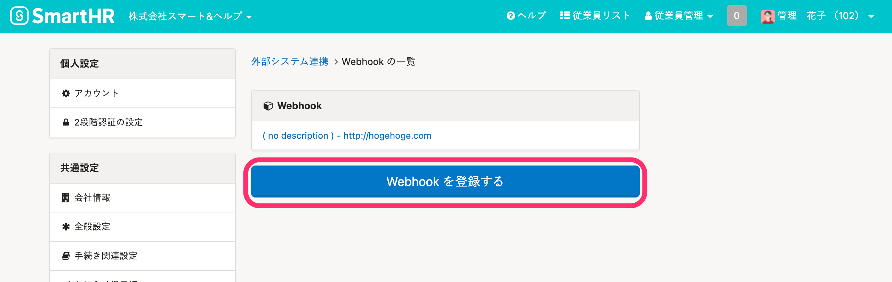
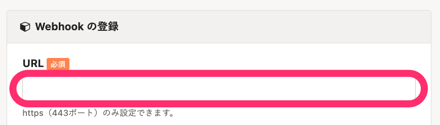
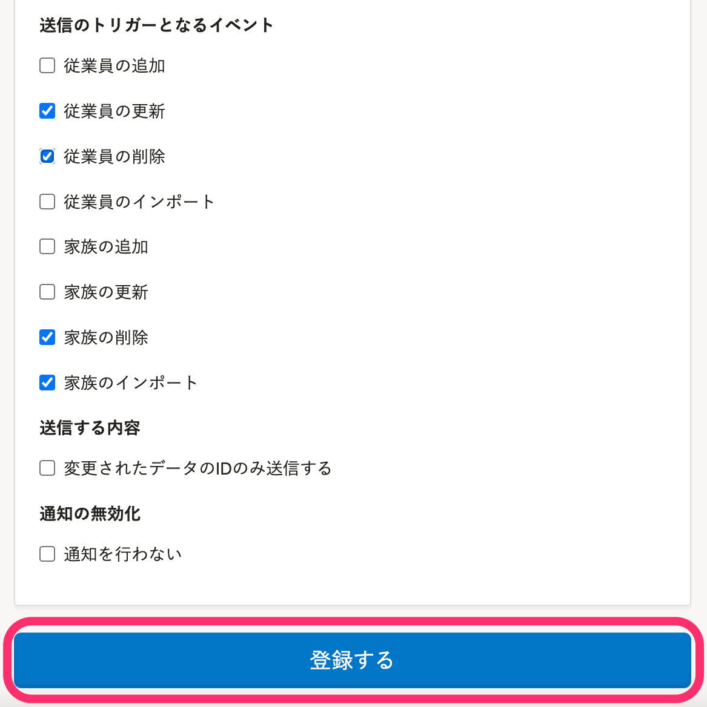
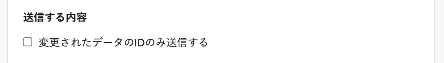
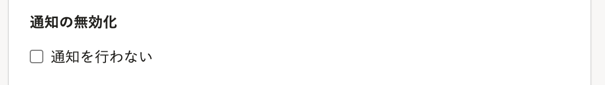

Webhookの設定をすると、SmartHRで従業員や家族情報の更新操作が行なわれた際に、指定したURLに通知が送信されるようになります。

# 1.［外部システム連携］画面に移動

**画面右上のアカウント名** > **［共通設定］** をクリックします。

画面左下にある **［外部システム連携］** をクリックすると、 **［外部システム連携］** 画面が表示されます。

 **［外部システム連携］** 画面の **［API連携］** にある **［Webhook］** をクリックすると、 **［Webhook］** の一覧が表示されます。

 **［Webhookを登録する］** をクリックすると、 **［Webhookの登録］** 画面が表示されます。

# 2\. 通知用URLを入力

 **［Webhookの登録］** の **［URL］** に、通知用のURLを入力します。

# 3.［送信のトリガーとなるイベント］を選択し、［登録する］をクリック

通知を送信するタイミングとなるイベントを選択し、 **［登録する］** をクリックすると、設定が完了します。

# その他の設定

## ［送信する内容］の設定

 **［変更されたデータのIDのみ送信する］** にチェックを入れると、変更された従業員情報（crew）や家族情報（dependent）のIDのみ受け取れます。

そのため、適切な権限設定をしたアクセストークンと組み合わせて、閲覧すべき情報のみにアクセスしながら連携の実装ができます。

## ［通知の無効化］の設定

通知を受け取るWebサービスが通知を受け取ったあとにWebhookにレスポンスしなかったり、エラーを返したりした場合、SmartHRからWebhookの再通知が送信されます。

 **［通知を行わない］** にチェックを入れると、再通知を止められます。

