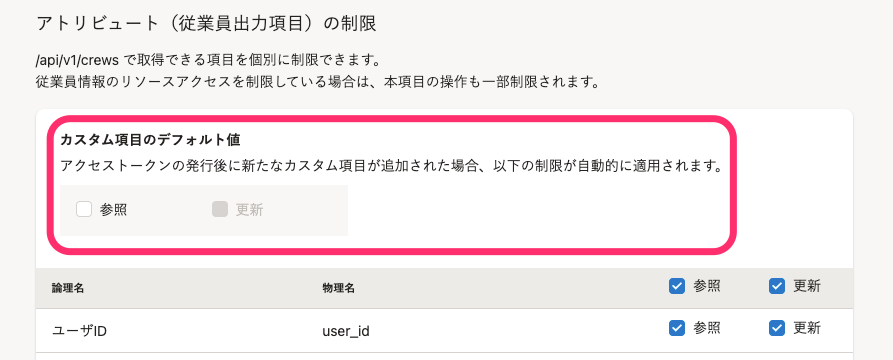

[SmartHR API](https://developer.smarthr.jp/)を使用する際に必要なアクセストークンの発行方法を説明します。

# 1\. 画面右上の［アカウント名▼］>［共通設定］>［外部システム連携］をクリック

画面右上の **［アカウント名▼］** \> **［共通設定］** をクリックします。

画面左下にある **［外部システム連携］** をクリックすると、 **［外部システム連携］** 画面が表示されます。

# 2.［アクセストークン］をクリック

 **［アクセストークン］** をクリックすると、アクセストークンの一覧画面が表示されます。

# 3\. ［+新規発行］をクリック

画面右上にある **［+新規発行］** をクリックすると、アクセストークンの追加画面が表示されます。

# 4\. 各種設定をして、［登録］をクリック

 **［アクセストークン名］** を入力し、 **［登録］** をクリックすると、アクセストークンが発行されます。

任意で、 **［メモ］、［リソースの制限］、［アトリビュート（従業員出力項目）の制限］** を設定できます。

## ［リソースの制限］で設定できること

APIやWebhookから使用できる機能を制限できます。

従業員情報、共通設定、招待、アプリケーション連携に関する機能について、 **［参照］［更新］** の制限を設定できます。

| **機能分類** | **対象項目** |
| --- | --- |
| 従業員情報に関する機能 |   従業員情報（/crews）  ※従業員項目とカスタム従業員項目が含まれます。 ※本項目を制限した場合、連動してアトリビュート（従業員出力項目）の操作も制限されます。   |
| 共通設定に関する機能 | 会社情報（/companies） |
| 事業所（/biz\_establishments） |
| アカウント（/users） |
| 雇用形態（/employment\_types） |
| 部署（/departments） |
| 役職（/job\_titles） |
| 給与支給形態（/payment\_periods） |
| 続柄（/dependent\_relations） |
| 口座情報（/bank\_account\_settings） |
| カスタム従業員項目（/crew\_custom\_field\_template\*） |
| 給与明細（/payrolls） |
| 源泉徴収票（/tax\_withholdings） |
| 招待に関する機能 | 従業員招待フォーム（/crew\_input\_forms） |
| メールフォーマット（/mail\_formats） |
| アプリケーション連携に関する機能 | Webhook（/webhooks） |

## ［アトリビュート（従業員出力項目）の制限］で設定できること

従業員情報（/api/crews）で取得できる項目を個別に制限できます。

リソースの制限欄で「従業員情報」の **［参照］［更新］** の制限を設定している場合は、連動して本項目の操作も制限されます。

:::tips
アクセストークンの発行後に追加されたカスタム項目は、個別に項目の制御を設定するまでは **［カスタム項目のデフォルト値］** で制限されます。
手動でアトリビュートの制限を設定する必要がないため、APIの操作のみでカスタム項目の新規追加から設定までを行なえます。

:::

# 5\. アクセストークンを取得する

 **［コピー］** をクリックすると、アクセストークンがクリップボードにコピーされます。

:::tips
発行したアクセストークンは**生成画面以外では表示されません**（漏洩防止のため）。
忘れた場合や紛失した場合は、再度新しいトークンを発行してください。
その際、**古いトークンは削除する**ことを推奨します。
:::
