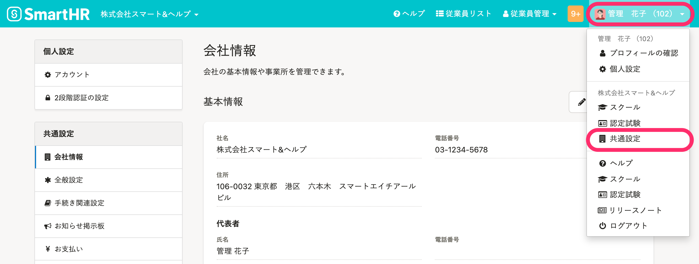
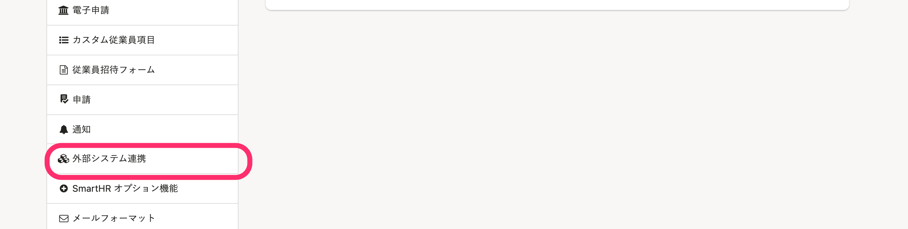
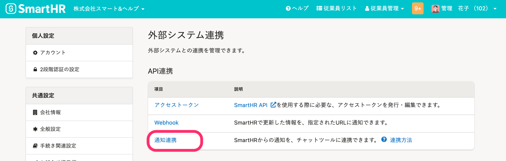
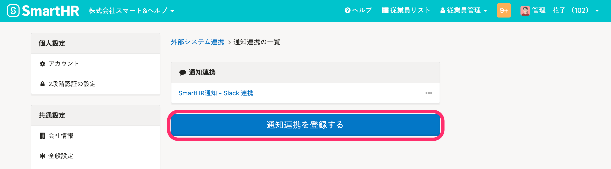
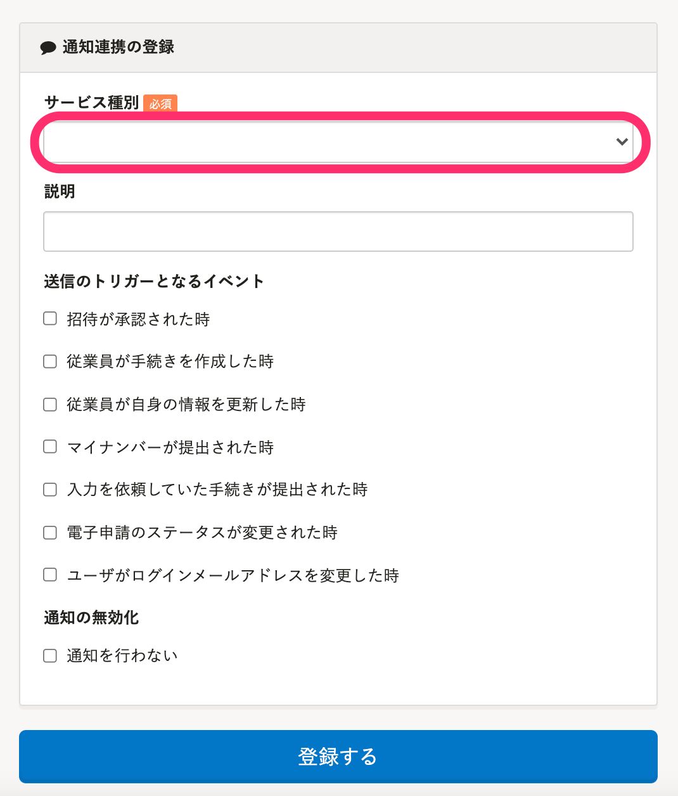
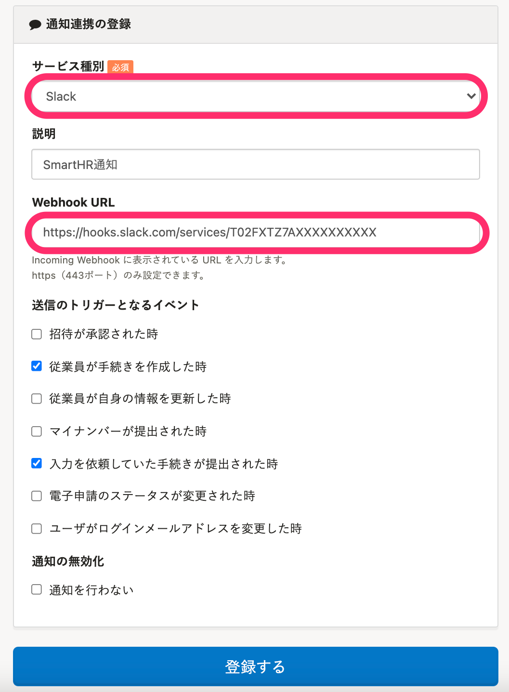

SmartHRから通知をチャットツール上で受け取る方法を紹介します。

# ［外部システム連携］>［API連携］>［通知連携］でチャットツールを選んで登録

## 通知連携できるチャットツール

現在、SmartHRは以下のチャットツールと通知の連携ができます。

- [Slack](https://slack.com/)
- [チャットワーク](http://www.chatwork.com/ja/)
- [Microsoft Teams](https://products.office.com/ja-jp/microsoft-teams/group-chat-software)

設定にあたって、それぞれチャットツール側からWebhook URLもしくはアクセストークンを取得する必要があります。

チャットツール側の管理者から必要な情報を入手した上で、設定してください。

:::alert
チャットツール側の仕様変更や、チャットツールのチャンネル名の変更などにともなって、設定に使うWebhookやアクセストークンを登録し直す必要が生じる場合があります。あらかじめご了承ください。
:::

## 1\. ［外部システム連携］画面に移動

**画面右上のアカウント名** > **［共通設定］** をクリックします。

画面左下にある **［外部システム連携］** をクリックすると、 **［外部システム連携］** 画面が表示されます。

 **［外部システム連携］** 画面の **［API連携］** にある **［通知連携］** をクリックすると、 **［通知連携］** の一覧が表示されます。

 **［通知連携を登録する］** をクリックすると、 **［通知連携の登録］** 画面が表示されます。

## 2\. ［サービス種別］でチャットツールを選択、設定して［登録する］をクリック

 **［通知連携の登録］** 画面で **［サービス種別］** をプルダウンメニューから選択すると、フォームが更新され、連携に必要な情報の項目が表示されます。必要事項を入力し、 **［登録する］** をクリックして完了です。

# Slackとの連携方法

例として、Slackと連携する場合の手順を以下にまとめます。

## 1\. Slack で Incoming WebHooks のURLを入手する

Slackから、Incoming WebHooksのURLを発行します。発行はSlackの管理権限をお持ちの方にお問い合わせください。

通知連携するSlackチャンネルは、Slack Apps側で設定します。チャンネルごとに、Incoming WebHooksのURLが発行されます。

:::tips
SlackのIncoming WebHooksはSlack Apps経由で取得します。詳しくはSlackのヘルプセンターをご確認ください。
[Slack での Incoming Webhook の利用｜Slackヘルプセンター](https://slack.com/intl/ja-jp/help/articles/115005265063)
:::

## 2\. ［サービス種別］で［Slack］を選択し、［登録する］をクリック

 **［通知連携の登録］** 画面で **［サービス種別］** のプルダウンメニューから **［Slack］** を選択し、各項目の指定・登録を行ない、 **［登録する］** をクリックします。

# 通知が届かない時は？

通知が止まってしまった場合には、以下を確認してください。

-  **［通知連携］** の編集画面で、 **［通知が無効化］** の **［通知を行わない］** にチェックが入っていないか確認してください。チェックを外して登録しなおせば、有効になります。
- 正しいIncoming WebHooksのURLが登録されているか確認してください。
- Webhooksが有効かどうか確認してください。（Slackの場合、Incoming WebHooksを作成された方がSlackメンバーから削除されると、Webhooksは無効となります。)

# 通知の自動無効化

通知連携の実行時に規定回数のエラーが発生すると自動で無効化にされます。 通知連携の一覧で、 **［無効］** のラベルが付いている場合は、設定を確認してください。
