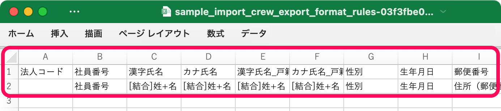
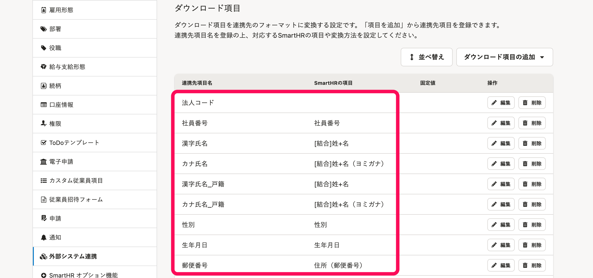
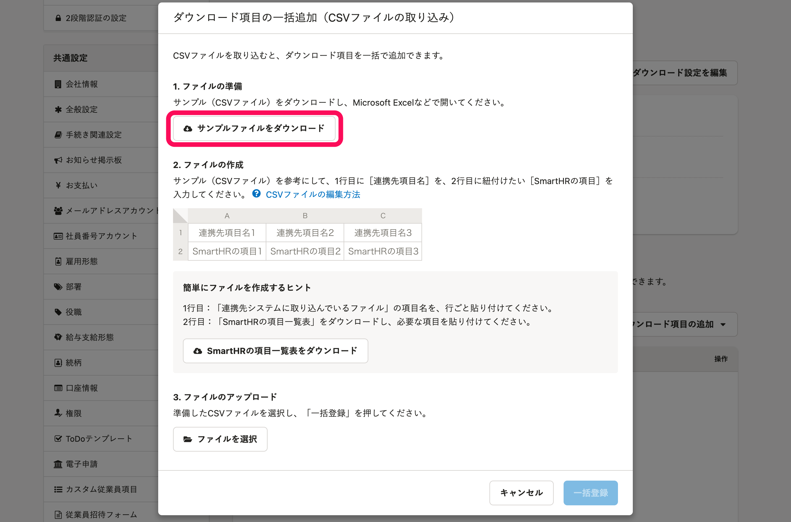
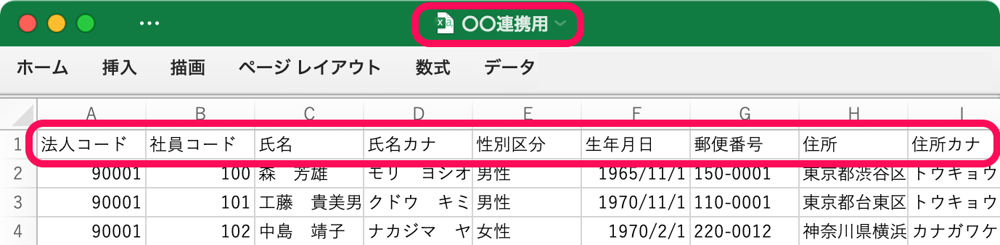
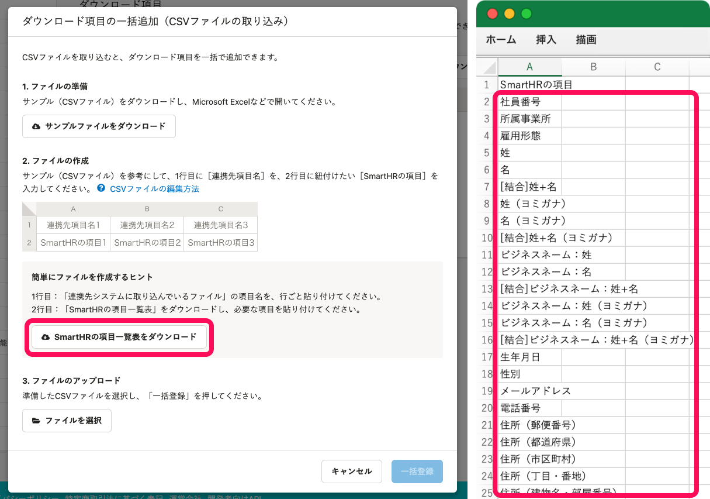
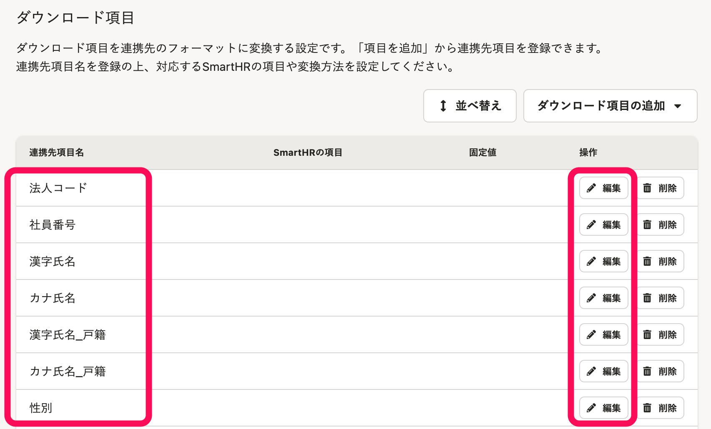

# A. 1行目に連携先システムの項目名を、2行目に紐付けたいSmartHRの項目を入力します。

CSVファイルをMicrosoft Excelなどで編集し、ダウンロード項目一括追加用のCSVファイルを作成してください。

1行目には、**連携先システムの項目名**を入力します（**入力必須** **）** 。

2行目には、**紐付けたいSmartHRの従業員項目**を入力します（ただし、 **入力必須ではありません）** 。

## 作成したCSVファイルをSmartHRに取り込むと

1行目の内容が **［連携先項目名］** として、2行目の内容が **［SmartHRの項目］** として登録されます。

## CSVファイル編集のコツをつかむには

 **［サンプルファイルをダウンロード］** して、そのままアップロードして **［一括登録］** してみてください。

CSVファイル編集のコツと、取り込み後の結果が把握できます。

## ダウンロード項目の一括追加の手順

以下のページを参照してください。

:::related
[カスタムダウンロードフォーマットの追加・編集・削除](https://knowledge.smarthr.jp/hc/ja/articles/4404850299289/)
:::
:::tips
### 1行目に入力する内容
「連携先システムに取り込んでいるファイル」があれば、そのファイルを活用してください。
**連携先システムの項目名を行ごとコピー**し、ダウンロード項目一括追加用のCSVファイルの1行目に貼り付けてください。

:::
:::tips
### 2行目に入力する内容
「紐付け可能なSmartHRの項目」は一覧表で確認できます。
 **［SmartHRの項目一覧表をダウンロード］** をクリックして一覧表をダウンロードし、紐付けたい項目をコピーして、2行目に貼り付けてください。

:::
:::tips
### 1行目だけ入力したCSVファイルを一括登録すると
1行目だけ入力したCSVファイルを一括登録すると、 **［連携先項目名］** だけが登録されます。
 **［編集］** をクリックし、 **［SmartHRの項目］** か **［固定値］** を登録してください。
詳しくは[カスタムダウンロードフォーマットの追加・編集・削除](https://knowledge.smarthr.jp/hc/ja/articles/4404850299289/)を参照ください。

:::
:::alert
一括追加の場合、 **［固定値］** を登録できません。
 **［固定値］** は、 **［編集］** をクリックして登録してください。
:::
