 **［カスタムダウンロードフォーマット］** 画面で、従業員リストをダウンロードする際に指定するフォーマットを、カスタマイズして登録、管理できます。

登録したフォーマットを利用して、**外部システムへの取り込みに適したファイル**を、CSV形式またはExcel形式（.xlsx）でダウンロードできます。

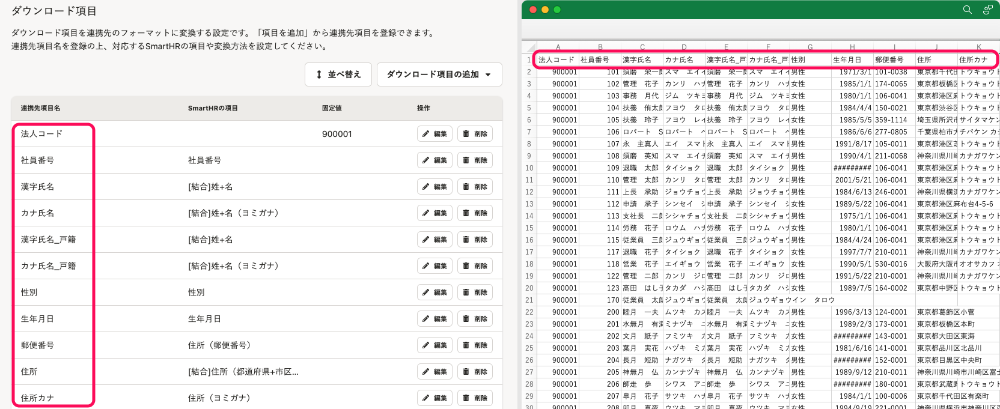

# ［カスタムダウンロードフォーマット］画面に移動する

## ［従業員リスト］から移動する

 **［従業員リスト］>［ダウンロード］** をクリックすると、 **［従業員情報のダウンロード］** ダイアログが表示されます。

 **［カスタムダウンロードフォーマット］** タブをクリックし **［カスタムダウンロードフォーマット］** のリンクをクリックすると、 **［カスタムダウンロードフォーマット］** 画面が表示されます。

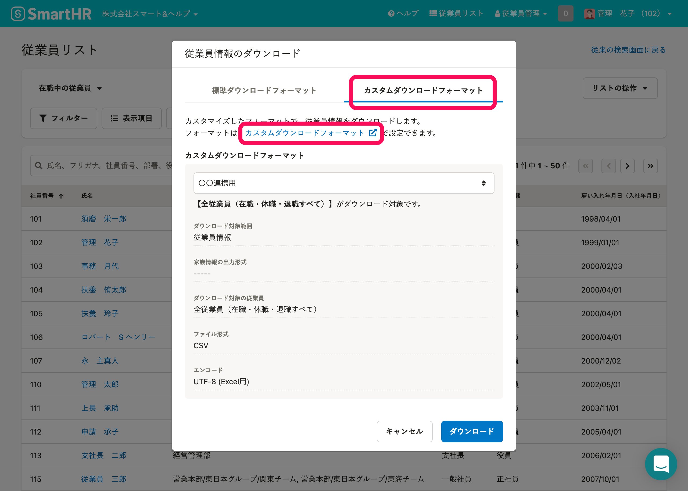

## ［共通設定］から移動する

画面右上の **［アカウント名▼］** \> **［共通設定］** をクリックします。

画面左のリストにある **［外部システム連携］>［カスタムダウンロードフォーマット］** をクリックすると、 **［カスタムダウンロードフォーマット］** 画面が表示されます。

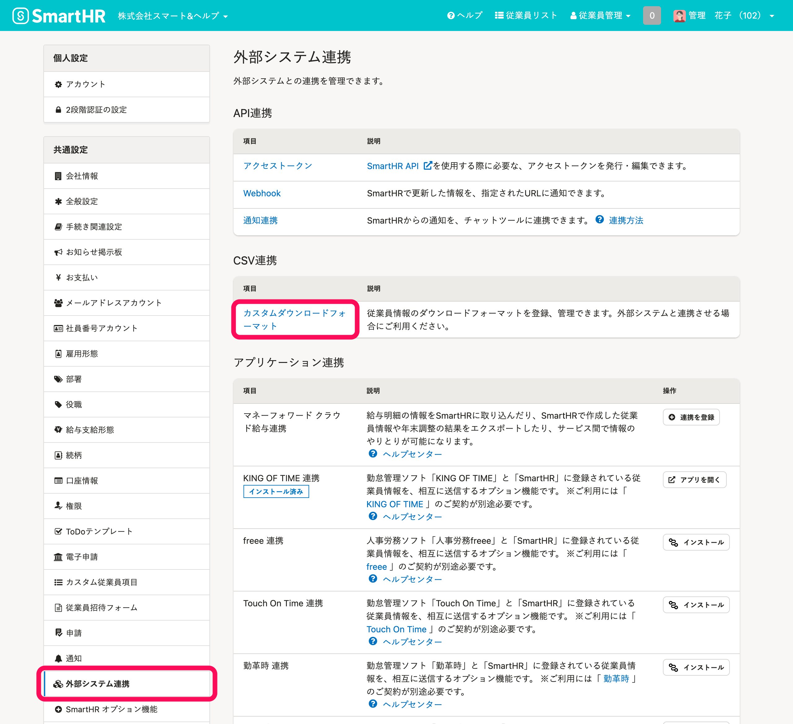

# カスタムダウンロードフォーマットを追加する

## 1\. ダウンロードフォーマットを追加する

 **［+ダウンロードフォーマットを追加］** をクリックすると、 **［ダウンロードフォーマットの追加］** ダイアログが表示されます。

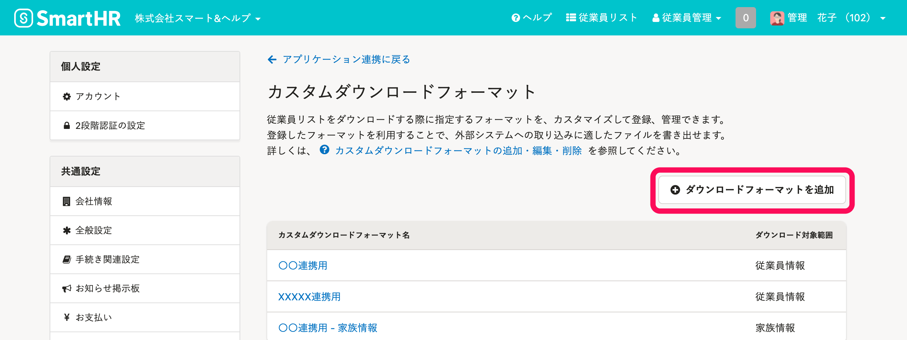

 **［カスタムダウンロードフォーマット名］** を入力し、 **［ダウンロード対象範囲］** を指定します（ **［ダウンロード対象範囲］はあとから変更できません** ）。

 **［登録］** をクリックすると、カスタムダウンロードフォーマットの詳細画面が表示されます。

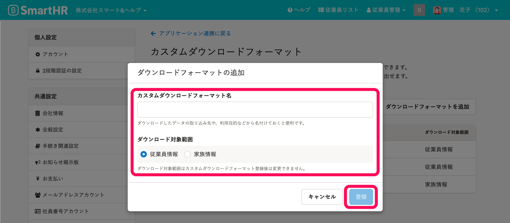

## 2\. ダウンロード設定を編集する

 **［ダウンロード設定を編集］** をクリックすると、 **［ダウンロード設定の編集］** ダイアログが表示されます。

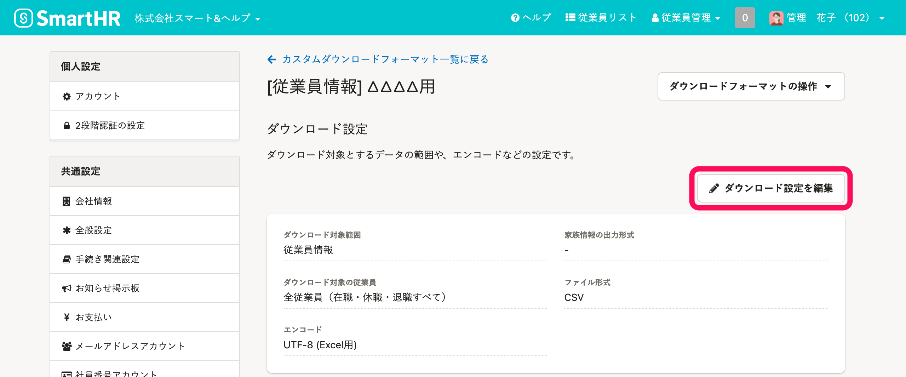

 **［ダウンロード対象の従業員］** 、 **［ファイル形式］** 、 **［エンコード］** を指定し、 **［更新］** をクリックします。

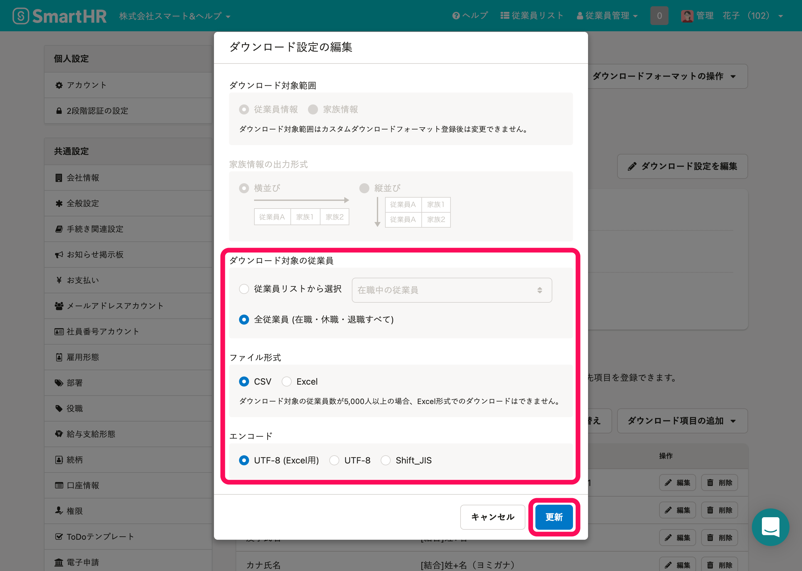

:::tips
 **［ダウンロード対象の従業員］** には**カスタムリスト**を指定できます。
カスタムリストの作成方法は、[フィルター機能を使って、条件に合致する従業員リストを表示させる](https://knowledge.smarthr.jp/hc/ja/articles/360040965373)をご覧ください。
:::

## 3\. ダウンロード項目を追加する

連携先システムの項目名と、紐付けたいSmartHRの従業員項目を追加します。

１つずつ項目を追加する方法と、[複数の項目を一括で追加する方法](https://knowledge.smarthr.jp/hc/ja/articles/4404850299289/#toc--9)があります。

### ダウンロード項目を1つずつ追加する

 **［ダウンロード項目の追加］>［項目を追加］** をクリックすると、 **［ダウンロード項目の追加］** ダイアログが表示されます。

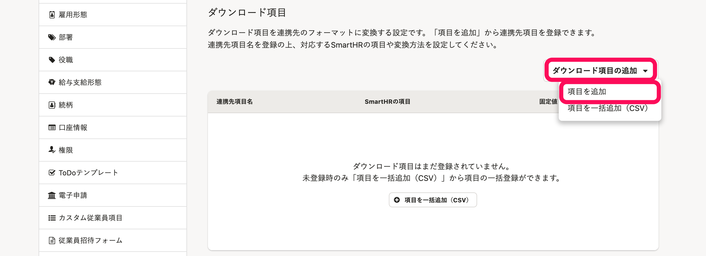

 **［連携先項目名］** には**連携先システムの項目名**を入力します。

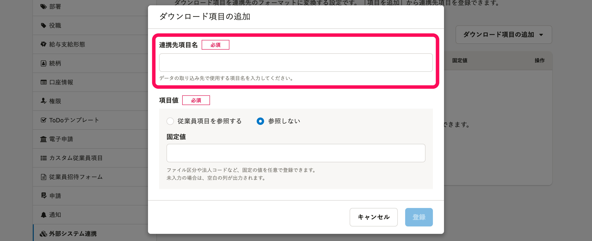

連携先システムに**SmartHRの従業員項目**を取り込みたい場合は、 **［項目値］** に **［従業員項目を参照する］** を指定し、 **［SmartHRの項目］** を検索して指定し、 **［登録］** をクリックします。

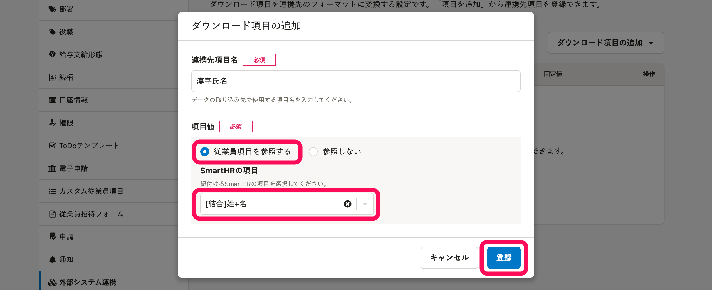

:::tips
 **［SmartHRの項目］** のうち一部の項目は、**結合・分割してダウンロード**できます。
結合・分割できる項目の一覧と、結合・分割をする方法は、以下のページを参照ください。
[従業員情報・家族情報の項目を、結合・分割してダウンロードするには？](https://knowledge.smarthr.jp/hc/ja/articles/4492483701913)
:::
:::tips
 **［SmartHRの項目］** のうち一部の項目は、**出力形式を変更してダウンロード**できます。
出力形式を変更できる **［SmartHRの項目］** を選択すると **［出力形式］** が表示されるので、半角カナや日付形式などを指定してください。
出力形式を変更できる項目の一覧は、以下のページを参照ください。
[【一覧】ダウンロードの際に出力形式を変更できる従業員情報・家族情報の項目](https://knowledge.smarthr.jp/hc/ja/articles/4412174492825)
:::
:::tips
**SmartHRに存在しない項目**を出力したい場合は、 **［項目値］** に **［参照しない］** を指定し、 **［登録］** をクリックします。
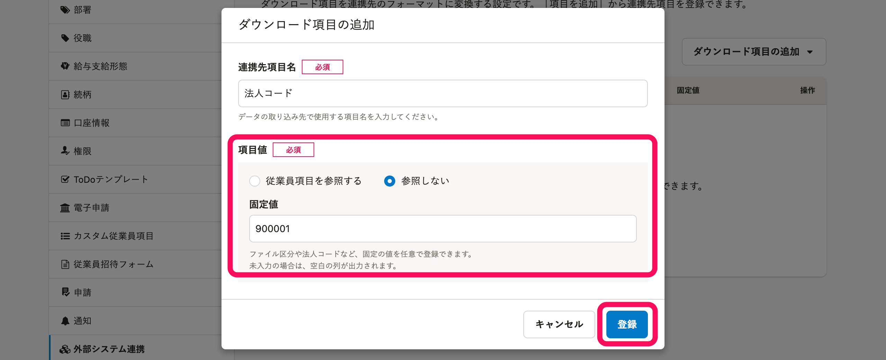
 **［固定値］** に登録した値が、ダウンロードしたファイルの該当列に表示されます。
 **［固定値］** は100文字以内で登録してください。
文字種の制限はないため、漢字・カナなども登録できます。
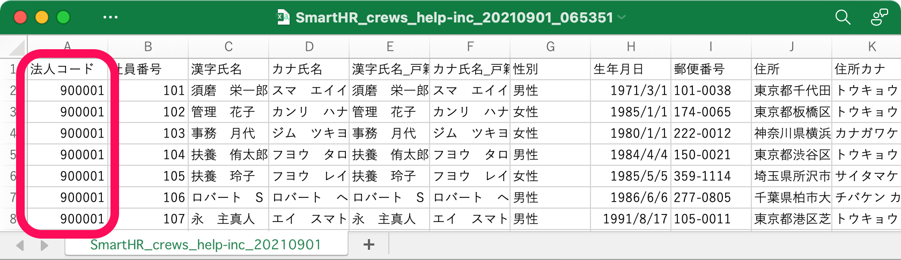
 **［固定値］** を入力せずに登録した場合、該当列は空白になります。
:::

### ダウンロード項目を一括追加する

以下のページを参考に、**ダウンロード項目一括追加用のCSVファイル**を作成します。

[カスタムダウンロードフォーマットのダウンロード項目一括追加用のCSVファイルの書き方は？](https://knowledge.smarthr.jp/hc/ja/articles/4404850250265/)

 **［項目を一括追加（CSV）］** をクリックすると、 **［ダウンロード項目の一括追加（CSVファイルの取り込み）］** ダイアログが表示されます。

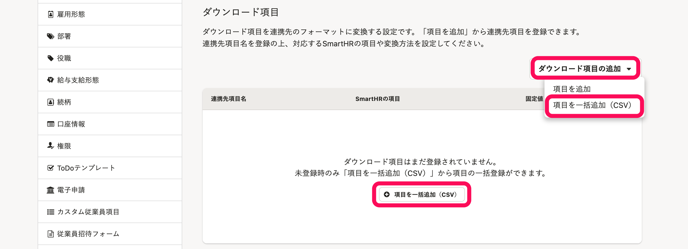

 **［3.ファイルのアップロード］** の **［ファイルを選択］** をクリックして、作成したCSVファイルを指定します。

 **［一括登録］** をクリックすると、バックグラウンド処理が開始され、処理が終了すると、ダウンロード項目が一括登録されます。

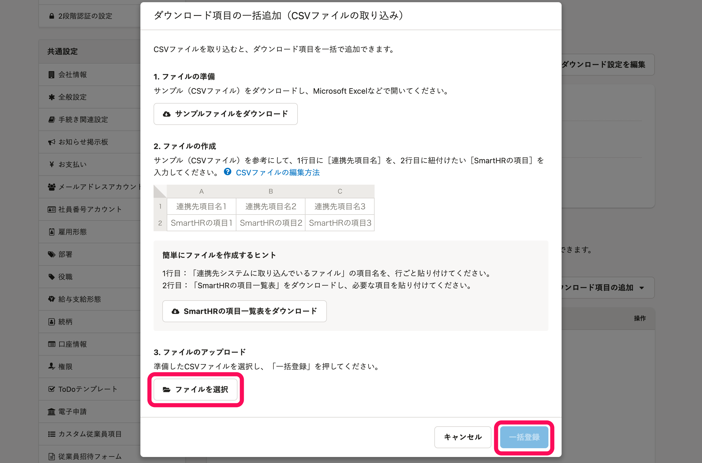

:::alert
ダウンロード項目が1つも登録されていない場合のみ、一括追加できます。
:::

# ダウンロードフォーマット名を編集する

編集したいカスタムダウンロードフォーマットの **［ダウンロードフォーマットの操作］>［ダウンロードフォーマット名を編集］** をクリックします。

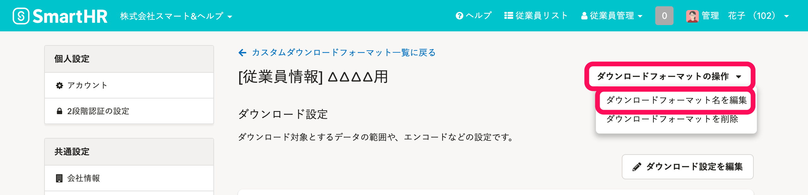

 **［カスタムダウンロードフォーマット名］** を編集し、 **［更新］** をクリックします。

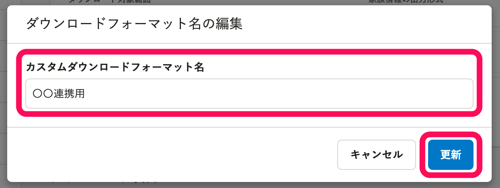

# ダウンロードフォーマットを削除する

編集したいカスタムダウンロードフォーマットの **［ダウンロードフォーマットの操作］>［ダウンロードフォーマットを削除］** をクリックします。

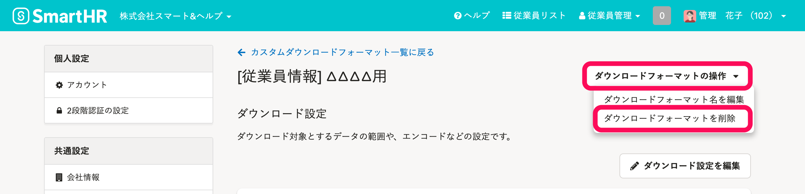

 **［削除］** をクリックすると、カスタムダウンロードフォーマットが削除されます。

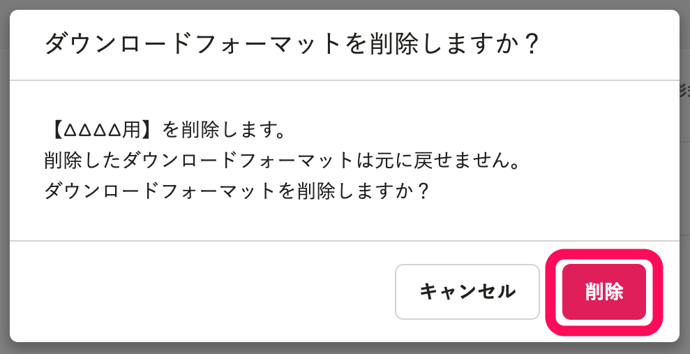
