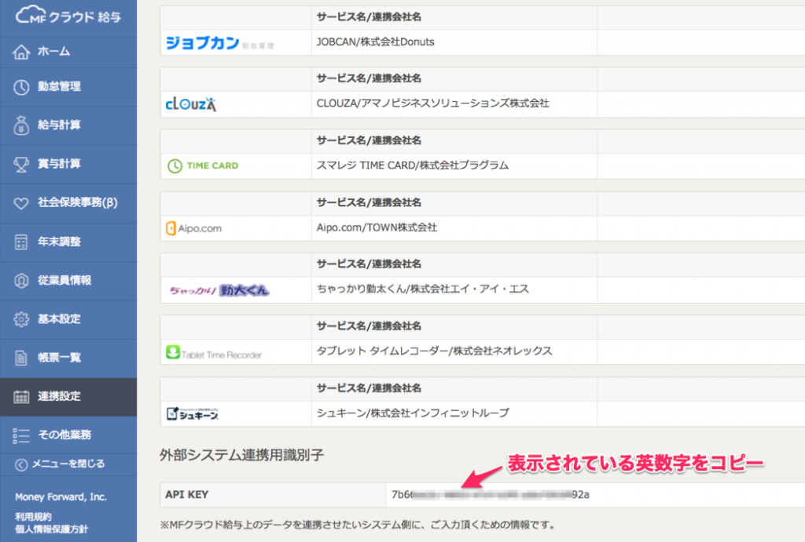
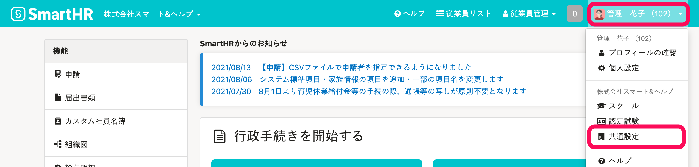
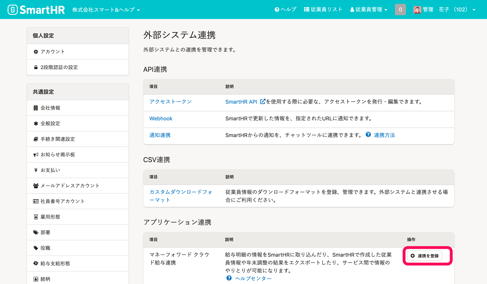
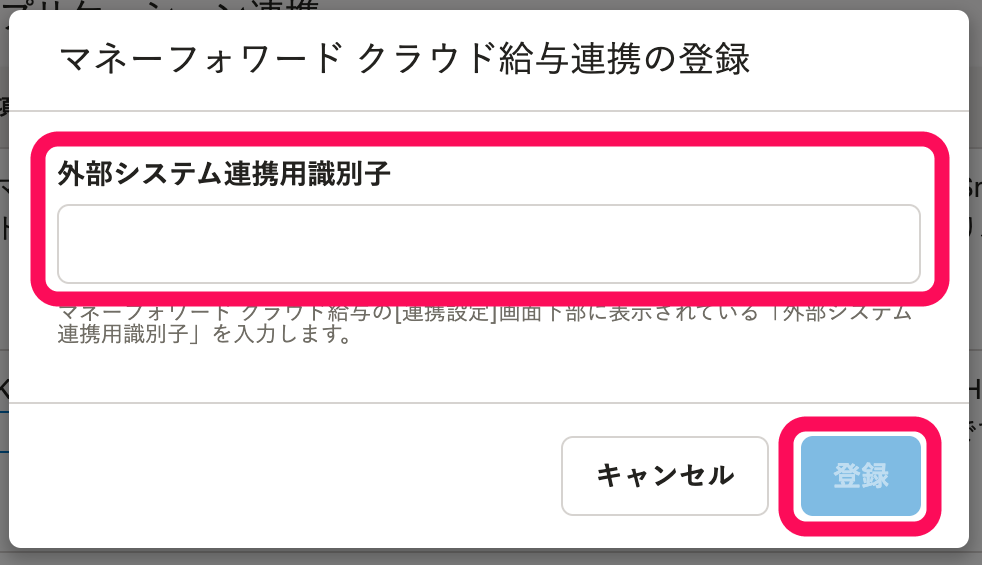
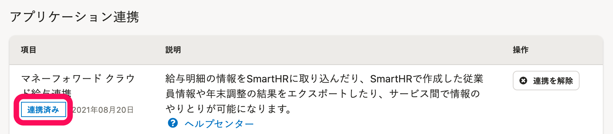

クラウド型給与計算ソフト[マネーフォワード クラウド給与](https://biz.moneyforward.com/payroll)との連携を登録すると、以下が可能になります。

- **マネーフォワード クラウド給与の給与明細情報**を、SmartHRに連携する
- **SmartHRの従業員情報・年末調整結果**を、マネーフォワード クラウド給与に連携する

このページでは、それぞれの初回利用時に必要な設定を説明します。

:::alert
**マネーフォワード クラウド給与の従業員情報**は、SmartHRに連携できません。
CSVファイルを利用し、SmartHRに従業員情報を取り込んでください。
[複数の従業員情報を一括で登録する](https://knowledge.smarthr.jp/hc/ja/articles/360026107234)
[複数の従業員情報・家族情報を一括で更新する](https://knowledge.smarthr.jp/hc/ja/articles/360026265333)
:::

# 給与明細情報の連携

## 1\. マネーフォワード クラウド給与にログインし、［API KEY］をコピーする

マネーフォワード クラウド給与 にログインし、 **［連携設定］>［外部システム連携用識別子］** にある  **［API KEY］** をコピーします。

## 2.［共通設定］>［外部システム連携］をクリック

画面右上の **［アカウント名▼］** \> **［共通設定］** をクリックします。

画面左下にある **［外部システム連携］** をクリックすると、 **［外部システム連携］** 画面が表示されます。

## 3.［連携を登録］をクリック

 **［マネーフォワード クラウド給与連携］の［連携を登録］** をクリックします。

## 4.［API KEY］を入力し［登録］をクリック

手順1でコピーした **［API KEY］** を入力し、 **［登録］** をクリックします。

下図のような表示になれば設定完了です。

設定完了後、マネーフォワード クラウド給与に給与明細情報を連携する場合の詳しい手順は下記のページをご覧ください。

:::related
[マネーフォワード クラウド給与の給与明細データをSmartHRに取り込む](https://knowledge.smarthr.jp/hc/ja/articles/360026105654)
[マネーフォワード クラウド給与からCSVで出力した給与明細を取り込む](https://knowledge.smarthr.jp/hc/ja/articles/360026264053)
:::

# 従業員情報・年末調整結果の連携

## 1\. SmartHRでアクセストークンを発行する

SmartHR APIを使用する際に必要なアクセストークンを発行します。

下記のヘルプページに記載の手順を参考にアクセストークンを発行してください。

:::related
[アクセストークンの発行方法](https://knowledge.smarthr.jp/hc/ja/articles/360026266033)
:::

## 2\. マネーフォワード クラウド給与でアクセストークンを設定する

マネーフォワード クラウド給与でアクセストークンを設定します。

詳しくは、下記のページを参照してください。

[マネーフォワード クラウド給与 使い方ガイド SmartHRからの従業員情報の取り込み・更新方法](https://support.biz.moneyforward.com/payroll/guide/integrations/in03.html)

設定完了後、マネーフォワード クラウド給与に従業員情報や年末調整結果を連携する場合の詳しい手順は下記のページを参照してください。

:::related
[【マネーフォワード クラウド給与】SmartHRの従業員情報を連携する](https://knowledge.smarthr.jp/hc/ja/articles/360026106414 "https://knowledge.smarthr.jp/hc/ja/articles/360026106414")
[マネーフォワード クラウド年末調整に年末調整結果を取り込む際の注意事項](https://knowledge.smarthr.jp/hc/ja/articles/4409171668633)
:::
