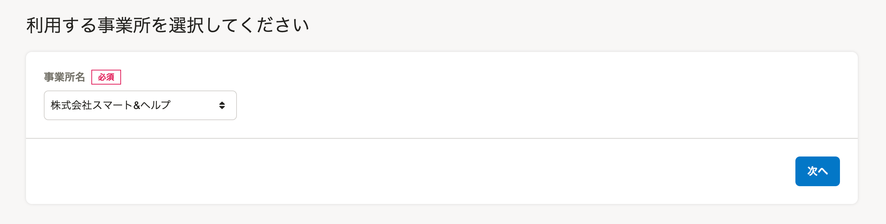
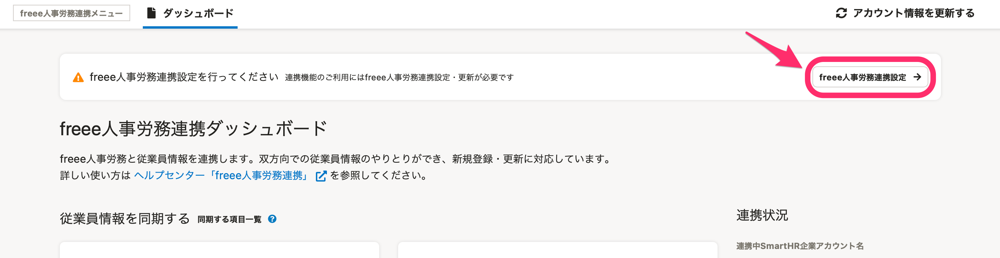
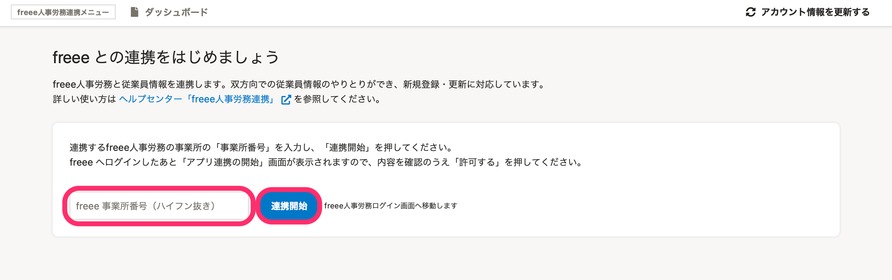
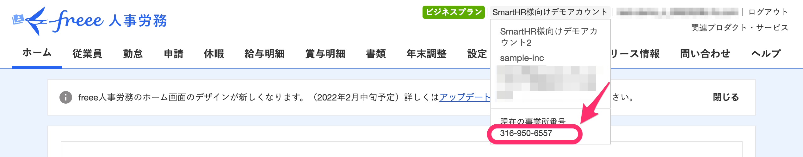
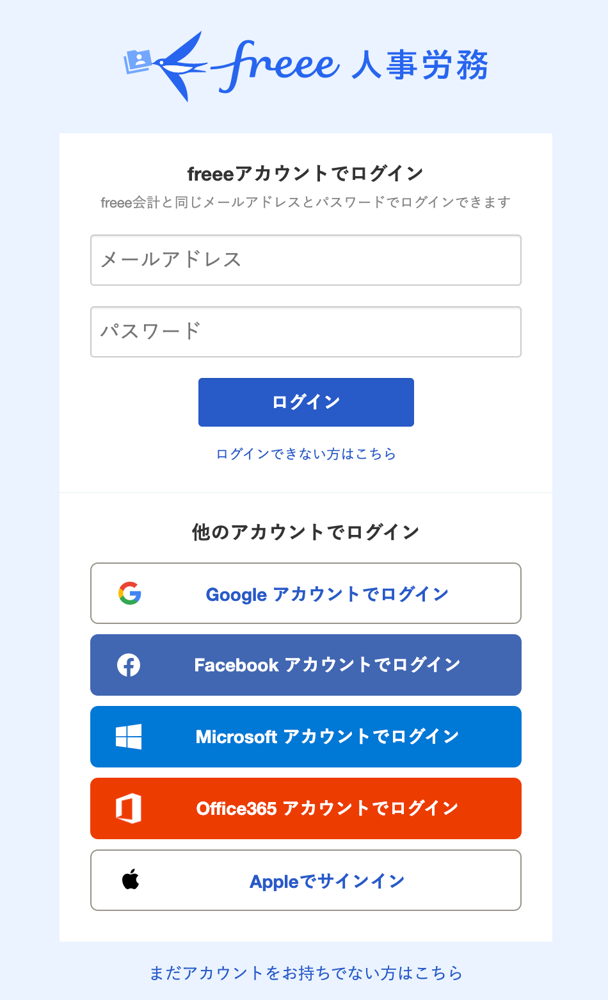
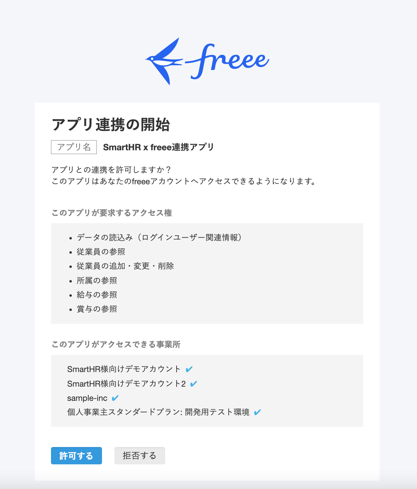
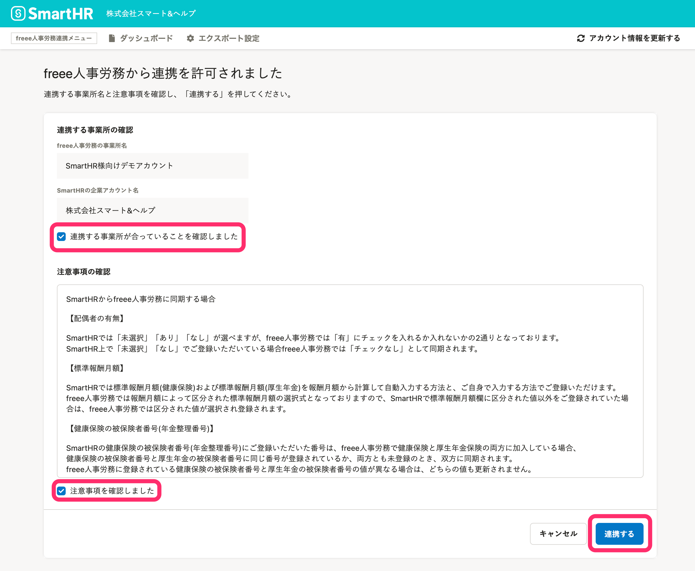
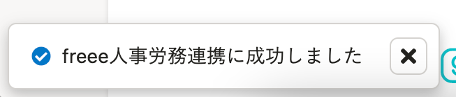

人事労務管理ソフト[freee人事労務](https://www.freee.co.jp/hr/)と連携し、SmartHRと相互に従業員情報を新規登録・更新が可能です。

SmartHRでのマルチログイン機能を利用している場合や、freee人事労務で複数の事業所を管理している場合でも同様に従業員情報を連携できます。

初回利用時に必要なインストール方法と連携設定の方法を説明します。

:::alert
初回設定では連携先を設定します。従業員情報の連携（更新）は行なわれません。
:::

# 1.［外部システム連携］で、freee人事労務連携をインストール

管理者アカウントでSmartHRにログインし、 **［共通設定］>［外部システム連携］>［アプリケーション連携］** にある、freee人事労務連携の **［インストール］** をクリックすると、オプション機能がインストールされます。

詳しくは下記のヘルプページを参照してください。

:::related
[他社のアプリケーションをインストールする](https://knowledge.smarthr.jp/hc/ja/articles/4405252726041)
:::

# 2\. トップページの［機能］にある［freee人事労務連携］をクリック

トップページ左側の **［機能］** 欄にある **［freee人事労務連携］** をクリックすると、freee人事労務連携ダッシュボードが表示されます。

マルチログインアカウントでログインしている場合は、事業所選択画面が表示されます。

任意の事業所を選択してください。

# 3.［freee人事労務連携設定］をクリック

freee人事労務連携画面に表示される注釈の右端にある **［freee人事労務連携設定→］** をクリックすると、連携設定画面に移動します。

# 4\. 事業所番号を入力し、［連携開始］をクリック

連携設定画面で連携させたいfreee人事労務の事業所番号を入力し、 **［連携開始］** をクリックすると、freee人事労務のログイン画面が表示されます。

:::tips
事業所番号はfreee人事労務の画面右上に表示されている会社名にカーソルを合わせると確認できます。

:::

# 5\. freee人事労務にログインする

freee人事労務にログインすると、連携の許可を確認する画面が表示されます。

すでにログインしている場合はこちらのステップは省略されます。

# 6.［許可する］をクリック

アプリ連携の許可を確認する画面で、 **［許可する］** をクリックすると連携確認画面が表示されます。

# 7\. 連携する事業所を確認し、［連携する］をクリック

連携確認画面にて連携させたい事業所となっていること、および注意事項を確認してください。

確認後、 **［連携する事業所が合っていることを確認しました］** と **［注意事項を確認しました］** の2つにチェックを入れ、 **［連携する］** をクリックすると連携が開始されます。

# 8\. 連携の完了を確認する

 **［freee人事労務連携に成功しました］** のメッセージが画面左下に表示されれば連携成功です。

続けてfreee人事労務との連携に必要なエクスポート設定が必要です。

詳しくは以下のヘルプページを参照してください。

:::related
[【freee人事労務】エクスポート設定](https://knowledge.smarthr.jp/hc/ja/articles/360026104234)
:::
