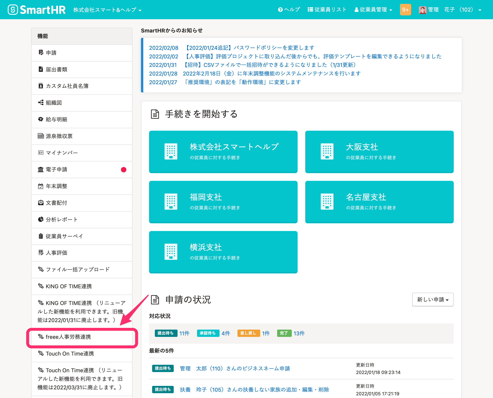
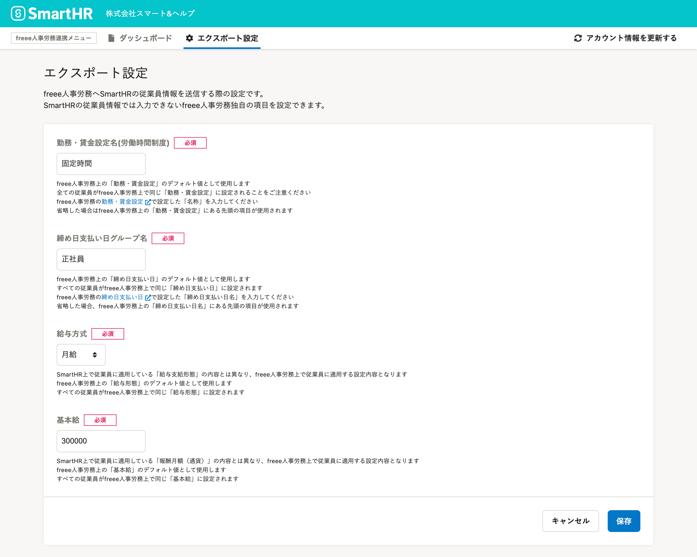

人事労務管理ソフト[freee人事労務](https://www.freee.co.jp/hr/)と連携し、SmartHRと相互に従業員情報の新規登録や更新が可能です。

連携時に必要なエクスポート設定の手順を説明します。

# 1.［機能］>［freee人事労務連携］をクリック

SmartHRにログインし、トップページの左側にある **［機能］ >［freee人事労務連携］** をクリックすると、 **［freee人事労務連携ダッシュボード］** が表示されます。

# 2.［エクスポート設定］をクリック

画面上部のfreee人事労務連携メニューにある **［エクスポート設定］** をクリックすると、エクスポート設定画面が表示されます。

# 3\. 内容を入力し、［保存］をクリック

freee人事労務で設定している内容を各項目に入力し、 **［保存］** をクリックすると設定が保存されます。

設定した内容は、freee人事労務へ従業員情報を送る際に一律で反映されます。

各項目の確認方法は下記のヘルプページを参照してください。

:::related
[【freee人事労務】エクスポート設定時の項目](https://knowledge.smarthr.jp/hc/ja/articles/360026104254)
:::

「基本給」については従業員取り込み後、freee人事労務側で一括更新が可能です。

[従業員の給与等を一括で更新する｜freeeヘルプセンター](https://support.freee.co.jp/hc/ja/articles/115005464626#2)

# 4\. 設定の完了を確認する

設定を保存するとfreee人事労務連携ダッシュボード画面に切り替わります。

画面左下に **［freee人事労務エクスポート設定を更新しました］** というメッセージが表示されたら設定完了です。

:::related
[【freee人事労務】従業員情報を取り込む](https://knowledge.smarthr.jp/hc/ja/articles/360026104194)
:::
