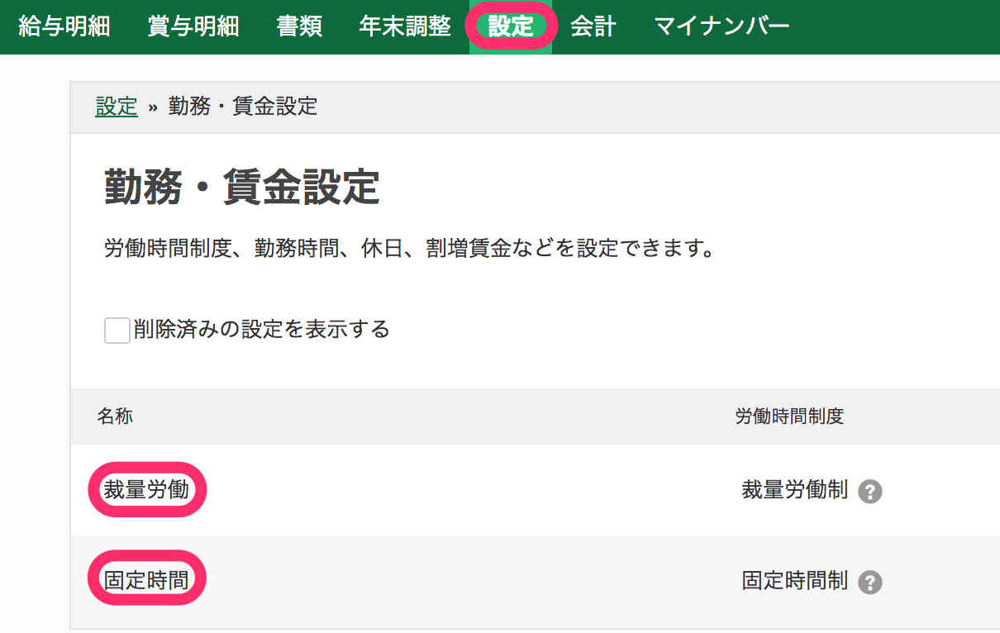
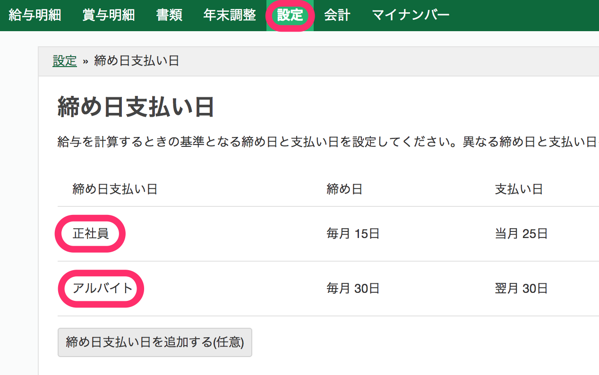

freee人事労務に従業員情報を送信するにあたり、SmartHRの従業員情報として入力できないfreee人事労務独自の項目を **［エクスポート設定］** で設定します。

SmartHRのエクスポート設定時に入力が必要な「freee人事労務に登録されている項目名」の確認方法を案内します。

 **［エクスポート設定］** の操作手順は以下のヘルプページを参照してください。

[【freee人事労務】エクスポート設定](https://knowledge.smarthr.jp/hc/ja/articles/360026104234)

# freee人事労務の登録内容の確認方法

## 勤務・賃金設定名

freee人事労務の勤務・賃金設定名は、 **［設定］>［勤務・賃金設定］** から確認できます。

例：「裁量労働」「固定時間」という名称の登録がある場合、SmartHRのエクスポート設定画面にある **［勤務・賃金設定名（労働時間制度）］** 項目に、いずれかの項目名を入力してください。

## 締め日支払い日グループ名

freee人事労務の締め日支払い日は、 **［設定］>［締め日支払い日］** から確認できます。

例：「正社員」と「アルバイト」の登録がある場合、SmartHRのエクスポート設定画面にある **［締め日支払い日グループ名］** 項目にはいずれかの項目名を入力してください。

## 給与方式

freee人事労務の登録内容の確認は不要です。

SmartHRのエクスポート設定画面にあるプルダウンメニューから「月給」「日給」「時給」のいずれかを選択してください。

## 基本給

freee人事労務の設定は確認不要です。

SmartHRのエクスポート設定画面にある **［基本給］** には、基本給を数値で入力してください。

:::tips
freee人事労務で基本給を一括で設定する方法については、以下のヘルプページを参照してください。
[従業員の給与等を一括で更新する｜freeeヘルプセンター](https://support.freee.co.jp/hc/ja/articles/115005464626#2)
:::

# エクスポート設定にまつわるよくある質問

## Q. ［エクスポート設定］で設定した内容がすべての従業員に反映されてしまいますか？

### A. いいえ、freee人事労務に新規登録する従業員にしか反映しません。

SmartHRと社員番号が同一かつ、 **［エクスポート設定］** で設定する内容がすでにfreee人事労務に登録されている従業員情報に対しては、 **［エクスポート設定］** で設定した内容は反映されません。

修正が必要な場合は、freee人事労務の従業員情報を修正してください。

freee人事労務側での一括設定については、以下のヘルプページをご覧ください。

:::related
[従業員の給与等を一括で更新する｜freeeヘルプセンター](https://support.freee.co.jp/hc/ja/articles/115005464626#2%22target=%22_blank%22)
:::
