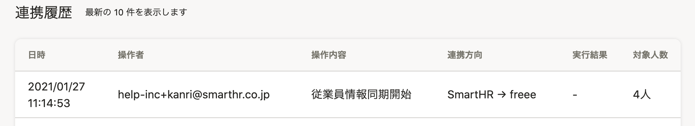

[freee人事労務](https://www.freee.co.jp/hr/)と連携し、SmartHRと相互に従業員情報の新規登録・更新が可能です。

freee人事労務からSmartHRに従業員情報を取り込む方法を案内します。

利用にあたり、あらかじめ[アプリのインストールと連携設定](https://knowledge.smarthr.jp/hc/ja/articles/360026262773)が必要です。

# 取り込み手順

## 1\. SmartHRに管理者権限でログインする

SmartHRに管理者権限でログインします。

SmartHRのログイン画面で **［メールアドレス］** と **［パスワード］** を入力し、 **［ログイン］** をクリックします。

## 2.［機能］>［freee人事労務連携］をクリック

トップページ左の **［機能］** にある **［freee人事労務連携］** をクリックすると、 **［freee人事労務連携ダッシュボード］** が表示されます。

## 3.［同期を開始］をクリック

 **［freee人事労務からSmartHRへ］** または **［SmartHRからfreee人事労務へ］** のパネルにある **［同期を開始］** をクリックすると、 **［情報取得基準日］** の設定画面が表示されます。

## 4.［情報取得基準日］を指定し、［次へ］をクリック

作業日（本日）以外の日付時点での情報を取得したい場合は **［情報取得基準日］** の日付を変更してください。

 **［次へ］** をクリックすると、従業員選択画面が表示されます。

:::tips
 **［情報取得基準日］** に指定した日付時点で在籍している従業員を検索できます。
例：2019年1月1日を指定した場合
入社日が指定した日付より後（例：2019年1月2日）、および、退職日がそれより前（例：2018年12月31日）で登録されている従業員は連携対象として表示されません。
デフォルトでは、作業日（当日）が指定されています。
:::

## 5\. 対象の従業員を選択し、［確認］をクリック

取り込みたい従業員にチェックを入れ、 **［確認］** をクリックすると、「従業員を同期しますか？」というダイアログが表示されます。

## 6\. 従業員情報を確認し、［同期］をクリック

同期する従業員を確認して **［同期］** をクリックすると、同期を開始します。

画面が切り替わり **［連携履歴］** に **［従業員情報同期開始］** の履歴が表示されます。

:::alert
従業員情報は、初回連携時の従業員情報ごとに発行される独自IDをキーにして連携しています。
初回連携後にSmartHRで従業員情報を削除すると独自IDが削除され、freee人事労務との従業員情報の紐付けがなくなります。
従業員情報を削除して再登録した場合、従業員情報を連携するとfreee人事労務で「新規登録」の扱いとなります。
:::

## 7\. 画面を再読み込みして実行結果を確認

しばらく時間をおいてから画面を再読み込みすると、同期結果が表示されます。

 **［連携履歴］** に **［従業員情報同期終了］** の履歴が表示され、 **［実行結果］** を確認できます。

【成功の場合】
選択した従業員情報が実際に取り込まれていることを確認してください。

【失敗の場合】
管理者に送られるメールで取り込み結果と失敗した要因を確認してください。

:::tips
同期終了後は結果に関わらず管理者の登録メールアドレスへ同期結果が配信されます。
取り込みに失敗した場合は、対象従業員の社員番号と失敗理由が記載されます。
記載された内容を参考に修正し、再度取り込んでください。
| 件名 | **\[SmartHR/freee人事労務\]** から**\[freee人事労務/SmartHR\]**へ従業員情報を同期しました｜**\[会社名\]** |
| --- | --- |
| 本文 |   いつもSmartHRをご利用いただきありがとうございます。  SmartHRからfreee人事労務に従業員データの取り込み結果が出ました。  成功: ○件  失敗: ○件  \-------------------------------------------------   **従業員番号: 【1020】**   **失敗理由: 入社日を入力してください**。  また、再試行しても解消しない場合は、freee連携アプリ（https://freee.smarthr.plus）に再度アクセスしてから、画面左上のSmartHRロゴをクリックしてSmartHRトップページの画面右下チャットアイコンよりお問い合わせください。  \-------------------------------------------------   |
:::

# 同期成功後の確認事項

## SmartHRからfreee人事労務へ送信後

freee人事労務に新規登録された従業員について、SmartHRの従業員情報として入力できないfreee人事労務独自の項目には、SmartHRの **［エクスポート設定］** で設定した内容を反映しています。

- ログインメールアドレスの設定
- 勤務・賃金設定名の変更
- 締め日支払い日グループ名の変更
- 給与方式の変更の変更
- 基本給の変更

修正が必要な場合は、freee人事労務の従業員情報を修正してください。

SmartHRと社員番号が同一かつ、 **［エクスポート設定］** で設定する内容がすでにfreee人事労務に登録されている従業員情報に対しては、 **［エクスポート設定］** で設定した内容は反映されません。

freee人事労務側での一括設定については、以下のヘルプページを参照してください。

:::related
[従業員の給与等を一括で更新する｜freeeヘルプセンター](https://support.freee.co.jp/hc/ja/articles/115005464626#2%22target=%22_blank%22)
:::
:::alert
従業員情報を連携する際、freee人事労務側の **［締め日支払い日］** で設定した日付基準で取り込みます。
例：freee人事労務の **［締め日支払い日］** を「月末締め翌月15日払い」に設定しているグループで1月中に取り込んだ場合、freee人事労務では、1月ではなく2月の従業員情報内に反映されます。
また、生年月日、性別、入社日、退職日、基礎年金番号、雇用保険被保険者番号については上記の限りではないため、過去の従業員情報にも反映されます。
:::

## freee人事労務からSmartHRへ取り込み後

freee人事労務の **［市区町村以降の住所カナ］** で入力されたヨミガナがSmartHRの **［住所（ヨミガナ）］** に反映されるため、修正が必要な場合には修正してください。

# よくあるエラーと対処法

## 失敗理由：接続元のIPアドレスからは、サービスをご利用いただくことができません。

「接続元のIPアドレスからは、サービスをご利用いただくことができません。」というメッセージが表示されて連携ができない場合、freee人事労務側でアクセス制限の設定がされている可能性があります。

連携するには、一度、freee人事労務側でアクセス制限を解除してください。

アクセス制限を解除してSmartHRと連携した後は、再度、freee人事労務側でアクセス制限の設定をしてください。

連携するには、その都度アクセス制限を解除する必要があります。
