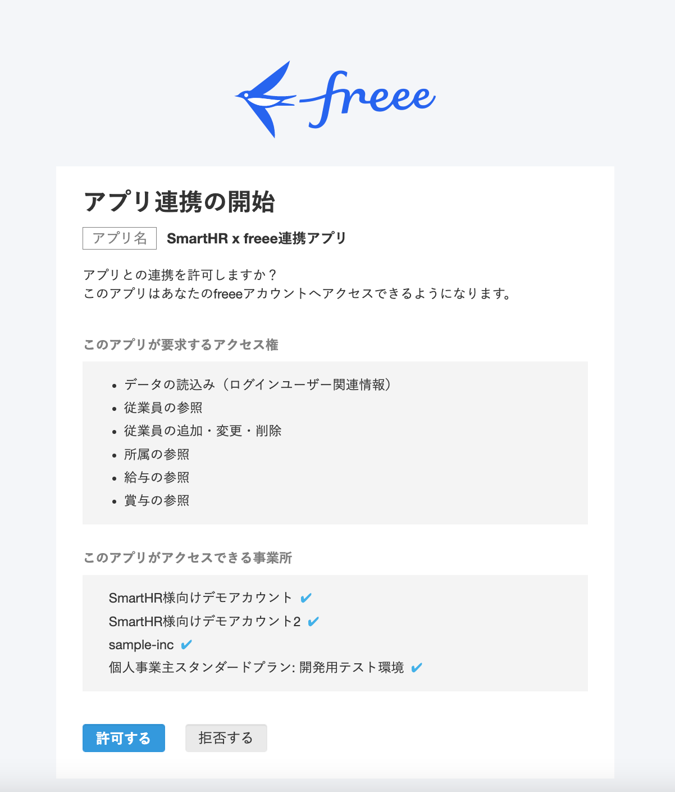

SmartHRおよびfreee人事労務で複数の企業アカウント（事業所）を利用している場合でも、企業アカウント（事業所）を選択・設定することで、相互に従業員情報の新規登録や更新が可能です。

# SmartHRの企業アカウントを変更する

マルチログイン設定時に企業アカウントを切り替える方法を説明します。

## 1.［機能］>［freee人事労務連携］をクリック

トップページ左側に表示されている **［機能］** 欄にある **［freee人事労務連携］** をクリックすると、企業アカウントを選択する画面が表示されます。

## 2\. 連携する事業所名を選択し、［次へ］をクリック

SmartHRの事業所名（企業アカウント）が選択できます。

連携する事業所名をプルダウンから選び、 **［次へ］** をクリックすると、freee人事労務連携ダッシュボード画面が表示されます。

:::tips
### 後から他の企業アカウントに切り替える場合は？
freee人事労務連携画面の右上にある **［アカウント情報を更新する］** をクリックすると、上記と同じ画面に移動して企業アカウントを切り替えられます。

:::

# freee人事労務の事業所を変更する

## 1.［連携状況を編集］をクリック

freee人事労務連携ダッシュボード画面右側の **［連携状況］** にある **［連携状況を編集］** をクリックすると、連携状況の編集画面が表示されます。

## 2.［連携を解除］をクリック

 **［連携を解除］** をクリックすると、連携解除の確認画面が表示されます。

## 3.［解除することを確認しました］にチェックを入れ、［解除］をクリック

連携解除の確認画面で **［解除することを確認しました］** にチェックを入れ、 **［解除］** をクリックすると、連携が解除されてfreee人事労務連携ダッシュボード画面へ戻ります。

「freee人事労務連携を解除しました」というメッセージが画面左下に表示されれば解除成功です。

## 4\. 連携するfreee人事労務の事業所番号を入力し、［連携開始］をクリック

freee人事労務連携設定画面へ移動し、連携するfreee人事労務の事業所番号を入力して **［連携開始］** をクリックすると、連携開始画面が表示されます。

:::tips
freee人事労務の事業所番号は、freee人事労務の画面上部にある会社名にカーソルを合わせると確認できます。

:::

## 5\. freee人事労務の画面で［許可する］をクリック

freee人事労務のアプリ連携開始画面で **［許可する］** をクリックすると、確認画面が表示されます。

## 6\. 事業所と注意事項を確認し、［連携する］をクリック

連携させたい事業所が表示されていることと、注意事項を確認してください。

確認後、 **［連携する事業所が合っていることを確認しました］** と **［注意事項を確認しました］** の2箇所にチェックを入れ、 **［連携する］** をクリックするとfreee人事労務連携ダッシュボード画面に戻ります。

「freee人事労務連携に成功しました」というメッセージが画面左下に表示されれば連携成功です。

