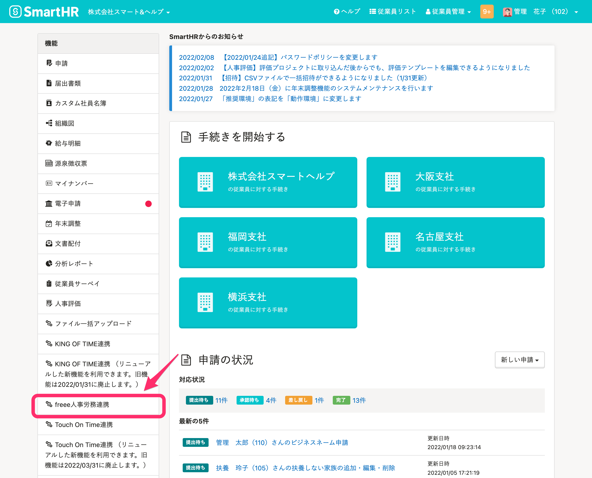

人事労務管理ソフト[freee人事労務](https://www.freee.co.jp/hr/)と連携し、freee人事労務の給与明細情報をSmartHRへ取り込む手順を説明します。

給与明細情報を連携するには、事前にインストールと連携設定を済ませてください。

また、連携可能な給与明細情報は以下のヘルプページを参照してください。

[【freee人事労務】インストール方法と連携設定（初回設定）](https://knowledge.smarthr.jp/hc/ja/articles/360026262773)

[【freee人事労務】連携可能な給与明細情報](https://knowledge.smarthr.jp/hc/ja/articles/360049747674)

:::alert
 **【1】当機能は、freee人事労務の利用プランが「ミニマムプラン」以上の場合に利用できます。** 
有料プランの利用可能期間が終了している場合や、無料お試しプランの利用期間を過ぎている場合は「無料プラン」となり、利用できません。利用プランについては、freee人事労務へお問い合わせください。
 **【2】SmartHRに取り込めるのは、freee人事労務で確定した給与明細のみです。** 
未確定の給与明細は取り込みできないため、事前に給与明細を確定してから連携してください。
:::

# 1.［機能］>［freee人事労務連携］をクリック

SmartHRにログインし、トップページの左側にある **［機能］>［freee人事労務連携］** をクリックすると、freee人事労務連携ダッシュボード画面が表示されます。

# 2.［従業員の給与明細を取り込む］項目の［同期を開始>］をクリック

freee人事労務連携ダッシュボード画面の **［従業員の給与明細を取り込む］** 項目にある **［同期を開始>］** をクリックすると、 **［支給月］** の設定画面が表示されます。

# 3.［支給月］を指定し、［次へ］をクリック

freeeから取り込む給与明細の **［支給月］** を指定し、画面右下にある **［次へ］** をクリックすると、対象の従業員を選択する画面が表示されます。

# 4\. 対象の従業員にチェックを入れ、［確認］をクリック

社員番号の左にあるチェックボックスにチェックを入れて、対象となる従業員を選択し、画面右下にある **［確認］** をクリックすると、「従業員の給与明細を取り込みますか？」というダイアログが表示されます。

従業員の選択画面には、前ページで指定した **［支給月］** に給与明細がある従業員が表示されます。

表示内容を確認して **［取り込み］** をクリックすると、freee人事労務連携ダッシュボード画面に切り替わります。

freee人事労務連携ダッシュボード画面左下に「SmartHRへ選択した従業員の給与明細同期を開始しました」というメッセージが表示され、連携履歴に **［給与明細同期開始］** の履歴が表示されます。

:::alert
 **［給与形態］［支給日］［給与計算開始日］［給与計算締日］** が同じ従業員のみ、同時に取り込めます。
 **［給与形態］［支給日］［給与計算開始日］［給与計算締日］** が異なる従業員がいる場合は、明細グループを分けて取り込んでください。

:::

# 5\. 画面を更新し、実行結果を確認する

しばらく時間をおいてから、画面を再読み込みしてください。

同期が終わると、連携履歴に **［給与明細同期終了］** の履歴が表示され、 **［実行結果］** を確認できます。

## 結果が成功の場合

トップページにある **［給与明細］** から、選択した従業員の給与明細が取り込まれていることを確認してください。

取り込んだ給与明細をSmartHRで確定・公開する手順は、以下のヘルプページを参照してください。

:::related
[給与明細機能とは（従業員への公開と通知）](https://knowledge.smarthr.jp/hc/ja/articles/360026107314#toc--11)
:::

## 結果が失敗の場合

取り込みに失敗した要因は、管理者に送られるメールで確認してください。

:::tips
同期終了後は結果に関わらず管理者の登録メールアドレスへ同期結果が配信されます。
記載内容を参考に修正し、再度取り込んでください。
| 件名 | **\[freee人事労務\]** から**\[SmartHR\]**へ給与明細の取り込みが失敗しました｜**\[会社名\]** |
| --- | --- |
| 本文 |   いつも SmartHRをご利用いただきありがとうございます。  freee人事労務からSmartHRへの給与明細の取り込みに失敗しました  \------------------------------------------------- SmartHRに存在しない従業員が指定されています  また、再試行しても解消しない場合は、freee連携アプリ( [https://freee.smarthr.plus](https://freee.smarthr.plus/) ) に再度アクセスしてから、画面左上のSmartHRロゴをクリックしてSmartHRトップページの画面右下チャットアイコンよりお問い合わせください。 \------------------------------------------------- ※ freee人事労務連携では、SmartHRとfreeeの仕様の違いにより以下の項目は完全一致の同期とならない場合がございます。あらかじめご了承ください。  【残業実績】 freee上の「残業手当合計」の内訳を、SmartHRでは「残業代」の支給項目として取り込んでおります。 尚、実績時間の内訳は、勤怠項目に取り込んでおります。  \-------------------------------------------------  このメールは SmartHR をご利用いただいているお客さまに送信しています。 送信専用アドレスのため、ご返信いただいても、ご返事ができません。 あらかじめご了承ください。   |
:::
